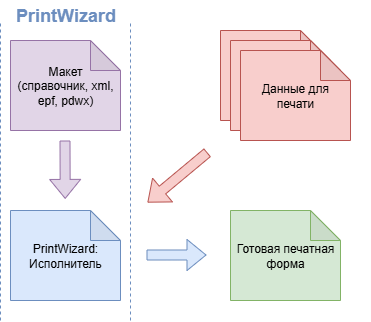

# Глава 1. Устройство PrintWizard (конструктор печатных форм)
{: .no_toc }

  

    Содержание
  

  {: .text-delta }
1. TOC
{:toc}

{: .note-title }
> Информация
> 
> При разработке конструктора печатных форм некоторые идеи были подсмотрены из системы компоновки данных (1С:Предприятие). Поэтому вы можете заметить, что некоторые термины и описания перекликаются. Однако, стоит учитывать, что функционал и предназначение может отличаться от СКД.

{: .important-title }
> Здесь и далее
> 
> * (*) - функционал планируемый к разработке
> * "разработчик" - пользователь Конструктора, имеющий доступ к визуальному механизму создания и настройки печатных форм

*Конструктор печатных форм* (далее *Конструктор*, *PrintWizard*) - мощный и гибкий инструмент для создания печатных форм на основе их декларативного описания. Использование декларативного описания макетов печатных форм позволяет реализовать следующие возможности:

* создание печатной формы без программирования в режиме 1С:Предприятие;
* возможность создания различных вариантов одной печатной формы;
* возможность задания различных вариантов пользовательских настроек;
* программное влияние на процесс формирования печатной формы;
* настройки структуры печатной формы;
* дополнительные объекты-абстракции для упрощения и унификации сбора данных;
* (*) автоматически генерируемая форма настройки печатной формы.

Конструктор состоит из набора элементов, каждый из которых имеет свое декларативное описание, возможность сериализации (то есть сохранения в XML и загрузки из XML). Это позволяет гибко управлять всеми этапами выполнения процесса формирования печатной формы.

Формирование печатной формы на основе конструктора разбивается на этапы. В каждый из этапов разработчик может вмешаться (визуально или программно).

    
     Рис. 1.1 схема взаимодействия PrintWizard

На схеме представлены следующие этапы формирования печатной формы:
1. Разработчик создает *макет печатной формы*, который содержит полную информацию о печатной форме;
2. *PrintWizard: Исполнитель* загружает схему макета печатной формы; извлекает данные из информационной базы; формирует наборы данных для печати; подготовленные данные выводит в различные форматы:
      * табличный документ (.mxl)
      * офисный документ (.docx)

Процесс разработки печатной формы с помощью Конструктора и его дальнейшее использование на практике выглядит следующим образом:

* Исходя из поставленной задачи, разработчик создает макет конструктора, в котором описывает
  * источники данных;
  * наборы данных;
  * связи между ними;
  * создает макет печатной формы (в табличном или офисном документе);
  * определяет параметры макета;
  * выполняет связь параметров макета с полями наборов;
* При необходимости описывает алгоритмы обработки событий в процессе формирования печатной формы (на языке 1С);
* Настраивает команду для формирования печатной формы.

В пользовательском режиме, у объекта появляется кнопка для формирования печатной формы. При нажатии на которую происходит автоматическое формирование печатной формы и вывод результата через стандартные средства подсистемы "Управление печатью" библиотеки стандартных подсистем 1С.

[1]: ./ch_01_02.html