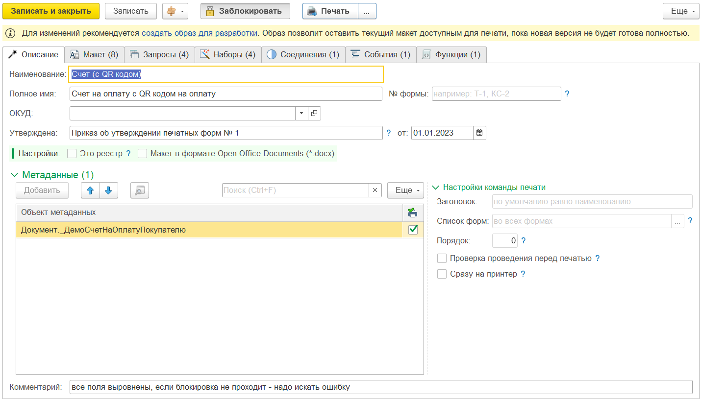
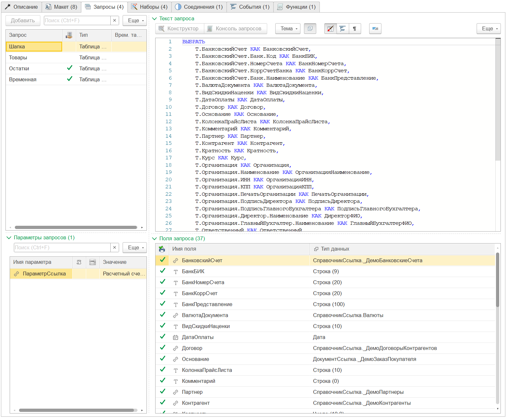

---
layout: default
title: Макет конструктора
parent: Устройство PrintWizard
grand_parent: Документация
nav_order: 1
--- 

# Макет конструктора
{: .no_toc }

  

    Содержание
  

  {: .text-delta }
1. TOC
{:toc}

Основой для работы PrintWizard является *макет конструктора* (не путать с макетом печатной формы). Создание макета может быть выполнено:
* визуально при помощи конструктора макета;
* программно при помощи объектов сериализатора PrintWizard.

Макет конструктора содержит следующие разделы:
* общая информация;
* целевые объекты метаданных;
* запросы данных;
* наборы данных;
* соединения наборов;
* макет печатной формы;
* события конструктора

## Общая информация

Данный раздел содержит информацию о печатной форме:
* Полное имя, 
* Номер унифицированной формы
* Документ утверждения печатной формы
* Дата документа утверждения печатной формы
* Ссылка на форму из ОКУД

## Объекты метаданных

Каждая печатная форма, как правило формируется для определенного объекта метаданных. В качестве целевого объекта может выступать объект метаданных Справочник или Документ (* планируется расширение и для других объектов). Целевой объект метаданных должен иметь предопределенное поле "*Ссылка*", по которому программа будет определять для кого формируется печатная форма. То есть в обычном режиме для одной ссылки формируется одна печатная форма.

> Существует возможность реализации печатной формы в виде "реестра". При этом печатная форма выводится одна для всех ссылок, переданных для сбора данных.

Целевой объект метаданных определяет не только ссылку (или массив ссылок) для формирования печатной формы. При наличии использовании подсистемы "Подключаемые команды" для целевого объекта при открытии формы объекта или списка, добавляется кнопка для формирования печатной формы.

Дополнительно, с целью оптимизации сбора данных система выполняет контроль на наличие отбора по переданному массиву ссылок. Данный контроль выполняется для запросов, без признака "Это общий запрос".

    
     Рис. 1.2 Настройка целевых объектов метаданных

## Запросы данных

Запросы данных - один из способов доступа к данным, которые в дальнейшем будут использоваться в качестве источников для наборов. Используя этот механизм, разработчик может читать данные, хранящиеся в информационной базе. Изменение данных при помощи запросов невозможно.

Разработчик, создавая макет конструктора, может добавить запросы любого вида и в любом количестве, которые ему необходимы. При этом текст запроса может быть получен следующим образом:

* заполнением на основе целевых объектов метаданных;
* редактированием при помощи конструктора запросов;
* редактированием вручную при помощи консоли запросов (специальный механизм с подсказками при редактировании);
* редактированием вручную в обычном текстовом редакторе.

В зависимости от запроса, результат выполнения может быть различного типа (определяется автоматически):

* в таблицу значений (для использования в наборах)
* во временную таблицу (для использования в других запросах)

Если в тексте запроса обнаружены параметры запроса, значения для них могут быть заданы следующим образом:

* вручную, путем ввода данных (простого типа) или выбора из информационной базы (ссылочные типы);
* программно, при помощи алгоритма вычисления значения для подстановки.

    
     Рис. 1.3 Форма настройки запросов

### Дополнительно
{: .no_toc }

* [Механизм запросов](https://v8.1c.ru/platforma/mehanizm-zaprosov/)
* [Язык запросов «1С:Предприятия 8»](https://its.1c.ru/db/pubqlang) (требуется доступ к ИТС)

## Наборы данных

Наборы данных являются источниками для печатной формы и формируются из данных запросов или алгоритмов (*). 

Каждый набор может иметь один из 4 видов:

* Первая строка. Для печатной формы доступны данные только 1й строки;
* Последняя строка. Для печатной формы доступны данные только 2й строки;
* Соединение строк. Набор сворачивается в одну строк, при этом уникальные значения внутри колонки соединяются в строку с разделителем "; ";
* Многострочная коллекция. Набор представляет собой таблицу. В печатной форме доступны данные итога по числовым полям или построчный вывод.

Вид набора определяет его поведение при использовании в макете печатной формы. В одной области макета могут быть использованы одновременно данные из нескольких наборов (подробнее см. Макеты).

Программа анализирует использование полей наборов данных в макете конструктора. Индикатор связи позволяет удалить неиспользуемые поля, тем самым оптимизировав сбор данных для печатной формы.

Дополнительно, полученный набор данных из запроса может быть изменен при помощи произвольного алгоритма. Таким образом, можно выполнить обработку набора любой сложности.

    
     Рис. 1.4 Форма настройки наборов данных

## Поля набора данных

Каждый набор данных, в результате своей подготовки образует набор полей, который в дальнейшем можно будет использовать в качестве источников данных для параметров макета печатной формы. 

Каждое поле имеет тип, который определяет поведение поля и возможности его редактирования:

* поле источника
* поле алгоритма
* поле доп. реквизита (1я очередь)
* вычисляемое поле (2я очередь)
* поле нумератора (3я очередь)
* поле конструктора (4я очередь)

Поля с очередностью вычисляются в момент подготовки набора в указанном порядке. Таким образом, поля нижестоящей очереди могут использовать значения полей вышестоящей очереди.

Поле набора данных может быть использовано как:

* источник данных для поля конструктора (см. поле конструктора)
* источник данных для поля нумератора (см. поле нумератора)
* владелец доп. свойства или реквизита (поле доп. реквизита)
* поле связи соединений наборов данных (см. соединения наборов)
* источник данных для параметра макета печатной формы (см. макеты печ. формы)

### Поле источника

Поле источника - это *предопределенное* поле, полученное из источника данных (например: запроса). Тип данных поля источника устанавливается автоматически при обновлении полей из запроса. 

### Поле алгоритма

Поле алгоритма - это поле, добавленное пользователем в алгоритме обработки набора данных (если в результате выполнения алгоритма изменится состав колонок).

### Вычисляемое поле

Вычисляемое поле - это поле с произвольным алгоритмом, который будет рассчитан в момент формирования набора данных. При добавлении вычисляемых полей рекомендуется самостоятельно указывать тип данных, который будет получен в результате выполнения алгоритма.

### Поле доп. реквизита

Если в конфигурации используется подсистема "Свойства" (из библиотеки стандартных подсистем 1С), то конструктор подсказывает разработчику о наличии доп. свойств или доп. реквизитов для типа данных поля. При необходимости, разработчик может добавить для свойства или реквизиты в состав полей набора.

Например:

* для справочника "Организации" добавлен дополнительный реквизит "Аффилированная организация" (тип булево);
* в наборе данных существует поле "Организация" с типом "Справочник.Организации";
* напротив данного поля будет указан признак о наличии доп. реквизитов;
* для строки поля "Организация" при нажатии "Добавить" > "Поле доп. реквизита" будет предложен список доп. реквизитов для выбора;
* после выбора требуемого доп. реквизита (Аффилированная организация) будет добавлено поле набора "Организация_АффилированнаяОрганизация" с типом "Поле свойства" и типом данных "Булево".

### Поле конструктора

В некоторых случаях для вывода в печатную форму необходимо "сконструировать" строковое значение. Например наименование организации с указанием: ИНН, КПП, ОГРН, а также адресом и номером телефона.

Подобные данные не всегда могут хранится в одном поле. Поэтому получить их запросом не представляется возможным. 

Конструктор позволяет:
* задать в табличном виде перечень полей из наборов, которые потребуются для формирования представления;
* определить порядок полей при соединении;
* указать "префикс", то есть строковые данные, которые будут подставлены перед значением поля;
* указать формат обработки значения из поля набора данных;
* при этом поля, значения у которых отсутствуют не будут выведены (в том числе и префикс).

Ключевой особенностью использования поля конструктора, является возможность визуальной настройки порядка вычисления поля, без необходимости использования алгоритмов на встроенном языке 1С.

### Поле нумератора

При формровании печатных форм также может потребоваться выполнить *вложенную нумерацию*.

Например, есть таблица:

| Тип файла | Имя файла | Сквозной № | № внутри типа |
|--|--|--|--|
| docx | Имя файла | 1 | 1 |
| docx | Имя файла | 2 | 2 |
| xlsx | Имя файла | 3 | 1 |
| xlsx | Имя файла | 4 | 2 |

Поля "Тип файла", "Имя файла" и "Сквозной №" были получены из запроса. А поле "№ внутри типа" необходимо добавить для вывода в печатную форму.

Для этого можно добавить поле нумератора, с указанием поля критерия отбора "ТипФайла". Таким образом, для каждого значения колонки "ТипФайла" будет выполнена своя сквозная нумерация согласно расположению строк в наборе.

Ключевой особенностью использования поля нумератора, является возможность визуальной настройки порядка вычисления поля, без необходимости использования алгоритмов на встроенном языке 1С.

## Соединения наборов

Как упоминалось ранее, макет конструктора может содержать несколько наборов данных. В случае, когда требуется получить связанную информацию из этих наборов, в макете конструктора описывается их связь по какому-то полю (или набору полей). При связывании наборов данных конструктор использует *Левое соединение*.

В результате соединения в левом наборе данных создается *вложенный набор* с указанным видом и именем. Данные вложенного набора могут быть использованы в макете печатной формы согласно виду набора установленному для данного соединения.

    
     Рис. 1.5 Форма настройки соединения наборов данных

## Макет печатной формы

Для формирования печатной формы требуется задать макет. В зависимости от типа печатной формы (табличный или офисный документ), макет редактируется различным способом. Дополнительно можно вставить макет из метаданных конфигурации или из внешнего файла.

Для табличного документа доступно редактирование при помощи средств конструктора. Для офисных документов доступен только просмотр, макет необходимо создавать в специализированном редакторе офисных документов.

    
     Рис. 1.6 Форма настройки макета печатной формы

### Области макета

После задания макета, программа автоматически определяет области макета печатной формы. Вывод областей в результирующий документ выполняется в порядке заданном разработчиком в макете конструктора. По умолчанию порядок устанавливается согласно следованию областей в макете печатной формы.

Для каждой области задается:
* собственный способ вывода;
* настройки вывода данных;
* связь параметров области в полями наборов данных.

### Параметры областей

У каждой области есть собственный набор параметров. Список параметров формируется автоматически из данных макета печатной формы.

Для параметра макета необходимо указать тип источника данных:

* Значение набора. Указывается поле из доступных для данной области наборов данных;
* Конструктор строки. Настройка "конструирования" строки представления. Механизм аналогичный *Поле конструктора* из полей наборов данных;
* Произвольный алгоритм. Возможность задать собственный алгоритм вычисления значения поля, при помощи языка платформы 1С.

Дополнительно можно задать настройку форматирования значения перед установкой в параметр области.

## События

В процессе работы конструктора может возникнуть необходимость "вмешаться" на различных этапах. Для реализации данной возможности существует механизм предопределенных событий, для которых можно задать собственный обработчик на языке платформы 1С. При этом для событий доступны различные входящие параметры, которые позволяют получить дополнительные данные, используемые конструктором в процессе формирования печатной формы.

Также некоторые события позволяют отказаться от выполнения действий конструктора. Например: при различных условиях можно не выводить на печать определенную область в макете. Кроме того после вывода области можно оформить печатную форму, добавив группировку строк, колонок или внести изменения в оформление отдельных областей, ячеек или всего документа.

    
     Рис. 1.7 Форма настройки обработчиков событий конструктора

