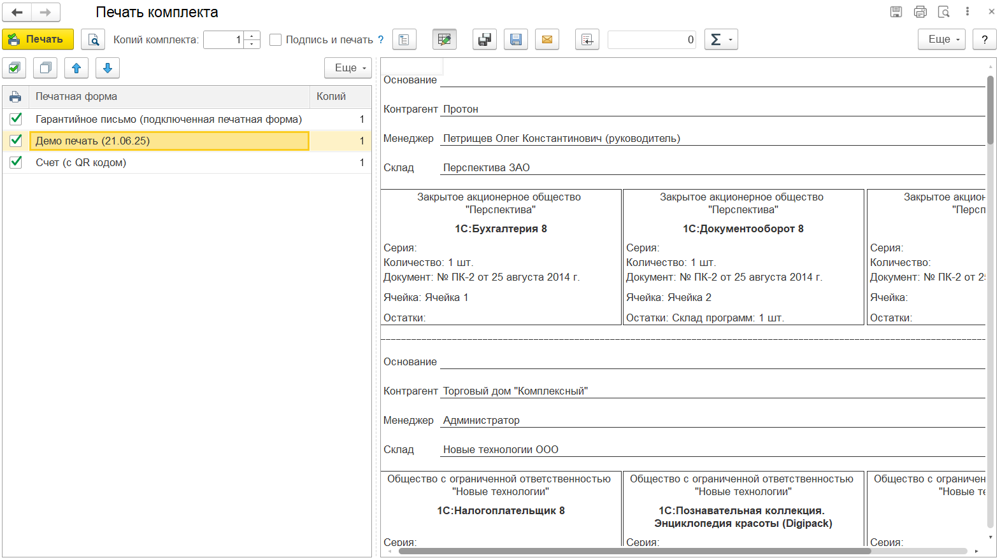

---
layout: default
title: Пакетная печать
parent: Про PrintWizard
grand_parent: Документация
nav_order: 2
--- 

# Пакетная печать

В состав PrintWizard входит механизм пакетной печати. Он расположен в меню "PrintWizard > PrintWizard: Пакетная печать". Для работы с обработкой необходимо наличие права "PrintWizard: Печать" или "PrintWizard: Редактирование".

    
     Форма пакетной печати

В форме пакетной печати пользователь может настроить:

* **Вид объекта** - список доступных на чтение объектов, для которых существуют печатные формы
* **Отбор** - настройка отбора для формирования списка документов для которых требуется выполнить печать
* **Печатные формы** - список печатных форм доступных для пакетной печати, с возможность указать количество экземпляров для печати.

{: .note-title }
> Информация
> 
> В список печатных форм могут попадают только команды печати, которые сами не являеются пакетными, а также не выполняются на клиенте.

Кроме того, форма пакетной печати может быть открыта из команды "PrintWizard: Пакетная печать" расположенной в подменю "Печать". При открытии из подменю форма пакетной печати блокирует выбор вида объекта и не сохраняет параметры формы.

    
     Пример результата пакетной печати

{: .important-title }
> Важный момент
> 
> При выборе печатных форм не следует выбирать сразу табличные печатные формы и в формате офисных документов. В таком случае печатные формы в формате офисных документов будут удалены из результата. И откроется только форма просмотра печатных форм в табличном формате.
>
> При этом пакетная печать нескольких форм в формате офисных документов допускается.