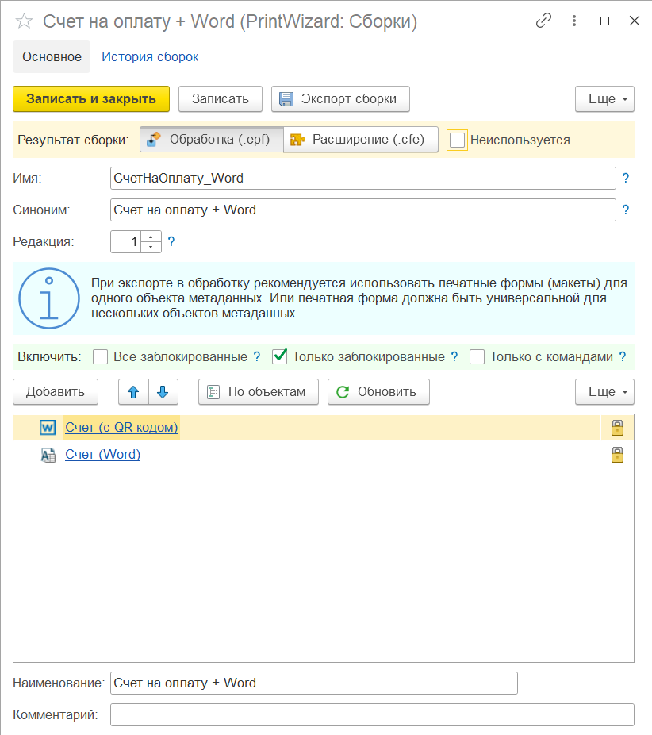
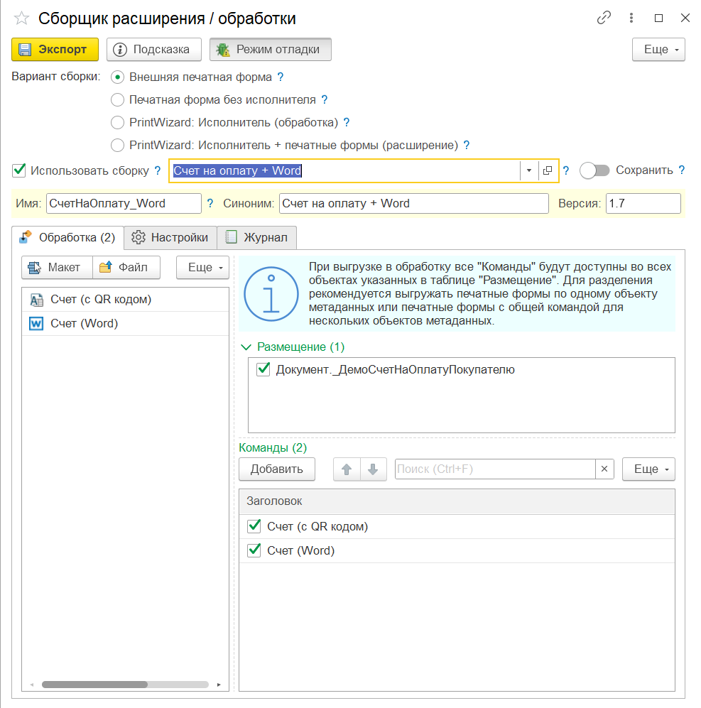

---
layout: default
title: Экспорт в файл
parent: Про PrintWizard
grand_parent: Документация
nav_order: 3
--- 

# Экспорт печатных форм

{: .important-title }
> Важный момент
> 
> Описание форматов экспорта актуально для версии 2025.2 и выше

Все созданные печатные формы в конструкторе могут быть экспортированы во внешний файл одним из следующих способов:

* файл формата **.pdwx** - это формат конструктора PrintWizard. Выгрузка в данном формате может быть использована для:
  * обмена макетами печатных форм
  * сравнения макетов печатных форм между собой
  * печати при помощи обработки **PrintWizard: Исполнитель**
* файл формата **.epf** - это формат внешней обработки. Внешняя обработка может быть выгружена в двух вариантах:
  * полностью автономная (с вложенным **PrintWizard: Исполнитель**)
  * только с печатными формами внутри. При этом **PrintWizard: Исполнитель** должен входить в состав конфигурации, расширения или добавлен как внешняя обработка

Внешние печатные формы выполнены по требованиям БСП. Могут быть открыты самостоятельно или подключены через дополнительные отчеты и обработки.

* файл формата **.cfe** - это формат расширения. Созданное расширение содержит **PrintWizard: Исполнитель**, а также все печатные формы, согласно настройкам выгрузки.

## Экспорт в расширение

Один из основных сценариев разработки, который может быть организован с использованием экспорта в виде расширения:

* создание и доработка печатных форм выполняется на копии базы командой разработчиков;
* готовые макеты переносятся на живую базу по мере подготовки обновлений с определенной периодичностью.

Печатные формы, созданные для тестирования могут быть экспортированы в виде внешних печатных форм. После окончания разработки, они могут быть также включены в новую версию расширения с отключением внешней печатной формы.

Расширение с печатными формами не содержит объектов хранения данных (справочников, документов и т.п.) и может быть в любой момент отключено без потери информации. Более того, данное расширение не требует наличие лицензии на сервере информационной базы, поскольку не содержит возможности редактирования печатных форм.

## Процесс экспорта

Рассмотрим процесс создания настройки сборки расширения и экспорт в файл. Сначала необходимо настроить сборку. Перейдем в справочник "Сборки (PrintWizard)", создадим новый элемент и заполним данные формы:

    
     Пример настройки сборки расширения

Рассмотрим реквизиты формы:

| Имя реквизита | Описание | Расширение | Обработка |
|--|--|--|--|
| Результат сборки          | Выбор результата сборки (внешняя обработка или расширение) | Да | Да |
| Неиспользуется            | Признак, что настройка не используется более. Неиспользуемые настройки нельзя выбрать при сборке | Да | Да |
| Имя                       | Имя для установки в расширение / обработку | Да | Да |
| Синоним                   | Синоним для установки в расширение / обработку | Да | Да |
| Редакция                  | Номер редакции сборки. Нумерация версий производится автоматически по шаблону [Редакция].[Версия]. Версии нумеруются автоматически согласно истории записанных версий | Да | Да |
| Поставщик                 | Наименование поставщика для установки в расширение | Да | Нет |
| Все заблокированные       | Автоматически добавлять все заблокированные макеты. Ручное изменение состава макетов недоступно | Да | Нет |
| Только заблокированные    | Добавлять в сборку только заблокированные макеты, из числа выбранных макетов в настройке | Да | Да |
| Только с командами печати | Добавлять в сборку только макеты с включенными командами для печати, из числа выбранных макетов в настройке | Да | Да |

При выборе признака "Все заблокированные" редактирование состава макетов недоступно. В таком случае, в обработку (или расширение) попадут все заблокированные макеты. Макеты указанные в сборке не обязательно должны быть заблокированы или иметь команды печати. Если не установлены ограничивающие признаки "Только заблокированные" и "Только с командами печати" они будут добавлены в сборку. К тому же они будут добавлены в команды печати. Поэтому следует внимательно относится к установленным настройкам.

Все обработки экспортируются в расширение по следующему принципу:

* обработки соответствуют объектам метаданных, все макеты объекта включены в одну обработку;
* если макет используется в нескольких объектах метаданных: макет будет добавлен только в одну обработку, в другой обработке он будет вызываться из первой обработки;
* команды печати добавляются автоматически;
* обработка имеет форму, где можно выбрать ссылку и макет для печати + выполнить печать;
* каждая обработка может быть сохранена во внешний файл и использована как внешняя печатная форма. Модуль объекта имеет все необходимые методы.

## Экспорт в обработку

Экспорт во внешнюю печатную форму может быть выполнен согласно заранее сохраненным настройкам или по произвольной настройке в форме экспорта. При этом историю версий можно хранить только для настроенных вариантов сборок.

Настройки сборки обработки соответствуют расширению. При этом в результате, все макеты будут включены в одну обработку, независимо от объектов метаданных (для печати). Команды будут добавлены согласно настройкам макетов конструктора.

## Сборка расширения / обработки

Запустить процесс подготовки и сборки расширения или обработки можно несколькими путями:

* из формы справочника "Макеты" (внешняя печатная форма по указанному макету)
* из формы справочника "Сборки" (согласно текущей настройке сборки)
* из основного меню PrintWizard (согласно пункту меню)

При этом будет открыта форма запуска сборки:

    
     Форма запуска сборки расширения

Рассмотрим подробнее реквизиты на форме:

| Имя реквизита | Описание | Область | Комментарий |
|--|--|--|--|
| Вариант сборки            | Выбор варианта сборки: расширение или внешняя печатная форма | cfe, epf |  |
| Использовать сборку       | Признак использования настройки сборки | cfe, epf |  |
| Настройка сборки          | Значение настройки для применения в сборке | cfe, epf | Использовать настройку |
| Сохранить                 | Сохранить результат сборки в историю версий по указанной настройке | cfe, epf | Использовать сборку |
| Имя                       | Имя для установки в расширение / обработку | cfe, epf |  |
| Синоним                   | Синоним для установки в расширение / обработку | cfe, epf |  |
| Версия                    | Версия для установки в расширение / обработку | cfe, epf |  |

### Страница "Обработка / Расширение"

На странице Обработка (или Расширение) доступен выбор макетов для экспорта в файл. 

* для обработки в правой части форма разделена на две табличные части: Объекты метаданных и Команды;
* для расширения в правой части форма содержит дерево: Объекты метаданных > Команды.

### Страница "Настройки"

У обработки есть режим отладки (подменю "Еще" формы в правом верхнем углу). В данном режиме доступна закладка "Настройки" и можно указать каталог сохранения временных файлов (Каталог сборки) и каталог информационной базы для сборки расширений (Каталог ИБ). В данном случае в каталоге сборки появятся следующие данные:

* данные исходного расширения или шаблона обработки в XML (каталоги cfe/old или epf/old соответственно)
* данные готового расширения или обработки в XML (каталоги cfe/new или epf/new соответственно)
* файлы исходного и готового расширения или обработки (.cfe или .epf соответственно)

Рассмотрим подробнее реквизиты на странице "Настройки":

| Имя реквизита | Описание | Комментарий |
|--|--|--|
| Директива                 | Указание директивы для выполнения процесса подготовки и сборки |  |
| Файл программы            | Путь к файлу программы 1С: Предприятие. Наличие установленного конфигуратора обязательно |  |
| Каталог сборки            | Путь к каталогу сборки в режиме отладки |  |
| Каталог ИБ                | Путь к каталогу файловой ИБ в режиме отладки | Расширение |
| Авторизация               | Признак необходимости авторизации в ИБ | Расширение |
| Логин                     | Логин пользователя ИБ | Расширение |
| Пароль                    | Пароль пользователя ИБ | Расширение |

### Страница "Журнал"

Журнал событий выполненных в процессе подготовки и сборки

## Результат

Всего в результате выполнения обработки можно получить следующие файлы:

* Автономная внешняя печатная форма (.epf) - внешняя печатная форма согласно настройкам из формы. Особенность печатной формы: она может быть добавлена в конфигурацию самостоятельно и не требует наличия никаких дополнительных объектов конструктора;
* Внешняя печатная форма без исполнителя (.epf) - внешняя печатная форма согласно настройкам из формы. Особенность печатной формы: она требует наличия PrintWizard: Исполнитель в составе конфигурации (или расширении) или в дополнительных отчетах и обработках;
* расширение с печатными формами (.cfe) - расширение с печатными формами, а также PrintWizard: Исполнитель в составе.

# Экспорт в файл .xml (.pdwx)

Файл с расширением .xml (также .pdwx) используется для хранения и обмена макетами между различными информационными базами.

Технически файл .pdwx является архивом, внутри которого хранится файл .xml с сериализованными данными.

Для экспорта в файл *.pdwx перейдите в форму списка или форму элемента макета, в командной панели есть меню "Экспорт / Импорт" с командами выгрузки и загрузки макета.