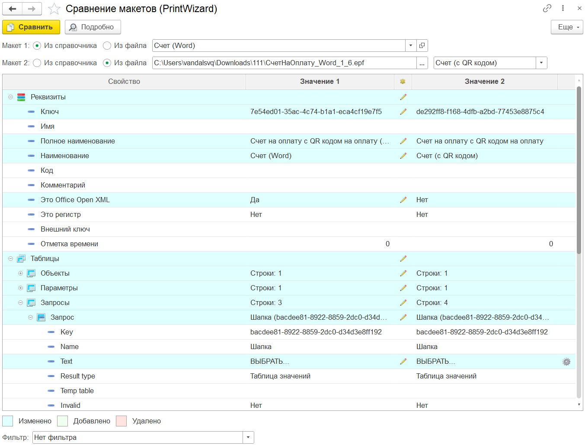
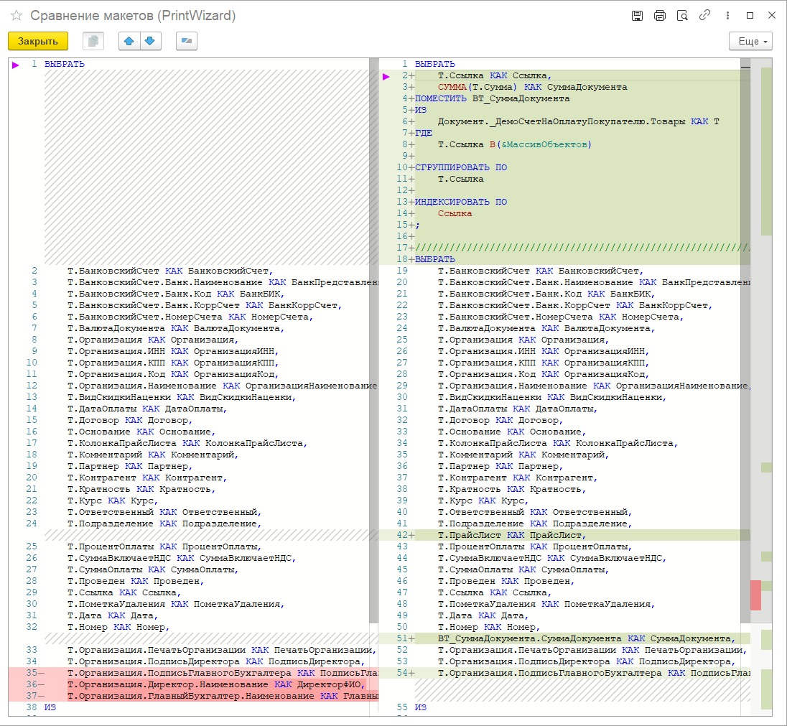
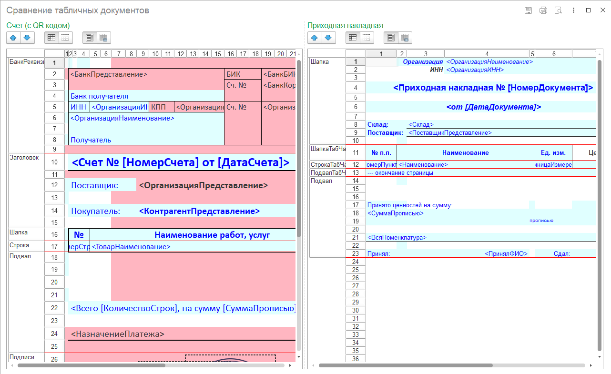

---
layout: default
title: Сравнение макетов
parent: Про PrintWizard
grand_parent: Документация
nav_order: 4
--- 

# Сравнение макетов

Одна из проблем печатных форм созданных в режиме конфигуратора 1С (независимо от способа) является сложность сравнения. Причины сложности сравнения "обычных" печатных форм в следующем:

* Невозможность сравнить данные из ИБ и параметры макета;
* Шаблон печатной формы находится отдельно от методов сбора и/или вывода данных;

PrintWizard лишен этих недостатков по той причине, что макет конструктора содержит всю информацию необходимую для макета внутри себя. При этом существует прямая связь между параметрами шаблона печатной формы и источником данных. 

Также для удобного анализа макетов в PrintWizard разработана собственная форма сравнения макетов конструктора

    
     Форма сравнения макетов PrintWizard

Сравнивать между собой можно:
* макеты сохраненные в ИБ (в справочнике);
* макеты сохраненные в файл в формате *.pdwx;
* макеты внешних печатных форм (*.epf) полученных обработкой экспорта конструктора.

Также механизм сравнения обладает дополнительным функционалом для анализа изменений:

* форма для сравнения: текста запроса, кода алгоритмов, строковых значений;
* форма для сравнения табличных документов.

Единственный существенный недостаток, механизм сравнения не обладает возможностью объединения. Этот функционал планируется реализовать в будущем.

    
     Сравнение текста запроса

    
     Сравнение табличных документов

