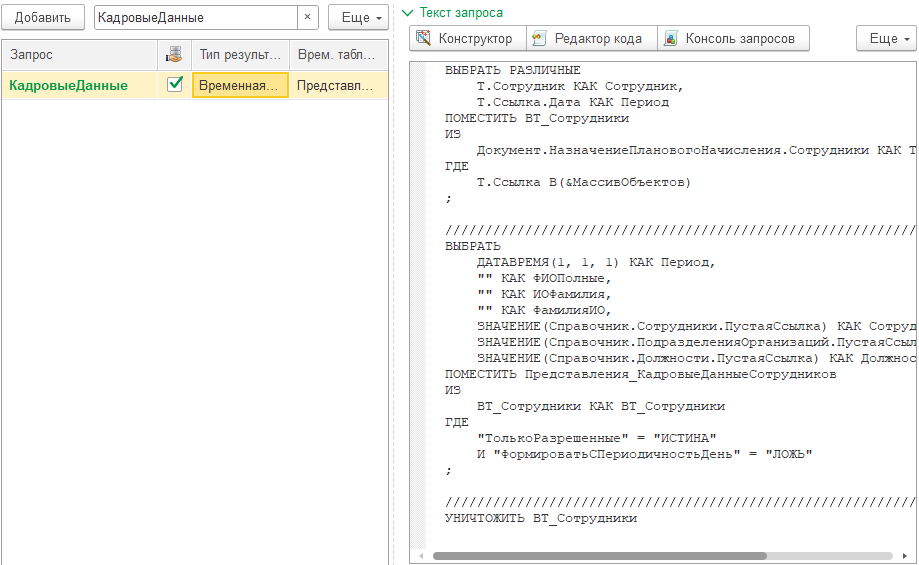
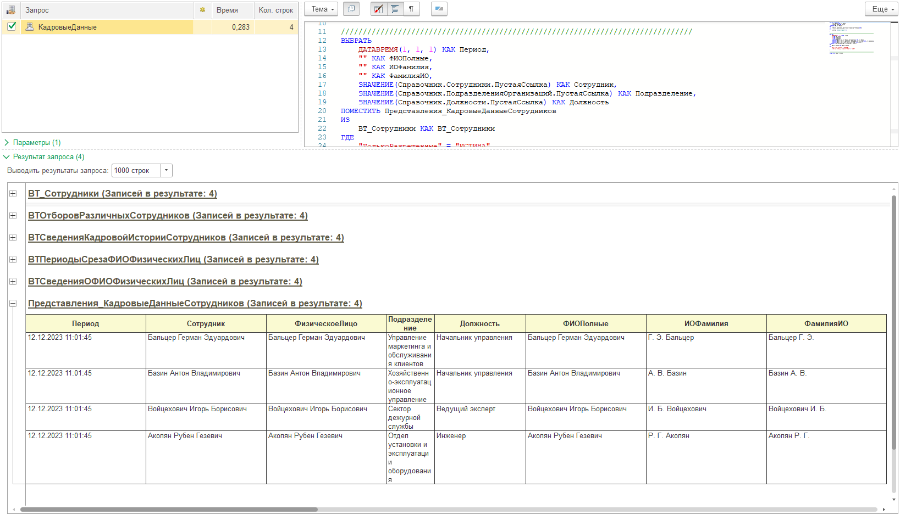
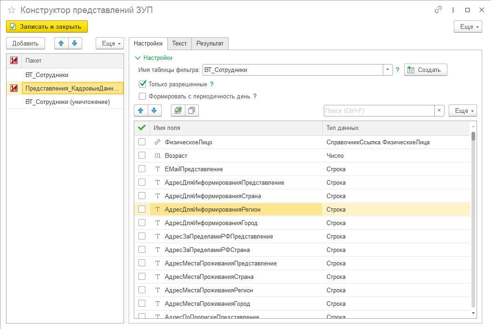
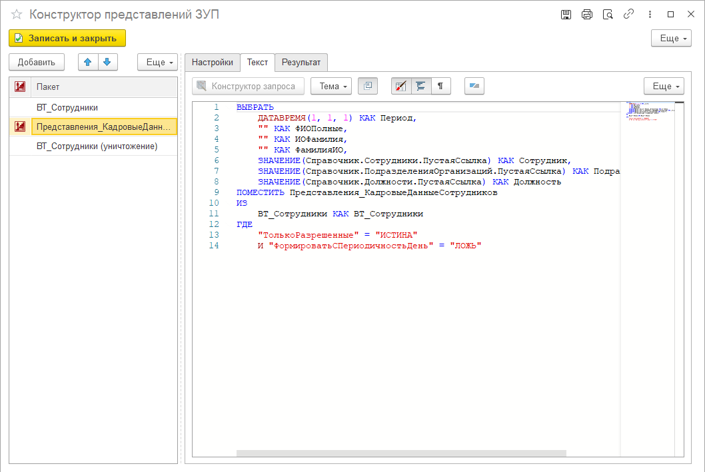
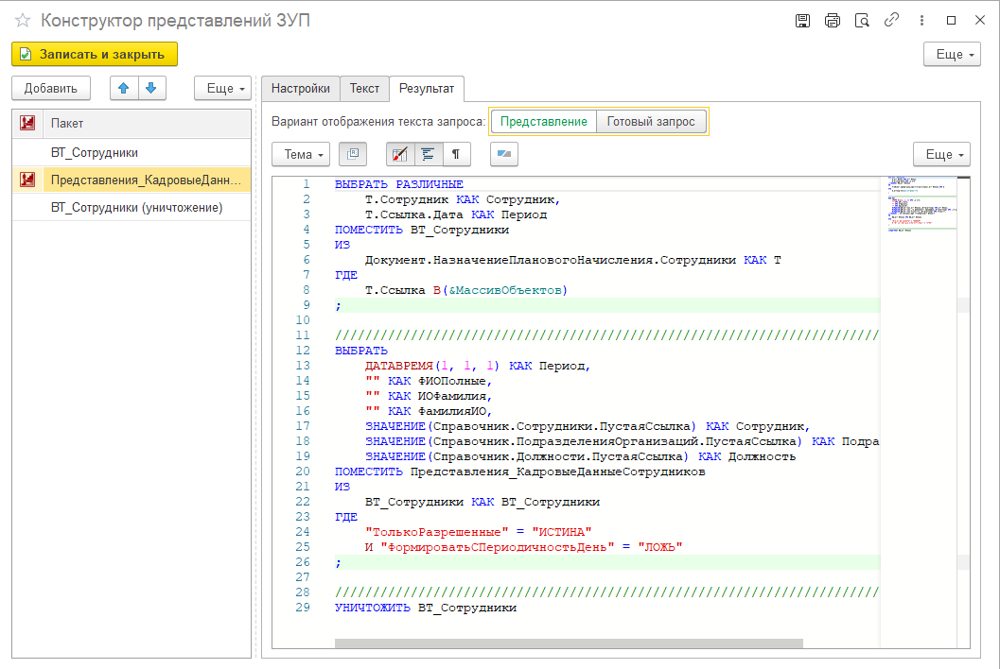

---
layout: default
title: Представления (ЗУП)
parent: Про PrintWizard
grand_parent: Документация
nav_order: 5
--- 

# Что такое "Представления" в ЗУП

Начиная с редакции 3 в конфигурации "Зарплата и управление персоналом" (сокр. ЗУП) появился полезный механизм выборки данных называемый (в профессиональной среде) *механизм представлений*. Данный механизм позволяет выбирать данные с разных регистров в одну таблицу, получать периодические данные с учетом различных дат формирования информации. Но самое главное, что запросы "отвязаны" от структуры конфигурации. Об этом заботится "вендор" (разработчик конфигурации, то есть 1С). Это позволяет пользователям относительно безопасно обновлять конфигурации, а также разработчику дает некоторый простор для манипуляции со структурой хранения без ущерба для обратной совместимости.

Дополнительное преимущество представлений в том, что они позволяют в одну таблицу получить данные из различных источников (регистров, справочников и т.д.).

В некоторых случаях, получение данных в одном представлении запросто приводит к сбору данных с доброго десятка источников, а также сопряжено с запросом в несколько временных таблиц (которые потом заботливо уничтожаются).

Простой пример - данные штатного расписания. Запрос с использованием представления имеет следующий вид

```
ВЫБРАТЬ
	ДАТАВРЕМЯ(1, 1, 1) КАК Период,
	ЗНАЧЕНИЕ(Справочник.Организации.ПустаяСсылка) КАК Организация,
	ЗНАЧЕНИЕ(Справочник.ПодразделенияОрганизаций.ПустаяСсылка) КАК Подразделение,
	ЗНАЧЕНИЕ(Справочник.Должности.ПустаяСсылка) КАК Должность,
	ЗНАЧЕНИЕ(Справочник.ТарифныеСетки.ПустаяСсылка) КАК ТарифнаяСетка,
	ЗНАЧЕНИЕ(Справочник.РазрядыКатегорииДолжностей.ПустаяСсылка) КАК РазрядКатегория,
	0 КАК КоличествоСтавок
ПОМЕСТИТЬ Представления_ШтатноеРасписание
ИЗ
	ВТ_ТаблицаФильтра КАК ВТ_ТаблицаФильтра
ГДЕ
	"ТолькоРазрешенные" = "ЛОЖЬ"
	И "ВключатьНачисления" = "ЛОЖЬ"
```

Однако исходный запрос к базе данных будет иметь практически 415 строк, сформирует 5 временных таблиц и будет обращаться к 4 физическим таблицам. 

По этой причине использование запросов с представлениями важный и удобный способ получения информации в конфигурации ЗУП.

# Поддержка использования представлений

Если расширение PrintWizard установлено в конфигурации ЗУП, то оно автоматически поддерживает возможность выполнения запросов к базе данных с использованием представлений. Сами запросы могут быть написаны вручную или составлены при помощи специального конструктора, встроенного в расширение.

{: .important-title }
> Поддержка
> 
> Возможность использования запросов с представлениями реализована не только для макетов печатных форм, но и в консоли запросов для удобной отладки.

В рамках формирования цепочки запросов, рекомендуется представления формировать в виде отдельных пакетов запросов, чтобы их подготовка была более удобна для использования конструктором. При этом такие запросы рекомендуется ставить с признаком "Общие запросы" (см. на картинке)

<p align="center">
    <a href="./../img/ch_01/1_07_1_query_row.png"></a>
    <br>Пример строки запроса с использованием "Представления"
</p>

{: .important-title }
> Особенности реализации
> 
> У данного подхода есть только один минус. Результат запроса во временную таблицу доступен в следующих строках запросов. Но при этом, при вызове конструктора он не появляется в дереве объектов метаданных. Также редактор кода может подсказать только название таблицы. 
> Для появления временных таблиц в конструкторе рекомендуется использовать конструктор запросов из инструмента Infostart Toolkit. Проблема с редактором кода возможно будет решена в одном из следующих релизов.

Открыть данный запрос в консоли запросов и выполнить запрос со временными таблицами, мы увидим результаты всех временных таблиц сформированных в процессе подготовки представления (см. на картинке ниже)

<p align="center">
    <a href="./../img/ch_01/1_07_2_query_result.png"></a>
    <br>Результат выполнения запроса в консоли
</p>

Если выполнить запрос без временных таблиц, результат будет пустой, поскольку все данные находятся во временной таблице "Представления_КадровыеДанныеСотрудников". И чтобы их получить запрос необходимо дополнить конструкцией

```
ВЫБРАТЬ * ИЗ Представления_КадровыеДанныеСотрудников КАК Т
```

# Конструктор представлений

Поскольку создание запросов с представлениям не самая простая задача, специально для PrintWizard был разработан механизм конструирования шаблонов запросов (так называемых пустышек). Вызов данного конструктора доступен из формы создания макета печатной формы, а также отдельно в консоли запросов. Рассмотрим подробнее возможности конструктора представлений.

Давайте посмотрим в качестве примера на настройку запроса по указанному запросу с использованием "Представления_КадровыеДанныеСотрудников"

<p align="center">
    <a href="./../img/ch_01/1_07_3_tz_wizard_1.png"></a>
    <br>Форма конструктора представлений ЗУП
</p>

Сам конструктор состоит из двух "половинок":

* слева находится таблица со списком пакетов запросов, входящих в цепочку
* справа находится панель с закладками "Настройки", "Текст", "Результат"

В левой таблице запросы "Представления_" помечены специальным значком . Это означает, что для данного пакета поддерживается возможность настройки представления. Для пакетов без данной пиктограммы возможно редактирование текста запроса.

При переключении пакетов в левой части окна происходит изменение отображения данных в панели справа. Давайте подробнее ознакомимся с закладками правой части.

## Закладка "Настройки"

Если активный пакет в левой таблице является запросов к временной таблице "Представления_...", которая поддерживается конструктором, то справа вы увидите аналогичную форму настройки. 

На представленной форме настройки доступны возможности:
* указать какая временная таблица будет являтся фильтрующей при подготовке данных. При этом будут доступны как временные таблицы пакетов текущего запроса, так и временные таблицы из ранее созданных строк макета печатной формы (или консоли запросов);
* установить дополнительные настройки и параметры. На представленной форме это параметры:
  * только разрешенные
  * формировать с периодичность День
* указать поля, которые необходимо получить при формировании представления

Для большинства настроек добавлены подсказки, что они означают или как их использовать.

Во многих таблицах есть необходимость указывать временную таблицу для отбора данных (см. поле "Имя таблицы фильтра"). Это временная таблица, которую необходимо заполнить по определенным правилам. И только данные из нее будут получены при формировании представления. Данное требование направлено на оптимизацию запросов при обращении к базе данных. Для таблиц фильтров предусмотрена подсказка по правилам ее формирования. А также возможность по нажатию на кнопку "Создать" сгенерировать запросы для данных таблиц. 

{: .important-title }
> Важная информация
> 
> Сгенерированный запрос является рекомендуемым, создается автоматически и требует доработки в части указания источников получения данных и дополнительных отборов

## Закладка "Текст"

Данная закладка будет содержать подготовленный текст запроса активной строки пакета запросов (в левой части).

<p align="center">
    <a href="./../img/ch_01/1_07_5_tz_wizard_text.png"></a>
    <br>Текст запроса текущего пакета (активной строки)
</p>

Если для текущего пакета предусмотрена возможность настройки, то текст запроса будет недоступен для редактирования. В остальных случаях текст запроса может быть доработан вручную.

## Закладка "Результат"

На данной закладке будет представлен итоговый результат, который будет возвращен в результате работы конструктора. 

<p align="center">
    <a href="./../img/ch_01/1_07_6_tz_wizard_result_1.png"></a>
    <br>Готовый результат работы конструктора
</p>

Предусмотрена возможность просмотра результата в двух вариантах:

* представление - это текст запроса, который будет возвращен конструктором в результате его работы
* готовый запрос - это реальный текст запроса, который будет сгенерирован программой при выполнении данного запроса

Готовый текст запроса нельзя вернуть в источник, но его можно скопировать и использовать по вашему усмотрению.

# Итоги

Поддержка механизма представлений в ЗУП дополнительно с конструктором дает широкие возможности при разработке печатных форм. Позволяет удобным и доступным образом создавать запросы. А также не требует необходимости исследования кода типовой конфигурации, для изучения поддерживаемых представлений, тестов для выяснения состава полей и требований при формировании таблиц представлений.

Конструктор представлений в PrintWizard поддерживает следующие таблицы:

* ШтатноеРасписание
* ТекущаяКадроваяРасстановка
* ФункциональныеОпцииОрганизаций
* ФактическиеОтпускаСотрудников
* ПлановыеНачисленияСотрудников
* ПлановыеУдержанияСотрудников
* СтажиСотрудников
* Периоды
* КадровыеДанныеСотрудников
* КадровыеДанныеФизическихЛиц
* РабочиеМестаСотрудников
* СотрудникиОрганизации
* ОтработанноеВремя
* ДанныеУчетаРабочегоВремениСотрудников
* ДанныеУчетаВремениИСостоянийСотрудников
* СрезПоследних
* СрезПервых
* ТаблицаРегистра

Дополнительно:
* при наличии подсистемы АттестацииСотрудников
  * СотрудникиПодлежащиеАттестации
* при наличии подсистемы ОхранаТруда (ЗУП КОРП)
  * РабочиеМестаОхраныТруда
* при наличии подсистемы КадровоеПланирование (ЗУП КОРП)
  * ПоказателиКадровогоПлана
* при наличии подсистемы ПодборПерсонала (ЗУП КОРП)
  * СведенияОКандидатах
  * ЛичныеДанныеКандидатов