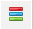
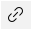

---
layout: default
title: Консоль команд
parent: Про PrintWizard
grand_parent: Документация
nav_order: 6
--- 

# Консоль команд печати

В каждом объекте, для которого существуют печатные формы, они как правило складываются в подменю "Печать". Внешний вид команд печати зависит от настроек заданных разработчиком (для встроенных печатных форм или внешних печатных форм) или настроек PrintWizard (если печатные формы разработаны при помощи конструктора).

Для управления составом подменю "Печать", доступностью кнопок, их положением в командной панели форм предназначена "Консоль команд печати". Для вызова консоли необходимо перейти в меню "PrintWizard" и в списке важных команд увидите соответствующую команду.

    
     Внешний вид консоли команд печати

{: .important-title }
> Настройка прав
> 
> Настройка консоли команд печати доступна только для пользователей с полными правами или включенной ролью: PrintWizard: Консоль команд или PrintWizard: Полные права. 
> Для того, чтобы подменю "Печать" было перестроено, необходимо повторно открывать целевую форму объекта. Например: если у пользователя была открыта форма списка для документа "Счет на оплату", изменение подменю "Печать" применится только при повторном открытии списка или формы документа.

Форма консоли разделена на две части:

* в левой стороне располагается дерево команд
* в правой стороне располагается форма настройки команды печати (для других пунктов оно будет пустым)

При открытии происходит построение дерева объектов, для которых могут существовать печатные формы. При этом, состав команд печати будет прочитан только при разврачивании соответствующей ветки дерева. Список команд выстраивается в том порядке, как он будет выглядеть в подменю "Печать".

Упорядочивание команд выполняется по соповокупности значений:
* важность (настройка консоли)
* порядок из настройки консоли
* порядок из конфигурации (или макета PrintWizard)
* заголовок

В дереве команд в правой части располагаются пиктограммы для подсказки пользователю:

| Пиктограмма | Пояснение |
|--|--|
|  | Пиктограмма важности команды |
|  | Признак наличия настроек команды |
|  | Признак наличия настроек доступа |
|  | Картинка печатной формы (PrintWizard или внешняя печатная форма). При наведении можно перейти к форме настройки печатной формы |
|  | Признак команды пакетной печати |

## Видимость команды

Видимость команды может быть отключена на уровне настройки в подсистеме БСП "Печать" ("Администрирование" - "Печатные формы, отчеты и обработки" - "Подменю "Печать""). Если команда отключена, это будет отображено в информационной панели (в шапке, чуть ниже заголовка текущей печатной формы). По гиперссылке "(перейти)" можно открыть форму из БСП и изменить текущую настройку.

Скрытые команды (на стороне БСП) имеют соответствующую пиктограмму в дереве консоли команд. При этом независимо от того, скрыта команда на уровне БСП или в настройке консоли (см. Отключить команду для всех) цвет текста такой строки - серый.

## Настройки команды

При активизации строки команды, в правой части формы консоли отобразятся поля для изменения настроек текущей команды. Рассмотрим настройки внимательнее:

* **Отключить команду для всех** - полностью отключает видимость команды для всех пользователей;
* **Видимость в формах** - список форм, для которых будет отображаться команда (список форм подбирается из метаданных, не обязательно, что на ней присутствует подменю Печати);
* **Назначение** - назначение формы, для списка или объекта. По сути этот функционал перекликается с настройкой "Видимость в формах";
* **Важность** - группировка команды печати в подменю, группы отделены горизонтальными разделителями:
  * **Важные** команды располагаются в самом верху;
  * **Обычные** располагаются в середине подменю;
  * **См. также** расположены в нижней части.
* **Сочетание клавиш** - сочетание клавиш для быстрого вызова команды. Возможность задать hotkey для команды. Сочетание клавиш может включать:
  * Ctrl - левый или правый Control;
  * Alt - левый или правый Alt;
  * Shift - левый или правый Shift;
  * клавиша - одна из допустимых клавиш:
    * 0-9 - цифры от 0 до 9 на основной части клавиатуры;
    * A-Z - буквы от A до Z;
    * Num0-Num9 - цифры от 0 до 9 на доп. части клавиатуры;
    * F1-F12 - специальные "функциональные" клавиши;
    * BackSpace, Space - удаление или пробел.
* **Формат сохранения** - формат сохранения печатной формы по умолчанию. Стандартная форма не открывается, печатная форма сразу преобразовывается в указанный формат. ВАЖНО: Для печатных форм в формате офисного документа (*.docx) настройка может быть задана, но будет проигнорирована;
* **Только во всех действиях** - расположение команды печати только в подменю "Еще" - "Печать". Возможность скрыть не самые актуальные команды.

## Настройка доступа

    
     Пример настройки доступа команды

В группе "Настройка доступа" располагается табличная часть, для задания настройки видимости команды по различным критериям:

* **Только пользователи** - отображать команду только для указанных пользователей;
* **Все пользователи, кроме** - отображать команду для всех пользователей, кроме указанных;
* **Только группа пользователей** - отображать команду только для пользователей, входящих в одну из указанных групп;
* **Все группы пользователей, кроме** - отображать команду для пользователей, не входящих в группы, указанные в списке;
* **Только роли** - отображать команду только для пользователей с одной из указанных ролей;
* **Все роли, кроме** - отображать команду для пользователей, у которых ни одна роль не входит в указанный список;
* **Только группы доступа** (!) - отображать команду только для пользователей, входящих в одну из указанных групп доступа;
* **Все группы доступа, кроме** (!) - отображать команду для пользователей, не входящих ни в одну из указанных групп доступа;
* **Только профили** (!) - отображать команду для всех пользователей, которым доступен хотя бы один из указанных профилей;
* **Все профили, кроме** (!) - отображать команду для пользователей, которым недоступен ни один из указанных профилей.

(!) - указанные настройки появляются только при наличии подсистемы **Управление доступом**.

Все настройки доступа комбинируются по условию "И", то есть если задано два условия, пользователь должен удовлетворять обоим, в таком случае команда будет отображена.

## Результат

В результате настройки, подменю печать будет обновлено (при следующем открытии формы целевого объекта). И может иметь вид, представленный на картинке ниже

    
     Вид подменю "Печать" после применения настроек консоли

