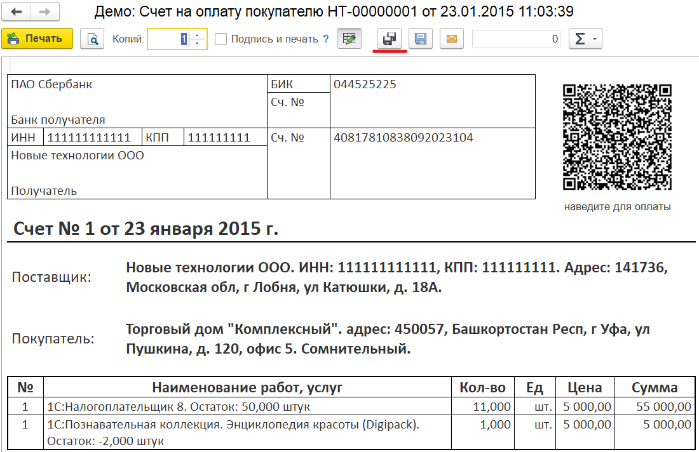
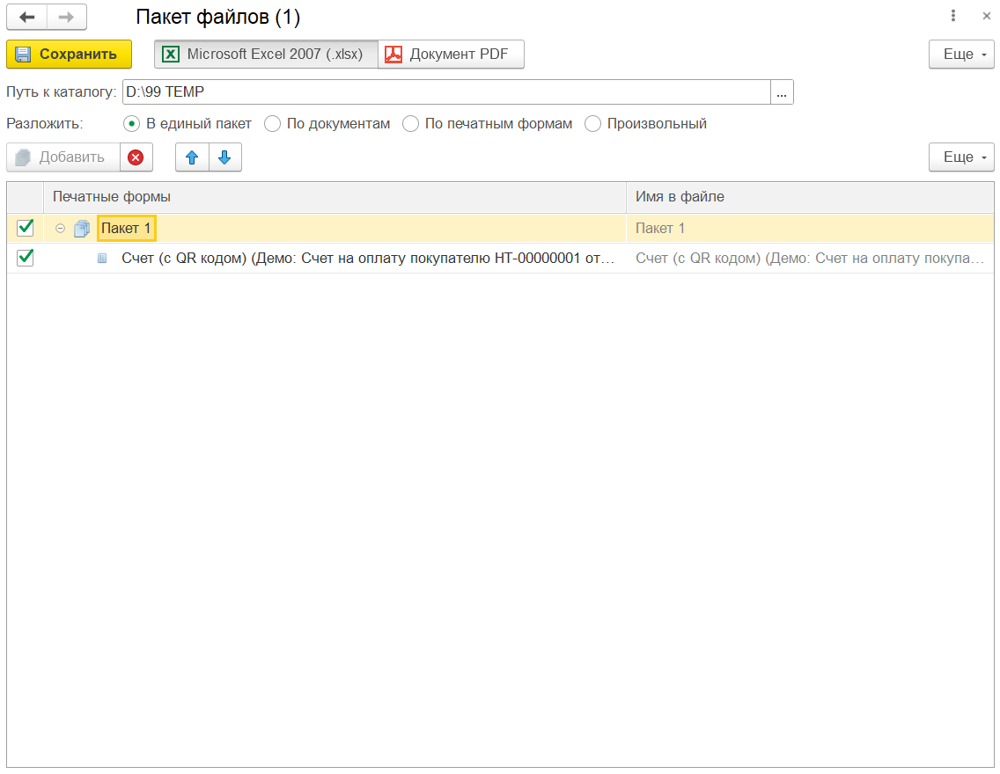
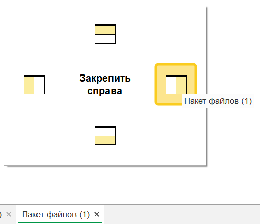
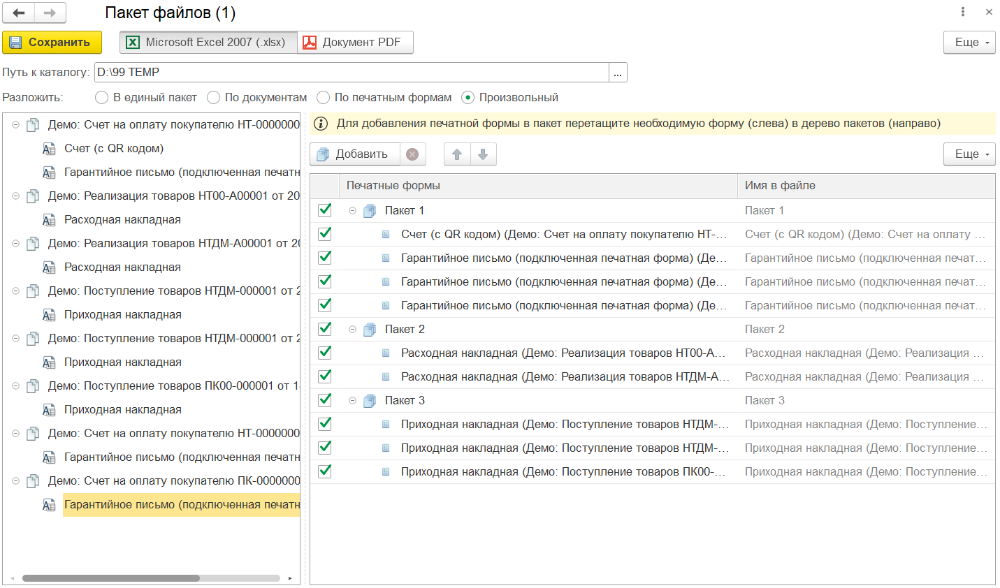
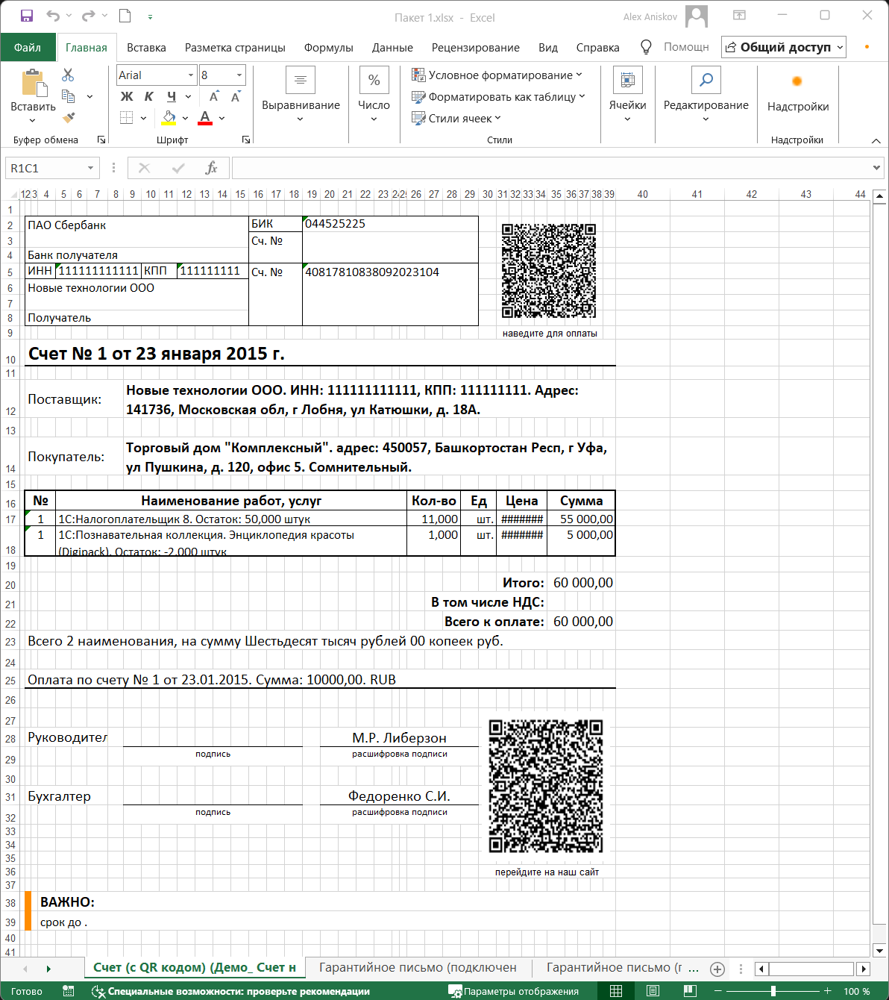

---
layout: default
title: Пакетное сохранение
parent: Устройство PrintWizard
grand_parent: Документация
nav_order: 19
--- 

# Пакетное сохранение
{: .no_toc }

  

    Содержание
  

  {: .text-delta }
1. TOC
{:toc}

{: .important-title }
> Предупреждение
>
> Пакетное сохранение доступно только для печатных форм в формате табличного документа.

В процессе формирования печатных форм из различных документов может понадобится собрать их в один или несколько многостраничных файлов.
Например:

* отправить контрагенту единый файл со счетом, заказом и спецификацией;
* отправить собрать в один файл все счет-фактуры по контрагенту, договору или организации.

Для того, чтобы сделать это удобно, в рамках единого окна 1С:Предприятие, PrintWizard добавляет специальный режим пакетного сохранения.

## Формирование пакета

Для формирования пакета, необходимо выполнить печать любой печатной формы, которую планируется добавить в пакет. Например, счет на оплату.

    
     Типовая форма вывода на печать

В основной командной панели рядом слева от стандартной кнопкой сохранения располагается кнопка пакетного сохранения. При ее нажатии будет открыта форма настройки пакета для сохранения. При этом, если уже есть открытая форма - печатная форма будет добавлена в уже открытую настройку пакета.

    
     Форма настройки пакета файлов

После открытия окна настройки пакета сохранения, рекомендуется его разместить справа от других окон, так будет удобнее настраивать.

    
     Форма расположения настройки

Для добавления новых печатных форм необходимо проделать следующие шаги:

* сформировать новую печатную форму, которую требуется добавить;
* в форме печати нажать на кнопку пакетного сохранения.

После того, как все печатные формы будут добавлены, необходимо:
* вернуться в форму пакетного сохранения;
* выбрать формат сохраняемого файла (Excel, PDF);
* указать каталог для сохранения пакетов;
* выбрать способ раскладки:
  * в единый пакет - все печатные формы будут добавлены в один файл. Каждая печатная форма на отдельной странице;
  * по документам - будет сформировано столько файлов, сколько различных документов есть среди печатных форм. Каждая печатная форма на отдельной странице;
  * по печатным формам - будет сформировано столько файлов, сколько различных макетов есть среди печатных форм. Каждый документ будет на отдельной странице;
  * произвольный - пользователь может в произвольном порядке разложить все печатные формы по файлам и страницам. При этом одна и та же печатная форма может быть использована в нескольких файлах;
* нажать на "Сохранить"

Если все выполнено верно, в указанном каталоге появятся файлы согласно настройке раскладки. А печатные формы будут разложены по страницам файлов.

    
     Результат настройки пакетов печати с раскладкой "Произвольный"

    
     Результат сохранения на примере одного из сформированных файлов

