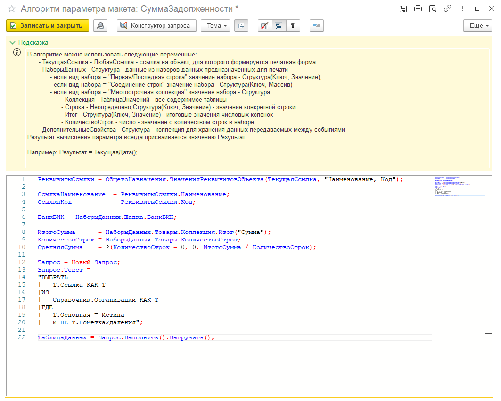
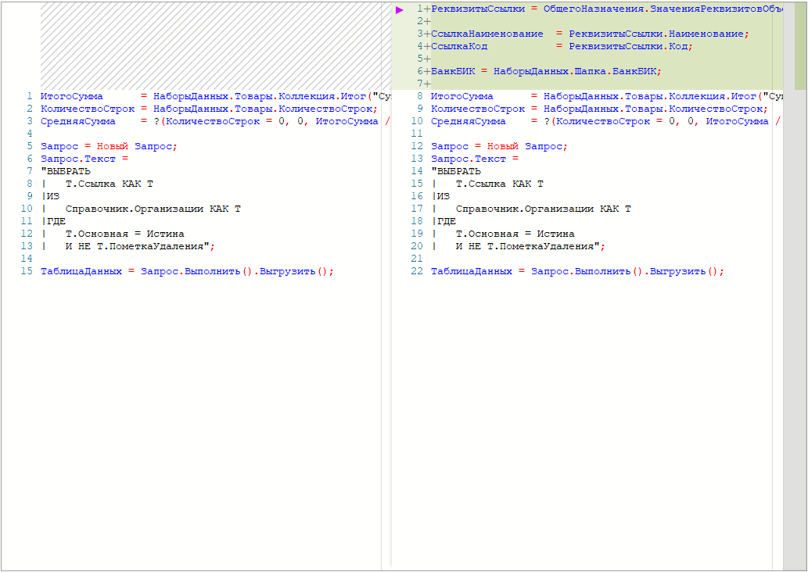
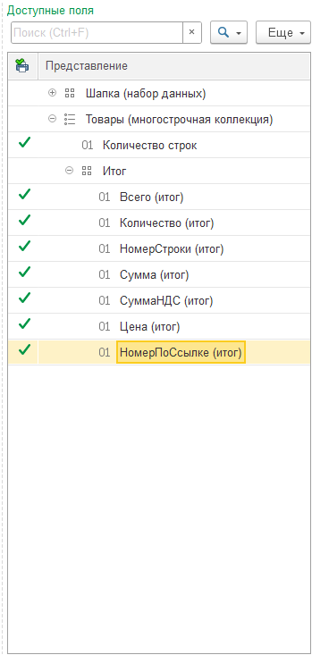
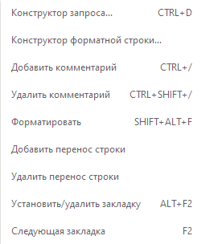
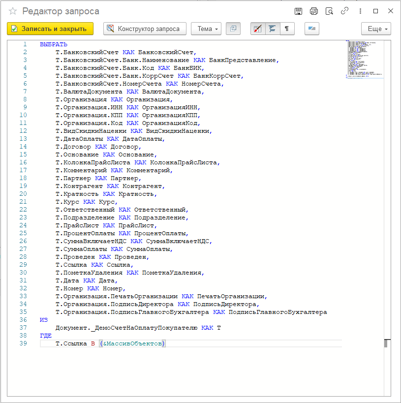

---
layout: default
title: Редактор кода
parent: Устройство PrintWizard
grand_parent: Документация
nav_order: 20
--- 

# Редактор кода

Для удобной работы с текстом запроса или программным кодом, в программу встроен специальный "редактор кода" (на основе [bsl_console](https://github.com/salexdv/bsl_console)). Данная консоль кода вызывается в разных местах, например:

* для редактирования текста запроса в макете
* для редактирования алгоритма вычисляемого поля в наборе
* для редактирования алгоритма значения параметра области
* для редактирования алгоритма расчета значения для QR-кода
* для редактирования алгоритма обработчика события
* для редактирования текста запроса в консоле запросов

Рассмотрим подробнее внешний вид редактора и его основные возможности.

## Внешний вид

Рассмотрим внимательнее интерфейс на примере редактирования параметра области "СуммаЗадолженности".

    
     Форма редактора кода

В верхней части формы расположена командная панель и подсказка по допустимым параметрам, которые могут быть использованы в процессе работы алгоритма.

Давайте подробнее рассмотрим все кнопки в командной панели

| Кнопка | Описание |
|--|--|
| 

  | Записать изменение и закрыть форму редактора |
| 

  | Открыть дерево доступных полей макета. Кнопка может отсутствовать |
| 

  | Вызов конструктора запросов |
| 

  | Переключение темы внешнего вида (светлая, темная) |
| 

  | Включить / выключить подсказку. По умолчанию включена |
| 

  | Включить / выключить карту кода. По умолчанию включена |
| 

  | Включить / выключить оформление текста запроса |
| 

  | Включить / выключить отображение табуляций и пробелов |
| 

  | Включить / выключить отображение строки состояния |
| 

 | Переключиться в режим сравнения с оригиналом |

Режим сравнения кода

    
     Режим сравнения кода

Дерево просмотра доступных полей

    
     Дерево доступных полей

По правой кнопке на поле редактора вызывается контекстное меню

    
     Контекстное меню

При редактировании текста запроса внешний вид практически не отличается

    
     Редактирование текста запроса

## Возможности редактора

* подсказка доступных параметров с учетом контекста редактируемого алгоритма
* подсветка синтаксиса 1С
* подсветка языка запросов
* автокомплит (подсказка) для метаданных (Справочники, Документы и т.д.)
* автокомплит (подсказка) для объектов метаданных (СправочникСсылка, ДокументОбъект и т.д.)
* подсказка параметров конструкторов и методов
* подсказка для типов
* вызов конструктора запроса и конструктора форматной строки
* сворачивание циклов, условий и текстов запросов
* всплывающие подсказки для глобальных функций, перечислений и классов
* подсказки через точку для реквизитов типа справочники/документы
* подсказки через точку для объектов типа ТаблицаЗначений/Массив/РезультатЗапроса/ДвоичныеДанные и др., в том числе для объектов, полченных через методы других объектов
* подсказки для источников и полей в режиме запроса

## Ссылки

* Инфостарт: [Консоль кода для управляемых форм](https://infostart.ru/1c/tools/1266087/)
* Github: [Репозиторий bsl_console](https://github.com/salexdv/bsl_console)