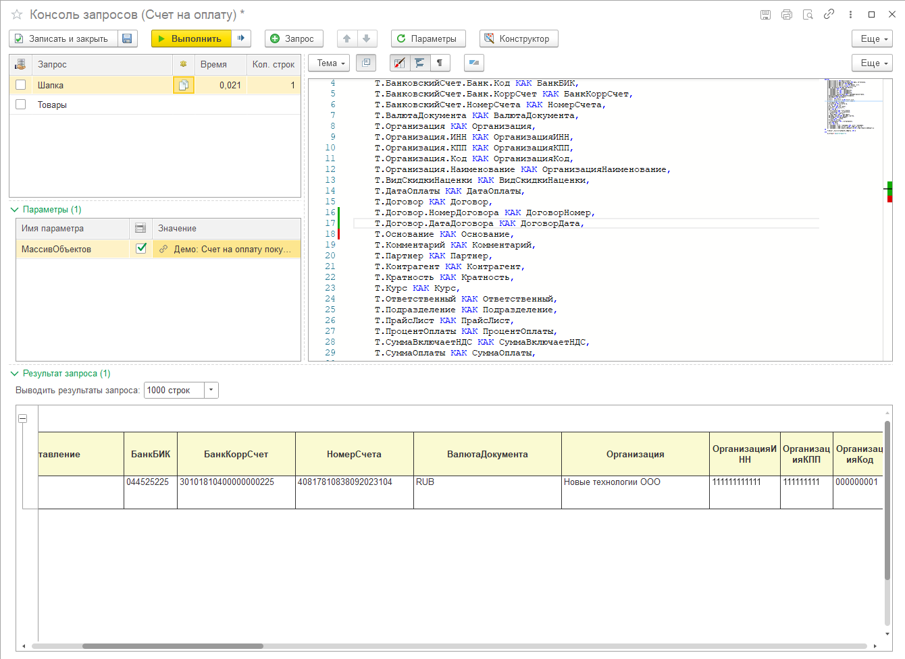
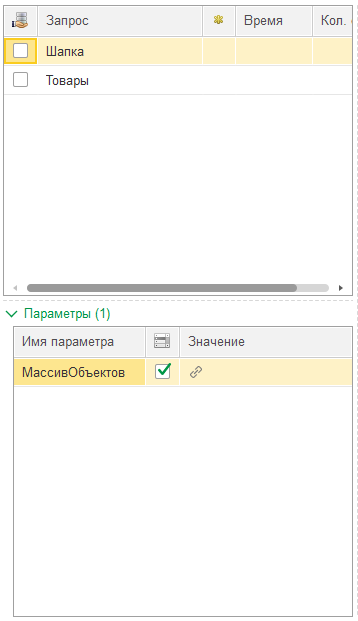
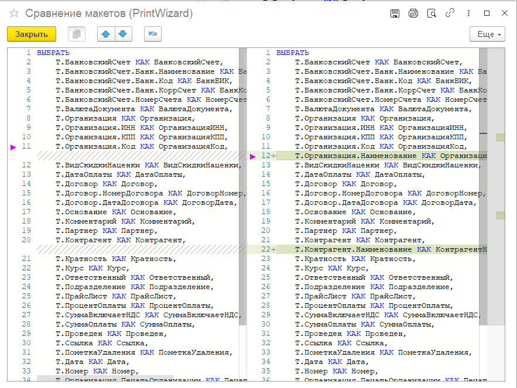
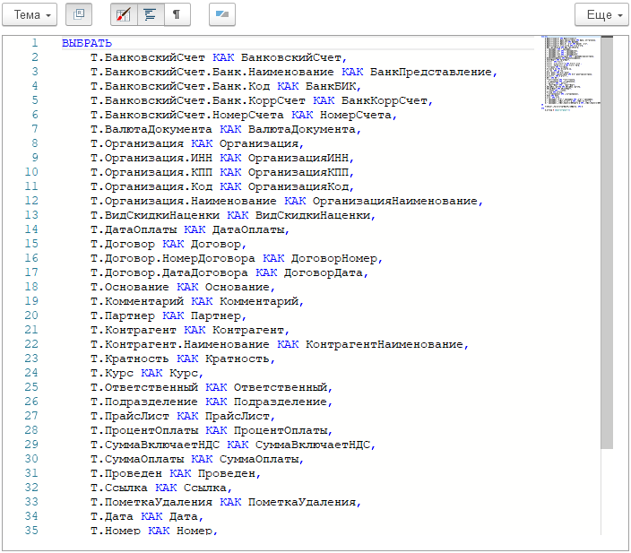
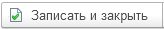
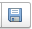
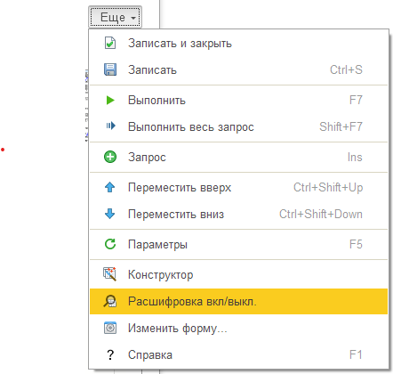

---
layout: default
title: Консоль запросов
parent: Устройство PrintWizard
grand_parent: Документация
nav_order: 21
--- 

# Консоль запросов

В конструкторе печатных форм встроена собственная консоль запросов. Основное предназначение консоли: редактирование запросов макета с возможностью просмотра результата сбора данных. Однако, консоль может быть использована самостоятельно.

Ключевая особенность консоли в том, что можно добавлять запросы во временные таблицы и эти врем. таблицы будут учитываться в следующих строках запросов.

То есть, например, если строка 1 это запрос ВТ_Организации (например: реквизиты справочника Организации), то в строке 2 запрос ВТ_Организации может быть использован. При этом в каждой строке запросов могут быть и свои временные таблицы, но их рекомендуется уничтожать после выполнения.

    
     Внешний вид консоли запросов

## Список запросов и параметров

В левой части расположено две таблицы Список запросов и параметры запроса

    
     Список запросов и параметров

Колонки таблицы запросов

| Колонка | Описание |
|--|--|
| Это общий запрос  | Признак, что запрос не привязан к массиву объектов печати |
| Запрос            | Имя запроса. Используется для удобной идентификации пользователем |
| Наличие изменений | Признак наличия изменений относительно исходного запроса. При нажатии открывается отдельное окно сравнения |
| Время             | Время выполнения запроса. Вычисляется после выполнения |
| Количество строк  | Количество строк в запросе. Для временных таблиц может быть равно 1, если выполнен расчет без развертки временных таблиц |

    
     Сравнение текста с оригиналом

Колонки таблицы параметров запросов

| Колонка | Описание |
|--|--|
| Имя параметра       | Имя параметра запроса, как оно задано в запросе |
| Это список значений | Признак, что значение параметра - это список |
| Значение            | Значение параметра запроса |

Параметры запросов обновляются по кнопке в командной панели формы.

## Текст запроса

Справа от таблиц запросов и параметров расположено поле для редактирования текста запроса. При наличии технической возможности используется поле [редактора кода](./ch_01_20.html). Для веб-клиента отображается обычное текстовое поле без расширенных возможностей редактирования и подсветки.

    
     Редактор запроса

## Командная панель формы

| Команда | Описание |
|--|--|
| 

 | Записать изменения запросов в макет и закрыть консоль. Существует только если консоль открыта из макета |
| 

 | Записать изменения запросов в макет. Существует только если консоль открыта из макета |
| 

 | Выполнить текущий запрос и показать результат |
| 

 | Выполнить текущий запрос с отображением информации по временным таблицам |
| 

 | Добавить строку запроса |
| 

 | Перемещение строк запроса |
| 

 | Обновить параметры запросов |
| 

 | Открыть форму конструктора запроса |

## Результат запроса

При выполнении запроса результат отображается в таблице под списком запросов и текстом запроса. По умолчанию в форме табличного документа с результатом расшифровка по двойному клику недоступна. Однако, если включить сохранение расшифровки, то содержимое таблицы можно будет открыть

    
     Кнопка включения расшифровки (подменю "Еще")

