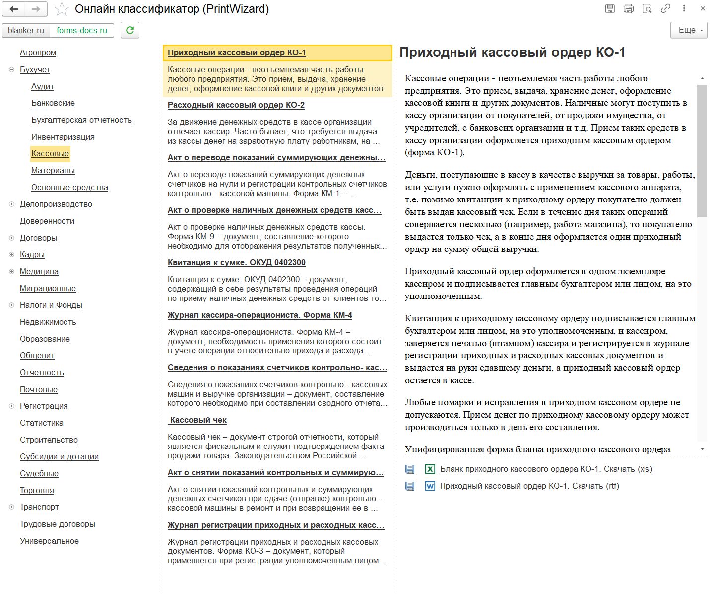

---
layout: default
title: Онлайн-классификатор
parent: Устройство PrintWizard
grand_parent: Документация
nav_order: 22
--- 

# Онлайн классификатор

В конструкторе печатных форм существует функционал доступа к онлайн-классификаторам различных печатных форм и других макетов документов.

    
     Внешний вид классификатора

В верхней части формы расположен переключатель между источниками данных.

Основная часть формы разделена на три части:

* левая часть - содержание классификатора. При нажатии данные могут быть развернуты, а также обновляется центральная часть;
* центральная часть - перечень печатных форм и других документов доступных в разделе. При нажатии обновляется правая часть;
* правая часть - описание выбранной печатной формы, доступные макеты для скачивания.

Классификатор носит вспомогательный характер, позволяет найти различные печатные формы, ознакомиться с информацией о печатной форме и скачать ее шаблоны.