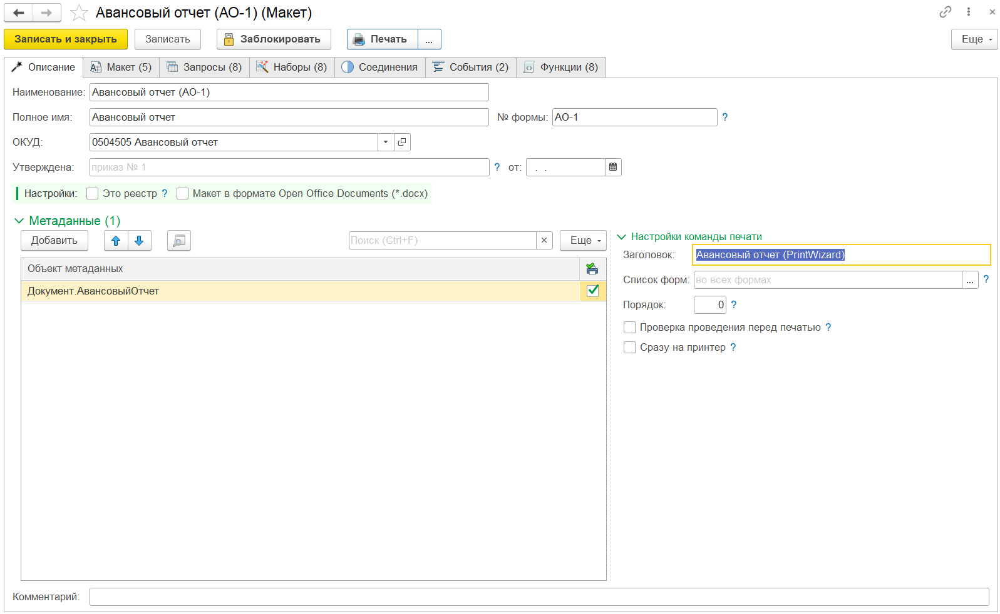

# Глава 2. Настройка макета конструктора
{: .no_toc }

  

    Содержание
  

  {: .text-delta }
1. TOC
{:toc}

## Форма макета

    
     Основная форма макета

Основная форма макета имеет 6 закладок:

| Имя закладки | Назначение закладки |
|--|--|
| [Описание][1]   | Основная информация о макете, базовая настройка, объекты и команды печати |
| [Запросы][2]    | Запросы основной информации и параметры запроса |
| [Наборы][3]     | Наборы данных и дополнительные поля для использования в макете |
| [Соединения][4] | Соединения наборов данных |
| [Макет][5]      | Настройка макета печатной формы, областей и параметров |
| [События][6]    | Алгоритмы обработчиков событий макета конструктора |

## Командная панель

Основная командная панель формы содержит типовые команды для справочника 1С (записать и закрыть, перечитать, скопировать, пометить на удаление и т.д.). Дополнительно добавлены команды:

* **Заблокировать**. Блокировка макета для изменений. После блокировки печатная форма становится доступной для пользователей (добавляется команда печати). Дальнейшую разработку рекомендуется выполнять с применением механизма [образов для разработки][7];
* **Обмен макетами** -> **Выгрузить в файл**. Команда для выгрузки макета в файл специализированного формата *.pdwx. Данный формат может быть использован для обмена между программами или сохранением резервной копии макета. Подробнее с форматом можно ознакомиться в [данном описании][8];
* **Обмен макетами** -> **Загрузить из файл**. Команда для загрузки макета из файла формата *.pdwx. Следует учитывать, что загрузка возможна только из совместимых форматах. Как правило форматы совместимы, если 1я цифра версии совпадает;
* **Экспорт во внешнюю обработку**. Команда для экспорта печатной формы в формате внешней обработки для подключения к конфигурации в качестве внешней печатной формы. Для исполнения внешней печатной формы требуется полная или упрощенная версия конструктора. Упрощенная версия конструктора может быть получена так же в данной обработке.

[1]: ch_02_03.html
[2]: ch_02_04.html
[3]: ch_02_05.html
[4]: ch_02_06.html
[5]: ch_02_07.html
[6]: ch_02_15.html
[7]: ch_02_17.html
[8]: ../convert/pw_template_file.html