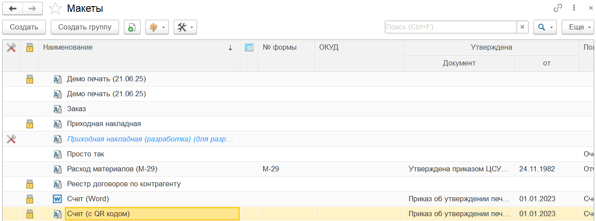

---
layout: default
title: Список макетов
parent: Настройка макета
grand_parent: Документация
nav_order: 2
--- 

# Список макетов
{: .no_toc }

  

    Содержание
  

  {: .text-delta }
1. TOC
{:toc}

Макеты расширения PrintWizard хранятся в справочнике "Макеты (PrintWizard)". Справочник располагается в основном меню "PrintWizard". Для доступа к справочнику необходимо наличие одной из роли "PrintWizard: Редактирование" (или полные права).

## Форма списка

    
     Форма списка справочника "Макеты (PrintWizard)"

Подробнее рассмотрим колонки формы списка

| Колонка | Описание |
|--|--|
|  | Пиктограмма макета, который является [образом для разработки][1] |
|  | Пиктограмма заблокированного макета |
| Наименование | Краткое представление печатной формы. Пиктограмма слева от наименоания указывает на формат печатной формы (табличный или офисный документ) |
|  | Пиктограмма печатной формы в виде реестра (Это реестр) |
| № формы | Номер унифицированной формы или внутренний локальный номер |
| ОКУД | Номер формы по общероссийскому классификатору управленческой документации |
| Утверждена - Документ | Представление документа, которым утверждена печатная форма (внешний или внутренний локальный документ) |
| Утверждена - от | Дата документа, которым утверждена печатная форма |
| Полное наименование | Полное наименование печатной формы |
| Комментарий | Произвольный комментарий к печатной форме |

## Командная панель

Командная панель формы содержит стандартные команды для формы списка справочника платформы 1С (создать, скопировать, изменить и т.д.). Дополнительно добавлены команды:

* **Экспорт во внешнюю обработку**. Команда для экспорта печатной формы в формате внешней обработки для подключения к конфигурации в качестве внешней печатной формы. Для исполнения внешней печатной формы требуется полная или упрощенная версия конструктора. Упрощенная версия конструктора может быть получена так же в данной обработке

[1]: ch_02_17.html