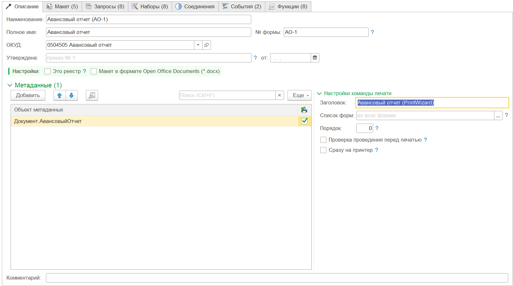

---
layout: default
title: Описание
parent: Настройка макета
grand_parent: Документация
nav_order: 3
--- 

# Описание
{: .no_toc }

  

    Содержание
  

  {: .text-delta }
1. TOC
{:toc}

Основная закладка формы макета печатной формы "Описание" содержит набор реквизитов для идентификации печатной формы в списке, основные настройки, источник данных и настройки команды печати.

    
     Вид закладки "Описание"

## Реквизиты

| Реквизит | Описание |
|--|--|
| Наименование | Краткое представление печатной формы |
| Полное имя | Полное наименование печатной формы |
| № формы | Номер унифицированной формы или внутренний локальный номер |
| ОКУД | Номер формы по общероссийскому классификатору управленческой документации |
| Утверждена | Представление документа, которым утверждена печатная форма (внешний или внутренний локальный документ) |
| от | Дата документа, которым утверждена печатная форма |
| Комментарий | Произвольный комментарий к печатной форме |

## Настройки

Основные настройки определяют поведение печатной формы.

* **Это реестр**. Печатные формы могут быть сформированы сразу для нескольких документов (и др. объектов). При этом каждая печатная форма будет сформирована для отдельного объекта. То есть 1 печатная форма = 1 объект. Но в некоторых случаях надо вывести печатную форму в виде журнала. Например: журнал кассовых документов. В таком случае, печатная форма будет сформирована одна на все переданные объекты. Для переключения режима формирования печатной формы в форму реестра (журнала) предназначена данная настройка.

* **Макет в формате Opеn Office Documents (*.docx)**. По умолчанию все печатные формы предполагается формировать в виде табличного документа. При этом, когда печатная форма предполагается в формате офисного документа (docx) необходимо включить данную настройку. При этом изменится пиктограмма и внешний вид закладки [Макет][1]. 

{: .important-title }
> Важная информация
> 
> Формирование печатной формы в формате офисного документа не требует внешних компонент, не зависит от операционной системы и версии библиотеки стандартных подсистем встроенной в конфигурацию. Однако, в силу особенностей реализации, большие документы (с количеством страниц > 10) могут формироваться от 1 до нескольких минут.

## Метаданные

В разделе "Метаданные" указываются объекты, используемые в качестве основных источников данных печатной формы. Например: в приведенном примере для печатной формы источником служит документ "_ДемоСчетНаОплатуПокупателю".

Напротив каждого объекта устанавливается признак необходимости добавления команды для формирования печатной формы.

{: .note-title }
> Информация
>
> Команда для печати будет добавлена автоматически при открытии формы списка (или объекта) источника данных. Но макет необходимо заблокировать от изменений.

### Настройки команды печати

| Реквизит | Описание |
|--|--|
| Заголовок | Представление команды печати. Если не заполнен наследуется из наименования |
| Идентификатор | Идентификатор команды печати. используется при формировании печатной формы для идентификации макета. Рекомендуется использовать уникальные имена, как минимум в рамках одного источника. |
| Список форм | Список форм для которых будет доступна печатная форма. Если не указана, то для всех форм (списка и объекта) |
| Порядок | Номер порядка расположения команды |
| Проверка проведения перед печатью | Необходимость проверки проведения документа, перед формированием печатной формы |
| Сразу на принтер | Вывод печатной формы сразу на принтер, без предварительного просмотра |

[1]: ./ch_02_07.html

