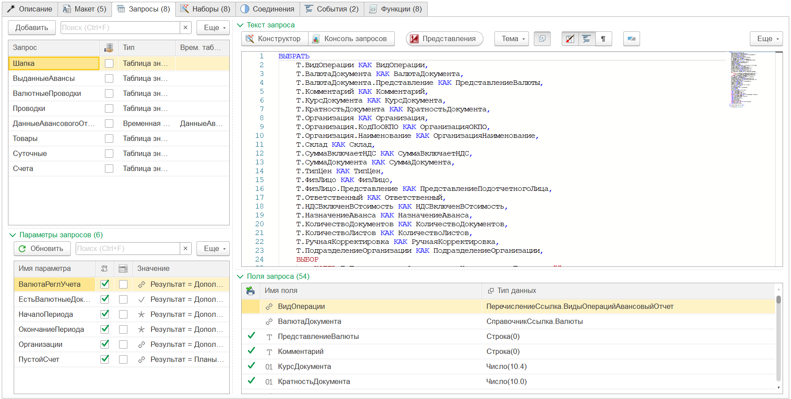
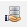
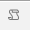
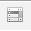
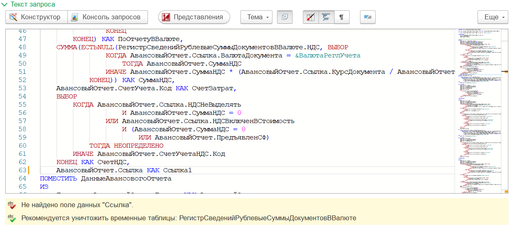

---
layout: default
title: Запросы
parent: Настройка макета
grand_parent: Документация
nav_order: 4
--- 

# Запросы
{: .no_toc }

<details open markdown="block">
  <summary>
    Содержание
  </summary>
  {: .text-delta }
1. TOC
{:toc}
</details>

Запросы - ключевая составляющая будущей печатной формы. Именно запросы определяют данные, которые в дальнейшем могут быть использованы.

<p align="center">
    
    <br>Вид закладки "Запросы"
</p>

Форма закладки "Запросы" разделена на две части:
* в левой части расположены список запросов и параметры устанавливаемые в запросы
* в правой части расположены текст запроса и список полей, которые будут получены из запросов

## Список запросов

При подготовке данных для печатной формы как правило требуется получить информацию из различных источников: реквизитов шапки, табличных частей, движений документов, остатков или оборотов по регистрам. При этом анализ пакетного запроса (когда в одном запросе будут получены сразу все необходимые данные), достаточно трудоемкий процесс. 

Интерфейс конструктора предусматривает возможность разделить сбор данных на отдельные запросы и дать каждому запросу имя. Запрос не обязательно должен возвращать готовые данные (в виде таблицы). В результате выполнения запроса можно получить временную таблицу, которая будет использована в следующих запросах.

Например: в печатной форме "Перемещение ТМЦ на МОЛ" необходимо напротив каждой позиции материалов (которые были перемещены), показать текущий остаток материалов за материально-ответственным лицом. Чтобы получить данные по остаткам, необходимо выполнить запрос:

```
ВЫБРАТЬ РАЗЛИЧНЫЕ
	_ДемоПеремещениеТоваровТовары.Номенклатура КАК Номенклатура,
	_ДемоПеремещениеТоваровТовары.Ссылка.МестоХраненияПриемник КАК МОЛ
ПОМЕСТИТЬ ВТ_Товары
ИЗ
	Документ._ДемоПеремещениеТоваров.Товары КАК _ДемоПеремещениеТоваровТовары
ГДЕ
	_ДемоПеремещениеТоваровТовары.Ссылка В(&МассивОбъектов)
;

////////////////////////////////////////////////////////////////////////////////
ВЫБРАТЬ
	Т.Номенклатура КАК Номенклатура,
	Т.МестоХранения КАК МОЛ,
	Т.КоличествоОстаток КАК Остаток
ПОМЕСТИТЬ ВТ_Остатки
ИЗ
	РегистрНакопления._ДемоОстаткиТоваровВМестахХранения.Остатки(
			,
			(Номенклатура, МестоХранения) В
				(ВЫБРАТЬ
					Т.Номенклатура,
					Т.МОЛ
				ИЗ
					ВТ_Товары КАК Т)) КАК Т
;

УНИЧТОЖИТЬ ВТ_Товары
```

Рассмотрим подробнее данный запрос:
* сначала выбираем все различные сочетания Номенклатура + МОЛ из документов, которые выбрали для печати (`&МассивОбъектов`). Результат помещаем в `ВТ_Товары`
* затем выбираем остатки из регистра `_ДемоОстаткиТоваровВМестахХранения` (без указания даты, то есть на текущий момент), по условию что Номенклатура + МестоХранения находятся в таблица `ВТ_Товары`. Результат помещаем в `ВТ_Остатки`
* уничтожаем временную таблицу `ВТ_Товары`. Ее дальнейшее использование не планируется. Если нам понадобится эта ВТ далее, то следует ее создать также, отдельной строкой перед данным запросом

Таким образом, в результате выполнения данного запроса мы получим временную таблицу `ВТ_Остатки` с данными по текущим остаткам Номенклатура + МестоХранения. В дальнейшем мы можем данную временную таблицу использовать в запросе к табличной части Товары документов перемещения.

```
ВЫБРАТЬ
	Товары.Ссылка КАК Ссылка,
	Товары.НомерСтроки КАК НомерСтроки,
	Товары.Номенклатура КАК Номенклатура,
	Товары.Количество КАК Количество,
	ЕСТЬNULL(ВТ_Остатки.Остаток, 0) КАК Остаток
ИЗ
	Документ._ДемоПеремещениеТоваров.Товары КАК Товары
		ЛЕВОЕ СОЕДИНЕНИЕ ВТ_Остатки КАК ВТ_Остатки
		ПО (Товары.Номенклатура = ВТ_Остатки.Номенклатура)
			И (Товары.Ссылка.МестоХраненияПриемник = ВТ_Остатки.МОЛ)
ГДЕ
	Товары.Ссылка В(&МассивОбъектов)
```

Рассмотрим колонки таблицы запросов

| Колонка | Описание |
|--|--|
|  | Признак "Это общий запрос". Данный запрос не содержит ключевого поля "Ссылка" |
| Запрос | Имя запроса для идентификации на закладке Наборы |
| Тип результата | Тип результата получаемых данных (Временная таблица, Таблица значений) |
| Врем. таблица | Имя временной таблицы запроса (только для типа Временная таблица) |

### Общий запрос 

Подробнее остановимся на признаке "Это общий запрос". Как упоминалось ранее если не установлен признак "Это реестр" (см. [Настройки][1] закладки "Описание") в результате 1 печатная форма будет сформирована на 1 объект исходных данных (ссылку). Однако, не все запросы возможно (или целесообразно) собирать в привязке к ссылке источника печатной формы. В вышеуказанном примере остатки номенклатуры по МОЛ в принципе не привязаны ни к одной ссылке документа источника (Перемещение). При этом, во избежании ошибок, конструктор контролирует наличие ключевого поля "Ссылка" и отбора по ключевому полю. При наличии ошибок выводится соответствующее предупреждение. Признак "Это общий запрос" создан специально, чтобы программа понимала, что данный запрос может не содержать поле "Ссылка" и его данные являются "общими".

{: .note-title }
> Примечание
> 
> Общий запрос может содержать поле "Ссылка" и отбор на `&МассивОбъектов`. Результатом запроса может быть любой (временная таблица или таблица значений).

## Параметры запросов

Под табличной частью со списком запросов располагается табличная часть для установки параметров, которые были использованы в запросе. Для заполнения списка, необходимо чтобы параметры были объявлены в запросах, а также необходимо нажать кнопку "Обновить". Список параметров общий для всех запросов.

Рассмотрим колонки таблицы параметров

| Колонка | Описание |
|--|--|
| Имя параметра | Имя параметра как оно задано в тексте запроса |
|  | Значение параметра задано в виде программного алгоритма |
|  | Значение параметра задано в виде списка значений |
| Значение | Представление установленного значения параметра (или алгоритма) |

Значением параметра может быть произвольное значение простого типа (число, дата, строка, булево), значение ссылочного типа (справочники, документы и т.д.), а также список данных значений. Но в некоторых случаях значение необходимо вычислять. Например, необходимо подставлять в запрос текущую дату. В таком случае, необходимо переключить значение на тип "Программный алгоритм" (колонка 2) и задать алгоритм вычисления значения. Например:

```
Результат = ТекущаяДатаСеанса();
```

Результат вычисления всегда должен быть присвоен переменной `Результат`. Более подробное описание представлено в форме редактирования алгоритма.

### Параметр &МассивОбъектов

Формирование печатных форм происходит для определенного списка объектов, выбранных пользователем (например документов, элементов справочника и т.п.). Пользователь может формировать печатную форму для 1 объекта или сразу для нескольких. Разработку печатных форм, рекомендуется с учетом того, что ссылок будет более одной.

Все выбранные ссылки будут переданы в виде массива в предопределенный параметр `&МассивОбъектов`. Данный параметр не отбражается в макете конструктора. Однако при переходе в консоль он появится и необходимо будет указать значения для отбора при выполнении запросов.

## Текст запроса

Справа от списка запросов располагается текст запроса соответствующий текущей строка табличной части "Запросы". При изменении активной строки текст запроса переключается. Под полем редактирования текста запроса могут находится информационные поля с описанием ошибок и рекомендаций по текущему запросу.

<p align="center">
    
    <br>Поле редактирования текста запроса
</p>

Над полем редактирования текста запроса располагаются кнопки перехода к вспомогательным инструментам:

* конструктор запросов
* [редактор кода][2] (недоступна для веб-клиента)
* [консоль запросов][3]

Для редактирования текста запросов рекомендуется использовать конструктор запросов и другие инструменты. Это снизит вероятность ошибок и позволит выполнять разработку в более комфортных условиях.

## Поля запроса

Под текстом запроса располагается информация о полях, которые будут получены в результате выполнения запроса (во временную таблицу или таблицу значений). В таблице отмечены поля, которые имеют простой тип и рекомендованы для использования в печатной форме (первая колонка). 

По двойному клику на колонке "Тип данных" можно открыть отдельное окно с деревом типов данных входящих в поле. Это может быть полезно, если количество типов достаточно большое (например поля регистров или субконто).

[1]: ./ch_02_03.html#настройки
[2]: ./ch_01_20.html
[3]: ./ch_01_21.html