---
layout: default
title: Наборы
parent: Настройка макета
grand_parent: Документация
nav_order: 5
--- 

# Наборы
{: .no_toc }

<details open markdown="block">
  <summary>
    Содержание
  </summary>
  {: .text-delta }
1. TOC
{:toc}
</details>

Наборы - это коллекции с данными конкретного объекта (и общих запросов) сформированные в момент подготовки печатной формы по конкретному объекту. Для печатных форм с признаком "Это реестр", набор данных аналогичен всем данным полученным из запросов. Данные наборов могут быть сформированы из результатов запросов или из результата выполнения алгоритма.

<p align="center">
    <a href="./../img/ch_02/12_page3.png">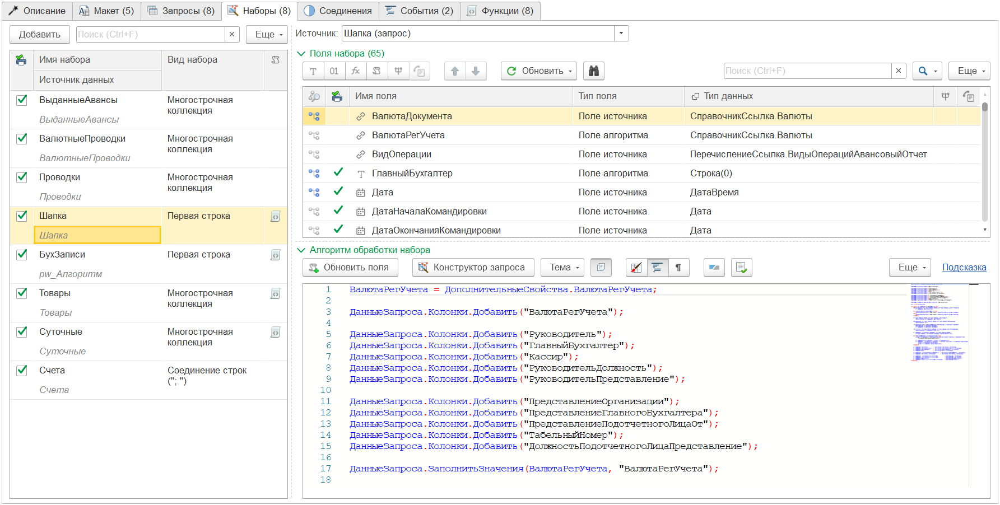</a>
    <br>Вид закладки "Наборы"
</p>

Форма закладки "Наборы" разделена на две части:
* в левой части расположен список наборов
* в правой части расположен список полей текущего активного набора

## Список наборов

По умолчанию список наборов создается на основании данных закладки "Запросы". В дальнейшем при изменении состава запросов данные наборов синхронизируются. То есть добавление или удаление запроса приводит к изменению наборов. Однако, если из запроса удалено поле, которое используется в макете (наборе, соединениях, параметрах) поле в наборе не будет удалено автоматически. Изменится пиктограмма связи поля и цвет текста (на красный).

Рассмотрим подробно колонки таблицы "Наборы"

| Колонка | Описание |
|--|--|
| 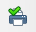 | Признак доступности набора для использования в параметрах печатной формы |
| Имя набора | Пользовательское представление набора |
| Источник данных | Имя источника данных (имя запроса или алгоритма) |
| Вид набора | Способ формирования коллекции данных набора для использования в печатной форме |
| 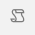 | Признак наличия алгоритма обработки набора данных |

### Источник данных

Источником данных для набора (как упоминалось выше) может выступать результат запроса или произвольный алгоритм (источник = pw_Алгоритм). 

Таблицы сформированные при помощи алгоритма (без запроса в основе) должны быть подготовлены полностью в самом коде. Поля набора при этом необходимо добавить вручную. Если в таком наборе будет присутствовать поле "Ссылка", конструктор будет рассматривать данное полекак ключевое, для отбора при подготовке данных конкретной печатной формы (по каждой ссылке).

### Обработка набора

Если набор создан из источника "Произвольный алгоритм", то необходимо заполнить алгоритм создания набора данных. Однако и наборы, созданные из источника "Запрос" могут быть доработаны произвольным алгоритмом. Для задания кода алгоритма, необходимо дважды кликнуть на ячейку колонки признака наличия алгоритма и в окне редактора создать алгоритм обработки. 

### Вид набора

Все наборы по умолчанию имеют вид "Многострочная коллекция", то есть по сути таблица. Вывод в печатную форму многострочных коллекций возможен только в виде таблицы. При этом, если нам необходимо добавить значение отдельного реквизита в шапку или другую область (не являющуюся таблицей) необходимо изменить вид набора.

Набор данных может иметь следующий вид:

* первая строка
* последняя строка
* многострочная коллекция
* соединение строк (через ";")

#### Первая, последняя строка

Рассмотрим пример. Запрос реквизитов шапки документа выглядит следующим образом:

```
ВЫБРАТЬ
  Т.Ссылка КАК Ссылка,
  Т.Номер КАК Номер,
  Т.Дата КАК Дата
ИЗ
  Документ.МойДокумент КАК Т
ГДЕ
  Т.Ссылка В (&МассивСсылок)
```

Если пользователь выбрал 3 документа для формирования печатных форм, то результат выполнения данного запроса будет иметь следующий вид:

| Ссылка | Номер | Дата |
|--|--|--|
| Мой документ № 1 от 01.01.2023 | 1 | 01.01.2023 |
| Мой документ № 2 от 02.01.2023 | 2 | 02.01.2023 |
| Мой документ № 3 от 03.01.2023 | 3 | 03.01.2023 |

Для каждого документа, в приведенной таблице, существует только одна строка с данными. Чтобы использовать реквизиты данной строки необходимо преобразовать данные из "горизонтального" вида в "вертикальный". Для этого необходимо изменить вид набора.

В приведенном примере нет значения первая или последняя строка будет использована для набора. В любом случае строка будет преобразована в структуру вида:

* Ссылка: Мой документ № 1 от 01.01.2023
* Номер: 1
* Дата: 01.01.2023

Такой набор данных будет доступен в областях со спобом вывода "Без повторений" или "Перенос строки".

#### Соединение строк

В некоторых случаях необходимо выполнить "сворчивание" таблицы в одну строку. 

Например. У нас есть запрос Товары

| Ссылка | Номенклатура | Количество |
|--|--|--|
| Мой документ № 1 от 01.01.2023 | Товар 1 | 10 |
| Мой документ № 1 от 01.01.2023 | Товар 2 | 10 |

Допустим нам необходимо вывести в шапке документа в одну строку всю номенклатуру из табличной части. В таком случае мы можем использовать вид набора "Соединение строк". В этом случае в набор будет "свернут" по ссылке и преобразован в вертикальную структуру (для документа № 1):

* Ссылка: Мой документ № 1 от 01.01.2023
* Номенклатура: Товар 1; Товар 2
* Количество: 10; 10

Поле "Количество" мы можем удалить, эти данные нас не интересуют.

#### Многострочная коллекция

Многострочная коллекция нужна для вывода табличных частей или когда набор содержит несколько строк на одну печатную форму.

## Поля набора

При активизации строки набора, в правой части отображается таблица полей набора. Рассмотрим подробнее колонки таблицы:

| Колонка | Описание |
|--|--|
| 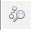 | Вид связи поля с данными макета |
| 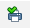 | Признак простого типа поля, рекомендуется к использованию в печатной форме |
| Имя поля | Имя поля для идентификации пользователем |
| Тип поля | Тип поля, определяет источник получения данных для поля |
| Тип данных | Представление типа данных значения поля |
| 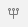 | Признак возможного наличия доп. реквизитов или свойств (подсистема "Свойства" БСП 1С) |
|  | Признак возможного наличия контактной информации (подсистема "Контактная информация" БСП 1С) |

Над табличной частью располагается командная панель. По умолчанию в ней находятся команды управления табличной частью. Дополнительно добавлены команды:

| Команда | Описание |
|--|--|
|  | Добавить в набор поле с типом "Поле представления" |
| 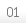 | Добавить в набор поле с типом "Поле нумератора" |
| 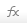 | Добавить в набор поле с типом "Вычисляемое поле" |
|  | Добавить в набор поле с типом "Поле алгоритма" |
| 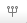 | Добавить в набор поле с типом "Поле свойства" |
|  | Добавить в набор поле с типом "Поле конт. инф." |
| Обновить - Из запроса | Обновить поля набора из существующего запроса |
| Обновить - Из набора | Обновить поля набора из существующего набора |
| Обновить - Наличие связей | Обновить пиктограмму наличия связей полей наборов в макете |
| Обновить - Наличие свойств и конт. инф. | Обновить признак наличия доп. реквизитов (свойств) и контактной информации полей набора (или всех наборов) |
| 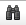 | Вывести в поле сообщения подробную информацию о связи поля с другими данными макета |

### Типы полей набора

#### Поле источника

По умолчанию, наборы созданные на основании запроса автоматически обновляются полями из запроса. Для таких полей устанавливается тип "Поле источника". Изменить что-либо для данного поля невозможно, поскольку оно унаследовано из запроса.

#### Поле алгоритма

Если набор создан на основе произвольного алгоритма или имеет алгоритм обработки доступно создание полей с типом "Поле алгоритма". Для данного поля разработчик должен указать имя и тип данных поля.

#### Поле представления

В некоторых случаях нам необходимо произвести соединение значений различных колонок в одно поле. Например чтобы вывести поле с наименованием организации, ИНН, КПП и адресом. Подобное поле можно создать в запросе. Но намного удобнее реализовать это в поле набора данных при помощи специального конструктора представления.

<p align="center">
    <a href="./../img/ch_02/24_p3_strwizard.png">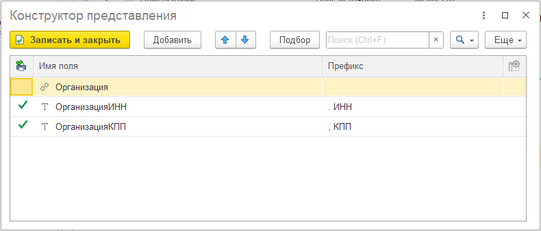</a>
    <br>Конструктор представления
</p>

В конструкторе представления можно использовать поля из вышестоящих наборов. При этом можно задать префикс, который будет предшествовать значению поля. А также настроить [форматирование значения поля][1].

При этом, если значение поля в момент формирования печатной формы будет пустым, префикс не будет выведен. В приведенном примере, если КПП не указан, то префикс ", КПП " не будет добавлен с результирующую строку.

#### Поле нумератора

В некоторых случаях необходимо выполнить собственную нумерацию строк табличной части. Например, допустим у нас есть таблица:

| № | ВидНоменклатуры | Номенклатура | Количество |
|--|--|--|--|
| 1 | Чайники | Tefal | 1 |
| 2 | Чайники | Brown | 1 |
| 3 | Чайники | Siemens | 1 |
| 4 | Кофеварки | Tefal | 1 |
| 5 | Кофеварки | Siemens | 1 |

Нам необходимо добавить колонку с номером внутри вида. Добавим поле нумератора "НомерПоВиду" с настройкой

<p align="center">
    <a href="./../img/ch_02/25_p3_numwizard.png">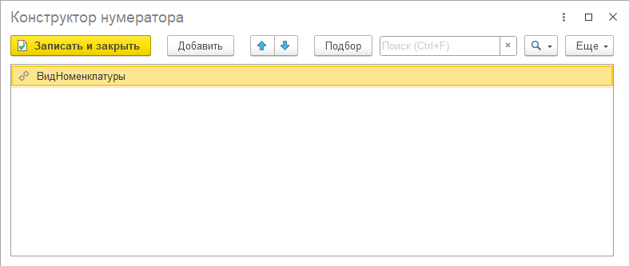</a>
    <br>Конструктор нумератора
</p>

В результате таблица будет иметь вид

| № | НомерПоВиду | ВидНоменклатуры | Номенклатура | Количество |
|--|--|--|--|--|
| 1 | 1 | Чайники | Tefal | 1 |
| 2 | 2 | Чайники | Brown | 1 |
| 3 | 3 | Чайники | Siemens | 1 |
| 4 | 1 | Кофеварки | Tefal | 1 |
| 5 | 2 | Кофеварки | Siemens | 1 |

#### Вычисляемое поле

Поле с произвольным алгоритмом в виде программного кода.

#### Поле свойства

При наличии подсистемы "Свойства" (БСП 1С) можно добавить поле из данных реквизитов или свойств по значению определенного поля. Например: у справочника "Контрагенты" есть доп. реквизит "Это подрядчик". Данное поле мы можем добавить путем доработки запроса. Но для этого надо знать как хранятся данные в подсистеме, а также учитывать некоторые нюансы. При этом конструктор позволяет просто встать на поле набора с типом данных "СправочникСсылка.Контрагенты" и добавить поле из свойств. Выбрать требуемый доп. реквизит (или свойство) и программа автоматически добавит поле "Контрагент_ЭтоПодрядчик". При формировании печатной формы значение будет считано автоматически.

#### Поле конт. информации

При наличии подсистемы "Контактная информация" (БСП 1С) можно добавить поле с определенным видом контактной информации по значению определенного поля. Например: у справочника "Организации" есть контактная информация с видом "Юридический адрес". Данное поле мы можем добавить путем доработки запроса. Но для этого надо знать как хранятся данные в подсистеме, а также учитывать что хранение может быть с историей. При этом конструктор позволяет просто встать на поле набора данных с типом "СправочникСсылка.Организации" и добавить поле с видом конт. информации "Юридический адрес". Программа автоматически добавить новое поле "Организация_ЮридическийАдрес". При формировании печатной формы значение будет считано автоматически.

Кроме того, есть возможность указать привязку получения данных контактной информации к определенному периоду, указав в настройке "Период" поле для получения данных, на какую дату требуется получение данных.

#### Очередность подготовки полей

* поле доп. реквизита (1я очередь)
* поле конт. информации (2я очередь)
* вычисляемое поле (3я очередь)
* поле нумератора (4я очередь)
* поле конструктора (5я очередь)

### Связь полей

При записи, а также в процессе редактирования макета программа анализирует использование полей набора в различных местах макета. Например: в вышеописанных примерах мы видели:

* поле "Контрагент" является владельцем для поля "Контрагент_ЭтоПодрядчик"* 
* поле "ВидНоменклатуры" используется в поле нумератора "НомерПоВиду"

Для данных, и других связанных полей программа подскажет что они используются в макете. А по кнопке вывода информации о связи (в командной панели), вы можете посмотреть подробную информацию о том, где используется данное поле.

Программа отличает следующие статусы связи полей

| Пиктограмма | Описание |
|--|--|
| 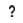 | Статус связи неизвестен. Устанавливается для добавленных полей до первой записи или изменения данных других закладок макета |
| 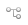 | Поле связано с источником, НЕ используется в макете |
| 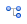 | Поле связано с источником и используется в макете |
| 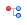 | Поле НЕ связано с источником, используется в макете |
| 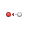 | Поле НЕ связано с источником, НЕ используется в макете. Как правило такие поля автоматически удаляются из наборов |

[1]: ./ch_02_11.html