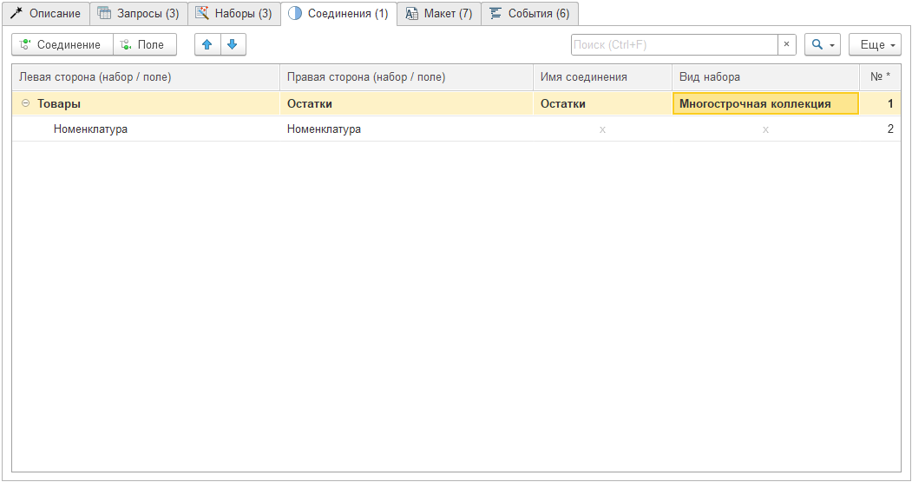
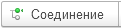
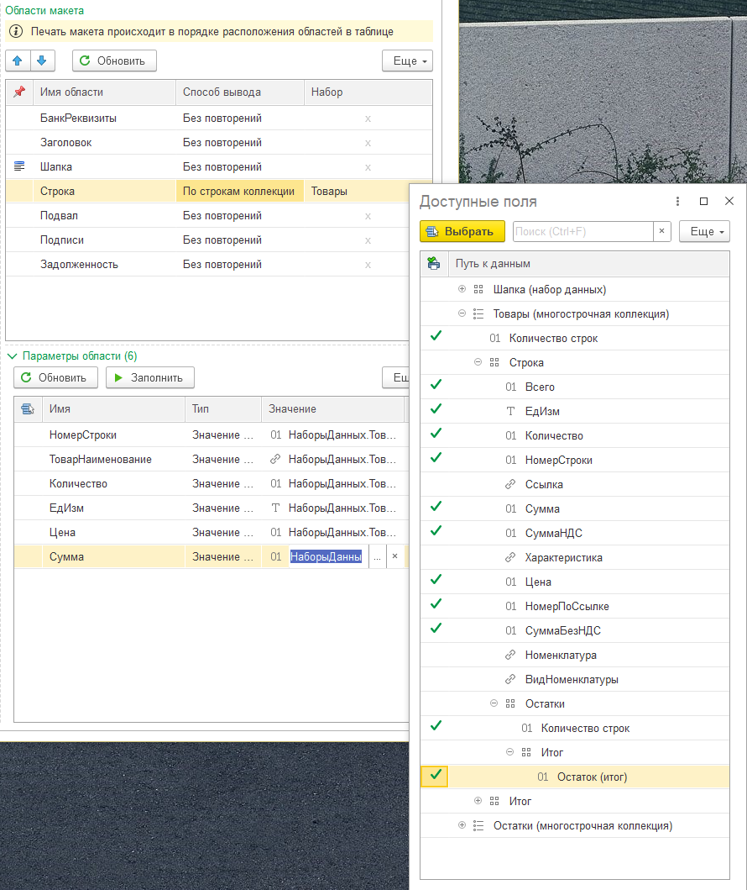

---
layout: default
title: Соединения
parent: Настройка макета
grand_parent: Документация
nav_order: 6
--- 

# Соединения
{: .no_toc }

<details open markdown="block">
  <summary>
    Содержание
  </summary>
  {: .text-delta }
1. TOC
{:toc}
</details>

В разделе [Запросы][1] и [Наборы][2] были приведены примеры создания общих запросов (и наборов), когда данные не привязаны напрямую к источнику для печатной формы. Например: остатки товаров на складах, задолженность контрагентов и т.п. В таких случаях одна таблица может содержать строки, которые могут быть избыточными для отдельной печатной формы. Чтобы использовать в печатной форме только необходимые строки другого набора можно использовать механизм соединений.

<p align="center">
    <a href="./../img/ch_02/31_page4.png"></a>
    <br>Вид закладки "Соединения"
</p>

{: .important-title }
> Важная информация
> 
> Соединение наборов с разным количеством строк не приводит к дублированию строк левого набора. Например: если соединить набор Шапка (1 строка) и Товары (10 строк) по полю "Ссылка", то в наборе Шапка останется 1 строка. А количество строк набора "Товары" будет продиктовано настройкой вида соединения (по аналогии с видом набора). Технически соединение, это фильтр по набору с правой стороны, где значения колонок правой и левой стороны совпадают.

## Внешний вид

Рассмотрим колонки таблицы соединений

| Колонка | Описание |
|--|--|
| Левая сторона (набор / поле) | Имя набора (или поля) с левой стороны |
| Правая сторона (набор / поле) | Имя набора (или поля) с правой стороны |
| Имя соединения | Имя соединения (вложенного набора для левой стороны) |
| Вид набора | Способ формирования коллекции данных набора для использования в печатной форме |
| № | Служебное поле |

Над табличной частью располагается командная панель. По умолчанию в ней находятся команды управления табличной частью. Дополнительно добавлены команды:

| Команда | Описание |
|--|--|
|  | Добавить строку соединения |
|  | Добавить строку поля условия соединения |

## Пример

Рассмотрим работу механизма соединений на примере. Пусть у нас есть две таблицы "Товары" (табличная часть Товары из документа) и "Остатки" (остатки по товарам на складах).

### Таблица "Товары"
{: .no_toc }

| Ссылка | Номенклатура | Ед. изм. | Количество |
|--|--|--|--|
| Документ № 1 от 01.01.2023 | Номенклатура 1 | шт. | 10 |
| Документ № 1 от 01.01.2023 | Номенклатура 2 | шт. | 10 |
| Документ № 2 от 02.01.2023 | Номенклатура 1 | шт. | 10 |

### Таблица "Остатки"
{: .no_toc }

| Номенклатура | Склад | Остаток |
|--|--|--|
| Номенклатура 1 | Склад 1 | 100 |
| Номенклатура 1 | Склад 2 | 50 |
| Номенклатура 2 | Склад 1 | 50 |

Мы хотим вывести в печатную форму таблицу "Товары" + колонка "Остаток". Классическое левое соединение таблицы "Товары" и "Остатки" по полю "Номенклатура" приведет к задвоению данных, поскольку "Номенклатура 1" у нас хранится на 2-х складах. Однако, соединение в конструкторе работает скорее как фильтр. Поэтому соединение не приводит к тому, что в таблице "Товары" становится больше строк. При любом раскладе, левая таблица не изменяется. Она дополняется колонкой, в которой хранятся данные правой таблицы, отобранные по заданным критериям.

### Итоговый набор
{: .no_toc }

В нашем случае итоговый набор данных "Товары" будет выглядеть следующим образом:

| Ссылка | Номенклатура | Ед. изм. | Кол-во | Остатки |  |  |
|--|--|--|--|--|--|--|
| Документ № 1 от 01.01.2023 | Номенклатура 1 | шт. | 10 | Номенклатура | Склад | Остаток |
|  |  |  |  | Номенклатура 1 | Склад 1 | 100 |
|  |  |  |  | Номенклатура 1 | Склад 2 | 50 |
| Документ № 1 от 01.01.2023 | Номенклатура 2 | шт. | 10 | Номенклатура | Склад | Остаток |
|  |  |  |  | Номенклатура 2 | Склад 1 | 50 |
| Документ № 2 от 02.01.2023 | Номенклатура 1 | шт. | 10 | Номенклатура | Склад | Остаток |
|  |  |  |  | Номенклатура 1 | Склад 1 | 100 |
|  |  |  |  | Номенклатура 1 | Склад 2 | 50 |

То есть, внутри каждой строки мы видим вложенную "копию" таблицы "Остатки" с фильтром по значению колонок "Номенклатура".

При этом вид данных будет зависеть от того, какой "Вид набора" мы применим (подробнее про [виды наборов][3]).

В итоге, для того, чтобы в печатной форме вывести колонку "Остаток", в соответствующем параметре области макета, необходимо выбрать значение набора:

```
НаборыДанных.Товары.Строка.Остатки.Итог.Остаток
```

Рассмотрим путь к данном полю:

* **НаборыДанных.Товары.Строка** - это стандартный путь, когда мы выводим данные по строкам многострочной коллекции
* **Остатки.Итог.Остаток** - это итог по полю "Остаток" в коллекции "Остатки".

<p align="center">
    <a href="./../img/ch_02/32_p4_field.png"></a>
    <br>Доступные поля набора данных "Товары"
</p>

[1]: ./ch_02_04.html
[2]: ./ch_02_05.html
[3]: ./ch_02_05.html#вид-набора