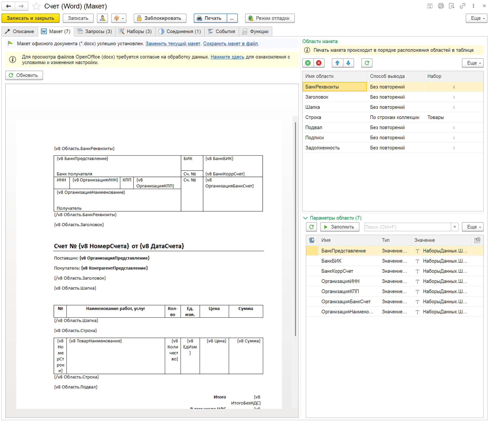
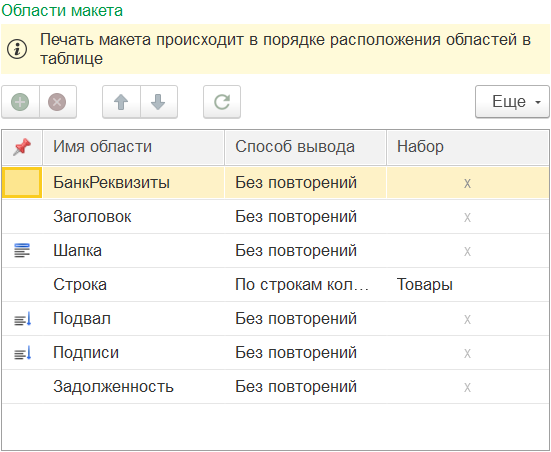
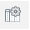

---
layout: default
title: Макет
parent: Настройка макета
grand_parent: Документация
nav_order: 7
--- 

# Макет
{: .no_toc }

  

    Содержание
  

  {: .text-delta }
1. TOC
{:toc}

Страница "Макет" одна из ключевых, с точки зрения настройки печатной формы. Внешний вид закладки напрямую зависит от настройки "**Макет в формате Opеn Office Documents (*.docx)**" заданной на странице "[Описание][1]".

    
     Вид закладки "Макет" для табличного документа

    
     Вид закладки "Макет" для офисного документа

## Внешний вид

Форма закладки "Макет" разделена на 2 части:

* левая сторона: макет печатной формы (табличный документ или просмотр офисного документа);
* правая сторона: две табличные части:
  * области макета
  * параметры текущей области макета

Более подробная работа с макетами [табличного][2] или [офисного][3] документа рассмотрены в отдельных разделах. В данной статье подробно рассмотрим работу с областями и параметрами областей.

## Области макета

В правой верхней части располагается таблица с областями макета. Список областей обновляется автоматически для макета офисного документа после загрузки макета. Для табличного документа при редактировании области надо обновлять вручную. 

{: .note-title }
> Информация
> 
> Автоматическое обновление областей табличного документа отключено сознательно. При редактировании событие изменения срабатывает при любом изменении, а не только назначении областей. Данное поведение планируется доработать в одном из будущих релизов. А на текущий момент (1.1), если в процессе редактирования области не обновились, нажать кнопку "Обновить" над табличной частью. При этом, если области не были кардинально изменены, настройка связи параметров будут сохранены.

{: .important-title }
> ВАЖНО
> 
> Порядок вывода областей в макете зависит от настройки заданной в табличной части. При заполнении порядок выстраивается на основании макета печатной формы. Но может быть изменен пользователем.

Рассмотрим колонки таблицы "Области макета"

| Колонка | Описание |
|--|--|
|  | Настройка вывода области. Существует только для табличного документа. |
| Имя области | Имя области, как оно задано в макете |
| Способ вывода | Способ вывода области макета |
| Набор | Имя набора, с которым связана область макета. Доступна только для Способ вывода = По строкам коллекции |

### Настройка вывода области

Для табличного документа доступна возможность настройки вывода области при печати. При двойном клике по колонке настройки будет предложены варианты:

    
     Варианты настройки вывода области

Рассмотрим варианты настройки:

| Вариант | Описание |
|--|--|
| Без настройки | Область будет выведена в табличный документ без какой-либо настройки |
| Повторять в шапке | Область будет повторяться в начале каждой страницы печатной формы |
| Повторять в подвале | Область будет повторяться в конце каждой страницы печатной формы |
| Проверить с переносом на след. страницу | Будет выполнена проверка на вместимость области (или нескольких областей) на остаток страницы. Если указанные области не вмещаются, они будут перенесены на следующую страницу с последней выведенной областью |

Рассмотрим вариант "**Проверить с переносом на след. страницу**".

Представим, что у нас областей подписей должна переноситься на новую страницу, если не вмещается целиком. При этом перенос должен быть выполнен совместно с подвалом табличной части и последней строкой. В таком случае необходимо указать следующую настройку (см. картинку):

    
     Настройки переноса областей

Для областей "Подвал", "Подписи" и "Задолженность" установлена проверка. То есть, при выводе последней строки набора "Товары" система проверит вместимость данной области вместе с подвалом, подписью и задолженностью. И если целиком на странице данную область не вместить, перенесет строку на новую страницу. А поскольку для области "Шапка" установлено "Повторять в шапке" то в результате последняя страница печатной форма будет иметь вид:

    
     Варианты настройки вывода области

{: .important-title }
> ВАЖНО
> 
> Если по каким-либо причинам программа некорректно рассчитывает вместимость областей на странице, то необходимо проверить настройки печати для табличного документа, наличие физического или виртуального принтера. Если программа работает в клиент-серверном варианте, обратится к администратору программы.

### Способ вывода области

Рассмотрим существующие способы вывода области в печатную форму:

| Способ вывода | Описание |
|--|--|
| **Без повторений**                        | Вывести область в печатную форму один раз |
| **По строкам коллекции**                  | Вывести область в печатную форму для каждой строки коллекции, указанной в колонке Набор |
| **Перенос строки**                        | Вывести область с переносом текста на новую строку |
| Не выводить на печать [без вывода]        | Не выводить область на печать |
| Область колонки [без вывода]              | Область колонок (не используется) |
| Контрольная строка [служ: перенос строки] | Служебная область. Только при наличии областей где Способом вывода = Перенос строки |
| Строка переноса [служ: перенос строки]    | Служебная область. Только при наличии областей где Способом вывода = Перенос строки |
| Пустая область [служ: перенос строки]     | Служебная область. Только при наличии областей где Способом вывода = Перенос строки |

Для каждого из трех базовых вариантов вывода области доступны разные наборы данных:

| Способ вывода | Данные наборов |
|--|--|
| **Без повторений**        | Наборы с видом "Первая строка", "Последняя строка", "Соединение строк" полностью. |
|                           | Наборы с видом "Многострочная коллекция" только итоговые колонки или количество строк |
| **По строкам коллекции**  | Наборы с видом "Первая строка", "Последняя строка", "Соединение строк" полностью
|                           | Данные строки из коллекции указанной в наборе области
|                           | Наборы с видом "Многострочная коллекция" только итоговые колонки или количество строк |
| **Перенос строки**        | Наборы с видом "Первая строка", "Последняя строка", "Соединение строк" полностью. |
|                           | Наборы с видом "Многострочная коллекция" только итоговые колонки или количество строк |

Способ вывода "Без повторений" и "По строкам коллекции" не требуют дополнительных настроек. Достаточно создать область, указать способ вывода и назначить набор (для вывода по строкам коллекции). Данные области будут выведены (как указывалось ранее) согласно последовательности в таблице областей.

Способ вывода "Перенос строки" достаточно специфический и рассмотрен в [отдельной главе][4].

## Параметры области

Под табличной частью областей располагается таблица с параметрами области макета. Если в процессе редактирования макета или обновления областей параметры по каким-либо причинам не обновились, рекомендуется обновлять их вручную (кнопка Обновить над табличной частью).

Рассмотрим колонки таблицы "Параметры области"

| Колонка | Описание |
|--|--|
|  | Параметр используется в расшифровке |
| Имя | Имя параметра, как оно задано в макете |
| Тип | Тип значения задаваемого в параметре |
| Значение | Представление заданного значения |
|  | Настройка форматирования значения |

Доступны следующие типа значения параметра:

| Тип | Описание |
|--|--|
| Значение набора       | Связь параметра напрямую со значением из набора. Доступные значения наборов зависят от способа вывода области. |
| Конструктор строки    | Использование конструктора представления для формирования значения (см. рисунок ниже) |
| Произвольный алгоритм | Вычисление значения для подстановки произвольным кодом |
| Данные QR-кода        | Конструктор значения для формирования QR-кода ([подробнее][5]) |
| Сумма прописью        | Конструктор данных для формирования суммы прописью с учетом валюты ([подробнее][6]) |

    
     Конструктор представления параметра области

### Вывод картинки

Для табличного документа программа определяет тип области с картинкой автоматически, рядом с именем параметра отображается пиктограмма картинки. Для офисного документа область с картинкой определяется исходя из установленного значения параметра.

Для вывода картинки можно использовать следующие сочетания типов и значений:

| Тип | Значение |
|--|--|
| Данные QR-кода  | Картинка QR-кода генерируется автоматически, на основе данных (подсистема Генерация штрихкода БСП) |
| Значение набора | Значение набора с типом данных "Картинка" |
| Значение набора | Значение набора с типом данных "Двоичные данные" |
| Значение набора | Значение набора с типом данных "...ПрисоедиенныеФайлы" (подсистема Работа с файлами БСП) |

При этом программа самостоятельно преобразует данные в картинку и выведет в печатную форму (табличного или офисного документа).

[1]: ./ch_02_03.html
[2]: ./ch_02_09.html
[3]: ./ch_02_10.html
[4]: ./ch_02_12.html
[5]: ./ch_02_20.html
[6]: ./ch_02_21.html