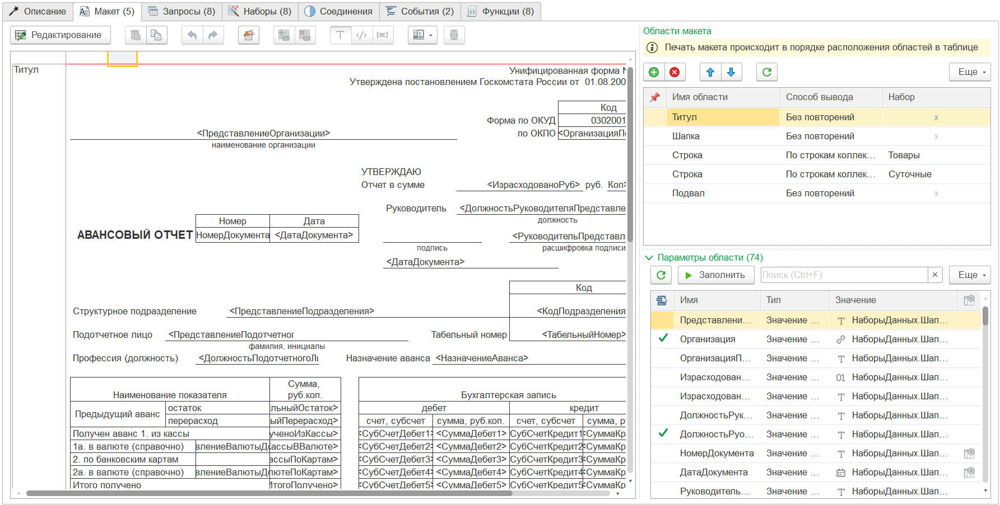
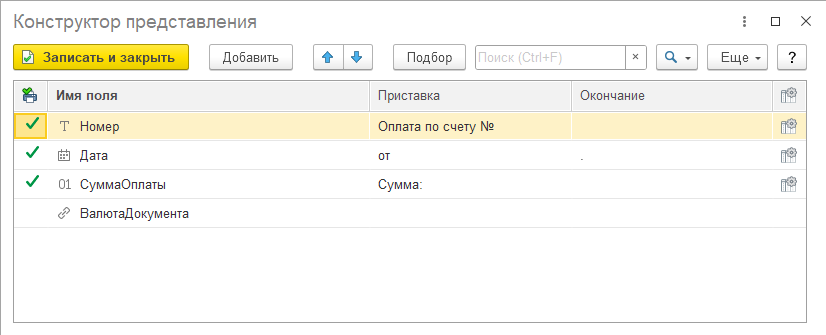

---
layout: default
title: Макет
parent: Настройка макета
grand_parent: Документация
nav_order: 7
--- 

# Макет
{: .no_toc }

  

    Содержание
  

  {: .text-delta }
1. TOC
{:toc}

Страница "Макет" одна из ключевых, с точки зрения настройки печатной формы. Внешний вид закладки напрямую зависит от настройки "**Макет в формате Opеn Office Documents (*.docx)**" заданной на странице "[Описание][1]".

    
     Вид закладки "Макет" для табличного документа

    
     Вид закладки "Макет" для офисного документа

## Внешний вид

Форма закладки "Макет" разделена на 2 части:

* левая сторона: макет печатной формы (табличный документ или просмотр офисного документа);
* правая сторона: две табличные части:
  * области макета
  * параметры текущей области макета

Более подробная работа с макетами [табличного][2] или [офисного][3] документа рассмотрены в отдельных разделах. В данной статье подробно рассмотрим работу с областями и параметрами областей.

## Области макета

В правой верхней части располагается таблица с областями макета. Список областей обновляется автоматически для макета офисного документа после загрузки макета. Для табличного документа при редактировании области надо обновлять вручную. 

{: .note-title }
> Информация
> 
> Как правило программа старается самостоятельно обновлять области. Но, если в процессе редактирования макета возникла ситуация, при которой области не обновились, рекомендуется выполнить обновление вручную.

{: .important-title }
> ВАЖНО
> 
> Порядок вывода областей в макете зависит от настройки заданной в табличной части. При заполнении порядок выстраивается на основании макета печатной формы. Но может быть изменен пользователем.

После того, как области были заполнены автоматически, можно добавить области самостоятельно и выбрать одну из ранее найденных программой областей. Добавленные области могут быть удалены. При этом программа не даст удалить единственную (оставшуюся) область.

Рассмотрим колонки таблицы "Области макета"

| Колонка | Описание |
|--|--|
|  | Настройка вывода области. Существует только для табличного документа. |
| Имя области | Имя области, как оно задано в макете |
| Способ вывода | Способ вывода области макета |
| Набор | Имя набора, с которым связана область макета. Доступна только для Способ вывода = По строкам коллекции |

### Настройка вывода области

Для табличного документа доступна возможность настройки вывода области при печати. При двойном клике по колонке настройки будет предложены варианты:

    
     Варианты настройки вывода области

Рассмотрим варианты настройки:

| Вариант | Описание |
|--|--|
| Без настройки | Область будет выведена в табличный документ без какой-либо настройки |
| Новый раздел | Начиная с этой области, все предыдущие настройки обнуляются и можно задать новые области для повтора в шапке, подвале и контроля переноса на след. страницу |
| Повторять в шапке | Область будет повторяться в начале каждой страницы печатной формы |
| Повторять в подвале | Область будет повторяться в конце каждой страницы печатной формы |
| Проверить с переносом на след. страницу | Будет выполнена проверка на вместимость области (или нескольких областей) на остаток страницы. Если указанные области не вмещаются, они будут перенесены на следующую страницу с последней выведенной областью |

Для того, чтобы корректно настроить вывод областей, следует определиться какие области необходимо повторять в шапке или в подвале на  каждой странице. А также требуется ли переносить какие то области на новую страницу, если данная область не поместится с учетом ниже лежащих областей. Рассмотрим на примере:

    
     Области макета "Счет на оплату"

Среди представленных областей, можно выделить следующие:

* Шапка - это шапка табличной части счета на оплату. Ее необходимо выводить в начале табличной части и на каждой новой странице (если строки были перенесены на новую страницу);
* Строка - это строки табличной части. Они будут выводиться согласно какому-то набору из макета. Заранее мы не знаем сколько будет строк, поэтому предполагаем что они могут не поместиться в какой-то определенный диапазон;
* Подвал - это итоги табличной части. Данная область должна быть выведена после завершения вывода всех строк. При этом, если подвал не помещается на последнюю страницу, необходимо перенести последнюю строку на новую страницу и только после этого выводить подвал. Также мы помним, что при переносе строк на новую страницу, будет снова напечатана область "Шапка";
* Подписи - эта область с подписями и печатью организации. Она также должна быть проверена вместе с областью "Подвал", помещается ли она с последней строкой на странице.

Таким образом, чтобы печатная форма выводилась корректно, нам необходимо настроить вывод областей следующим образом:

    
     Настройки вывода областей макета "Счет на оплату"

* Шапка - Повторять в шапке
* Строка - без настройки
* Подвал - Проверить с переносом
* Подписи - Проверить с переносом

#### Настройка вывода "**Проверить с переносом на след. страницу**".

Согласно требованию область "Подписи" должна переноситься на новую страницу, если не вмещается целиком на текущую. При этом контроль на "вместимость" необходимо выполнять с учетом области "Подвал", перед выводом последней строкой. 

Для этого настройку "Проверить с переносом" необходимо установить для области: Подвал, а также Подписи (на скриншоте дополнительно указана область Задолженность), чтобы они проверялись обе. Таким образом, при выводе последней строки набора "Товары" программа проверит вместимость данной области вместе с подвалом, подписью (и задолженностью). И если целиком на странице данные области не вместить, перенесет все на новую страницу. А поскольку для области "Шапка" установлено "Повторять в шапке" то в результате последняя страница печатной форма будет иметь вид:

    
     Варианты настройки вывода области

{: .important-title }
> ВАЖНО
> 
> Если, по каким-либо причинам, программа некорректно рассчитывает вместимость областей на странице, то необходимо в первую очередь проверить настройки печати для табличного документа, наличие физического или виртуального принтера. Если программа работает в клиент-серверном варианте, обратится к администратору программы.

#### Несколько табличных частей различной структуры

Если в одной печатной форме несколько табличных частей с различной структурой колонок, а также разными настройками вывода шапки (подвала и т.п.), необходимо для каждой области шапки, подвала (и т.п.) выставить соответствующие настройки. При этом, в таком случае, для области перед шапкой рекомендуется установить настроку **Новый раздел**. Таким образом, печатная форма будет разделена на части, для каждой из которых будут действовать свои настройки повторения шапки, подвала или контроля переноса.

### Способ вывода области

Рассмотрим существующие способы вывода области в печатную форму:

| Способ вывода | Описание | Вид макета |
|--|--|--|
| **Без повторений**                        | Вывести область в печатную форму один раз | все |
| **По строкам коллекции**                  | Вывести область в печатную форму для каждой строки коллекции, указанной в колонке Набор | все |
| **Перенос строки**                        | Вывести область с переносом текста на новую строку | все |
| **Верхний колонтитул**                    | Вывести область как верхний колонтитул | docx |
| **Нижний колонтитул**                     | Вывести область как нижний колонтитул | docx |
| Не выводить на печать [без вывода]        | Не выводить область на печать | все |
| Область колонки [без вывода]              | Область колонок (не используется) | mxl |
| Контрольная строка [служ: перенос строки] | Служебная область. Только при наличии областей где Способом вывода = Перенос строки | все |
| Строка переноса [служ: перенос строки]    | Служебная область. Только при наличии областей где Способом вывода = Перенос строки | все |
| Пустая область [служ: перенос строки]     | Служебная область. Только при наличии областей где Способом вывода = Перенос строки | все |

Для каждого из трех базовых вариантов вывода области доступны разные наборы данных:

| Способ вывода | Данные наборов |
|--|--|
| **Без повторений**        | Наборы с видом "Первая строка", "Последняя строка", "Соединение строк" полностью. |
|                           | Наборы с видом "Многострочная коллекция" только итоговые колонки или количество строк |
| **По строкам коллекции**  | Наборы с видом "Первая строка", "Последняя строка", "Соединение строк" полностью
|                           | Данные строки из коллекции указанной в наборе области
|                           | Наборы с видом "Многострочная коллекция" только итоговые колонки или количество строк |
| **Перенос строки**        | Наборы с видом "Первая строка", "Последняя строка", "Соединение строк" полностью. |
|                           | Наборы с видом "Многострочная коллекция" только итоговые колонки или количество строк |
| **Верхний колонтитул**         | Наборы с видом "Первая строка", "Последняя строка", "Соединение строк" полностью. |
|                           | Наборы с видом "Многострочная коллекция" только итоговые колонки или количество строк |
| **Нижний колонтитул**        | Наборы с видом "Первая строка", "Последняя строка", "Соединение строк" полностью. |
|                           | Наборы с видом "Многострочная коллекция" только итоговые колонки или количество строк |

Способ вывода "Без повторений" и "По строкам коллекции" не требуют дополнительных настроек. Достаточно создать область, указать способ вывода и назначить набор (для вывода по строкам коллекции). Данные области будут выведены (как указывалось ранее) согласно последовательности в таблице областей.

Области со способами "Верхний колонтитул" и "Нижний колонтитул" могут располагаться в любой последовательности. В любом случае они будут выведены в соответствующих областях макета. При этом, если у макета отсутствуют колонтитулы или для области колонтитула изменен Способ вывода, данные области не будут выведены в печатную форму.

Способ вывода "Перенос строки" достаточно специфический и рассмотрен в [отдельной главе][4].

## Параметры области

Под табличной частью областей располагается таблица с параметрами области макета. Если в процессе редактирования макета или обновления областей параметры по каким-либо причинам не обновились, рекомендуется нажать кнопку "Обновить" повторного чтения параметров.

Рассмотрим колонки таблицы "Параметры области"

| Колонка | Описание |
|--|--|
|  | Параметр используется в расшифровке |
| Имя | Имя параметра, как оно задано в макете |
| Тип | Тип значения задаваемого в параметре |
| Значение | Представление заданного значения |
|  | Настройка форматирования значения |

Доступны следующие типа значения параметра:

| Тип | Описание |
|--|--|
| Значение набора       | Связь параметра напрямую со значением из набора. Доступные значения наборов зависят от способа вывода области. |
| Конструктор строки    | Использование конструктора представления для формирования значения (см. рисунок ниже) |
| Произвольный алгоритм | Вычисление значения для подстановки произвольным кодом |
| Данные QR-кода        | Конструктор значения для формирования QR-кода ([подробнее][5]) |
| Сумма прописью        | Конструктор данных для формирования суммы прописью с учетом валюты ([подробнее][6]) |

    
     Конструктор представления параметра области

Для параметров области с типом "Значение набора" возможно редактирование текста (подбор) или автозаполнение (по кнопке "**Заполнить**" над табличной частью).

При автозаполнении программа находит поля в наборах с именем = имени параметра, но есть ограничения:

* если по имени параметра найдено более 1 возможного поля из наборов, параметр не заполняется;
* если способ вывода области = "По строкам коллекции", совпадение анализируется только для указанного набора.

### Вывод картинки

Для табличного документа программа определяет тип области с картинкой автоматически, рядом с именем параметра отображается пиктограмма картинки. Для офисного документа область с картинкой определяется исходя из установленного значения параметра.

Для вывода картинки можно использовать следующие сочетания типов и значений:

| Тип | Значение |
|--|--|
| Данные QR-кода  | Картинка QR-кода генерируется автоматически, на основе данных (подсистема Генерация штрихкода БСП) |
| Значение набора | Значение набора с типом данных "Картинка" |
| Значение набора | Значение набора с типом данных "Двоичные данные" |
| Значение набора | Значение набора с типом данных "...ПрисоедиенныеФайлы" (подсистема Работа с файлами БСП) |

При этом программа самостоятельно преобразует данные в картинку и выведет в печатную форму (табличного или офисного документа).

[1]: ./ch_02_03.html
[2]: ./ch_02_09.html
[3]: ./ch_02_10.html
[4]: ./ch_02_12.html
[5]: ./ch_02_20.html
[6]: ./ch_02_21.html