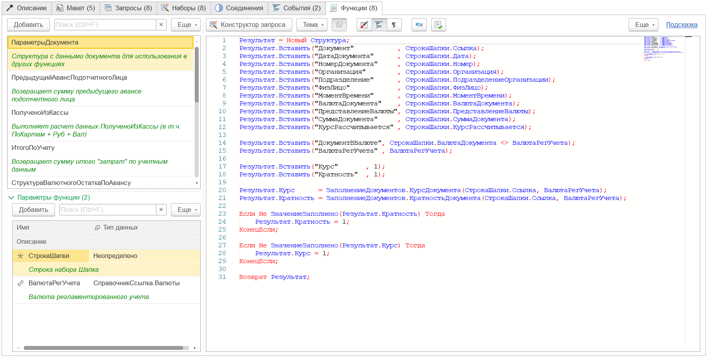

---
layout: default
title: Функции
parent: Настройка макета
grand_parent: Документация
nav_order: 8
--- 

# Функции
{: .no_toc }

<details open markdown="block">
  <summary>
    Содержание
  </summary>
  {: .text-delta }
1. TOC
{:toc}
</details>

При разработке печатных форм может возникнуть необходимость добавления различных общих алгоритмов, которые могут быть использованы в различных местах печатной формы. Для данной цели, начиная с версии 2025.1 появилась возможность добавлять собственные функции в макет.

<p align="center">
    <a href="./../img/ch_02/73_functions.png"></a>
    <br>Вид закладки "Функции"
</p>

## Внешний вид

Форма закладки "Функции" разделена на 2 части:

* левая сторона: список функций и параметров
* правая сторона: консоль кода функции

Для добавления новой функции необходимо нажать кнопку **Добавить** над левой верхней таблицей. После добавления новой строки, необходимо ввести имя функции. При необходимости в левой нижней таблице могут быть добавлены параметры, которые будут переданы в функцию для применения.

## Пример использования

Представим, что в процессе реализации печатной формы нам понадобилась коллекция, в которой будут хранится различные настройки, которые мы будем передавать для использования в другие алгоритмы.

Добавим строку в таблицу функций и назовем метод **ПараметрыДокумента**. Дополнительно можно дописать краткое описание назначения метода. Чтобы в будущем можно было быстро понять, для чего он сделан (или где используется).

В качестве параметра метод будет получать параметры:
* СтрокаШапки (Неопределено) - с данными документа, для которого будут формироваться параметры
* ВалютаРегУчета (СправочникСсылка.Валюты) - валюта регламентированного учета текущей конфигурации

Сам метод будет иметь следующий код:

```
Настройки = Новый Структура;
Настройки.Вставить("Документ"			, СтрокаШапки.Ссылка);
Настройки.Вставить("ДатаДокумента"		, СтрокаШапки.Дата);
Настройки.Вставить("НомерДокумента"		, СтрокаШапки.Номер);
Настройки.Вставить("Организация"		, СтрокаШапки.Организация);
Настройки.Вставить("СуммаДокумента"		, СтрокаШапки.СуммаДокумента);
Настройки.Вставить("ДокументВВалюте"    , СтрокаШапки.ВалютаДокумента <> ВалютаРегУчета);
Настройки.Вставить("ВалютаРегУчета"	    , ВалютаРегУчета);

Настройки.Вставить("Курс"		, 1);
Настройки.Вставить("Кратность"	, 1);

Настройки.Курс		= ЗаполнениеДокументов.КурсДокумента(СтрокаШапки.Ссылка, ВалютаРегУчета);
Настройки.Кратность	= ЗаполнениеДокументов.КратностьДокумента(СтрокаШапки.Ссылка, ВалютаРегУчета);
```

При необходимости получения результата вычисления из функции необходимо выполнить одно из двух:
1. Возвращаемое значение присвоить переменной **Результат**. Например: `Результат = Настройки;`
2. Вызвать **Возврат** и указать переменную, которую требуется вернуть. Например: `Возврат Настройки;`

{: .important-title }
> ПРИМЕЧАНИЕ
>
> В коде функций нельзя использовать переменную **Параметры**. Данная переменная зарезервирована под системные нужды.

### Вызов функции в алгоритме

Например, данный метод мы будем вызывать при обработке набора данных **Шапка**. Для этого на закладке "Наборы" активируем необходимый набор данных и в поле алгоритма (справа в нижней части) мы можем вызвать функцию, выполнив следующий код:

```
ВалютаРегУчета = ОбщегоНазначенияБПВызовСервераПовтИсп.ПолучитьВалютуРегламентированногоУчета();

Для Каждого СтрокаШапки Из ДанныеЗапроса Цикл
    ПараметрыДокумента = ЭтотМакет.ВыполнитьФункцию(ЭтотМакет.Функции.ПараметрыДокумента,
        СтрокаШапки,
        ВалютаРегУчета);

    // далее мы уже можем использовать ПараметрыДокумента по необходимости
КонецЦикла;
```

{: .important-title }
> ПРИМЕЧАНИЕ
>
> Метод "ВыполнитьФункцию" может принять не более 10ти дополнительных параметров, кроме указания функции. При необходимости передачи большого количества параметров рекомендуется их "оборачивать" в структуру (или другую коллекцию) и передавать уже готовую коллекцию.

Кроме прямого указания параметров при вызове функции, их можно указать при помощи структуры. При этом структуру может подготовить специальный метод `ЭтотМакет.ПараметрыФункции()`. Например:

```
ПараметрыМетода = ЭтотМакет.ПараметрыФункции(ЭтотМакет.Функции.ПараметрыДокумента);
ПараметрыМетода.СтрокаШапки = СтрокаШапки;
ПараметрыМетода.ВалютаРегУчета = ВалютаРегУчета;

ЭтотМакет.ВыполнитьФункцию(ЭтотМакет.Функции.ПараметрыДокумента, ПараметрыМетода);
```

## Доступность функций

Функции могут быть вызваны в любых алгоритмах. Кроме того, функцию можно вызывать в самой себе. Таким образом выполнять рекурсивный вызов.