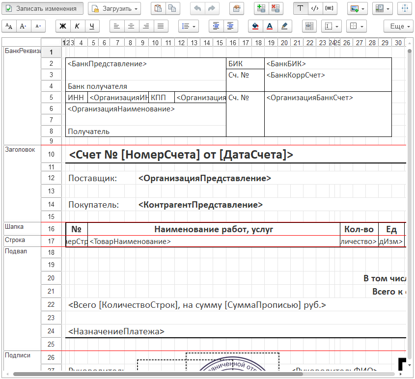

---
layout: default
title: Табличный документ
parent: Настройка макета
grand_parent: Документация
nav_order: 10
--- 

# Табличный документ
{: .no_toc }

  

    Содержание
  

  {: .text-delta }
1. TOC
{:toc}

Для удобной разработки печатных форм в виде табличного документа, в конструкторе предусмотрен собственный редактор.

    
     Редактор табличного документа

## Внешний вид

Внешний вид редактора табличного документа очень похож на знакомым многим Microsoft Excel (и ему подобные программы). 

Над самим табличным полем расположена командная панель. Командная панель имеет 2-а этажа. Полный формат командной панели доступен в режиме редактирования. Рассмотрим ее подробнее:

**1-й уровень командной панели**

| Команда | Описание |
|--|--|
|  | Перейти / отключить режим редактирования макета |
|  | Подменю для выбора источника загрузки формы макета. **Из макета объекта** / **Из общего макета** - выбор макетов из состава конфигурации. **Из файла на диске** - выбор файла формата mxl, с диска пользователя. |
|  | Отменить / повторить последнее действие |
|  | Открыть / скрыть панель свойств области макета |
|  | Создать / удалить область макета |
|  | Изменение типа заполнения текста ячейки (текст, параметр, шаблон) |
|  | Вставка элемента в макет табличного документа |
|  | Команды изменения области макета табличного документа |
|  | Изменить параметры страницы |

**2-й уровень командной панели**

| Команда | Описание |
|--|--|
|  | Настроить / увеличить / уменьшить размер щрифта текущей области макета |
|  | Включить / отключить настройку шрифта полужирный / курсив / подчеркнутый для текущей области макета |
|  | Переключить горизонтальное выравнивание текста в текущей области макета |
|  | Переключить вертикальное выравнивание текста в текущей области макета |
|  | Добавить или удалить отступ перед текстом |
|  | Изменить цвет фона, текста, линии текущей области макета |
|  | Изменение способа размешения текста в ячейке. **Авто** - выводит текст до пересечения с текстом в другой ячейке. **Переносить** - переносит текст внутри ширины ячейки. **Обрезать** - обрезает текст на ширину ячейки. **Забивать** - заменяет текст на "###" если он не влазит в ширину ячейки. |
|  | Изменение линии границы текущей области макета |
|  | Подменю всех команд редактирования макета табличного документа |

## Области макета

Обычно табличный документ формируется на основе макета как из строительных блоков. Макет представляет собой шаблон для формирования печатной формы. Разработчик может создавать области, изменять высоту строк и ширину колонок, задавать форматирование ячеек и всего табличного документа, включать в макет рисунки и другие объекты.

Области макета предназначены для однократного или многократного вывода, например, как макет представленный на картинке в шапке статьи.

Некоторые ячейки содержат только текст, который должен быть выведен. Другие ячейки содержат имена параметров (в угловых скобках). Значения этих параметров должны быть сопоставлены в соответствующей табличной части (справа от табличного документа).

Редактор позволяет разработчику задавать имена областей документа. В качестве области может выступать ячейка или группа ячеек.

При именовании строк и столбцов документа, редактор может отображать имена областей в окне редактирования и выделять именованные области.