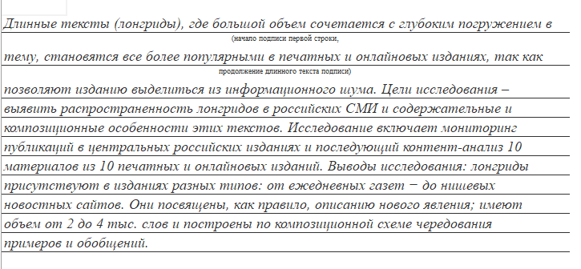
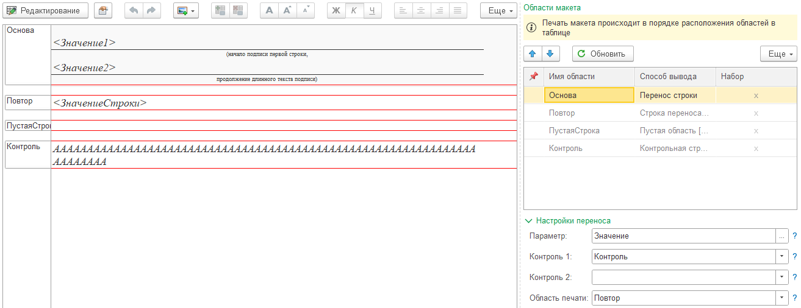
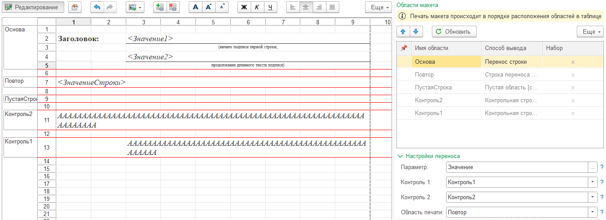
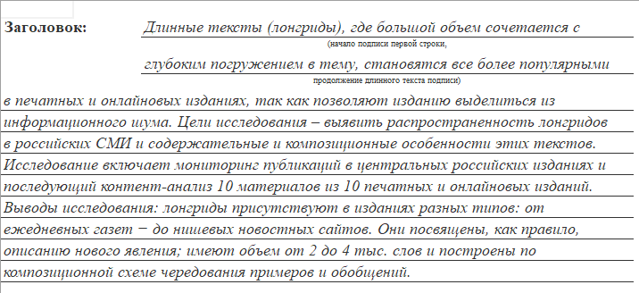

---
layout: default
title: Перенос строки
parent: Настройка макета
grand_parent: Документация
nav_order: 12
--- 

# Перенос строки

Рассмотрим подробнее как работает способ вывода областей для печати "Перенос строки".

Данный способ вывода предназначен для организации печати длинного текста, в фиксированную область с заданным составом строк. Программа автоматически рассчитывает максимальную вместимость символов и выполняет перенос на следующую строку.

Например, необходимо выполнить печать подобной строки:

    
     Пример печатной формы с предопределенной частью области

Особенность данного макета в том, что первая и вторая строка текста имееют подписи (начало подписи первой строки, продолжение длинного текста подписи). Рассмотрим компоновку макета табличного документа для реализации подобной печатной формы:

    
     Настройка печати области с переносом строки

Подробно рассмотрим области макета:

| Имя области | Описание |
|--|--|
| Основа       | Область с фиксированными строками, которые обязательно должны быть в печатной форме |
| Повтор       | Область для вывода дополнительных строк, которые не вместились в основную часть |
| ПустаяСтрока | Область с пустой строкой, для подстановки после вывода последней строки |
| Контроль     | Область с контрольным количеством символов в строке |

В области "**Основа**" по задаче находятся две строки, которые обязательно будут в печатной форме, независимо от длины текста для заполнения. Имена параметров в области: Значение1 и Значение2. Базовая часть имени параметра "**Значение**", а индекс 1 и 2 - это порядковый номер в области. Количество параметров с индексами должно соответствовать количеству "предопределенных" строк в фиксированной области. 

Имя параметра должно строится по принципу: `[ИмяПараметра][Индекс]`, где `ИмяПараметра` - это базовая часть имени (без индекса), `Индекс` - порядковый номер фиксированной строки.

Для обеспечения печати строк остатка строки, не вмещающейся в основную область необходимо добавить область с повторяемой строкой. В приведенном примере это область "**Повтор**". Данная область должна иметь параметр "**ЗначениеСтроки**". Данная область будет повторяться при выводе, пока все строковое значение не будет выведено в печатную форму.

Если по окончанию печати основной области и переноса, необходимо добавить область с пустой строкой, тогда необходимо в макете создать область "**ПустаяСтрока**". Имя области предопределенное. Область не является обязательной.

Кроме того, поскольку программе надо рассчитывать количество символов, которые могут уместиться в строке, необходимо создать область с контрольной строкой. В примере данная область называется "**Контроль**". Данную строку необходимо заполнить символом "*А*" (шрифт Times New Roman, 11, рекомендуется курсив). Из-за особенностей расчета ширины, рекомендуется задавать немного бОльшее количество символов, чем вмещается в строку. Примерно на 10%. Но вообще, количество символов можно подобрать при тестировании печатной формы.

Также можно реализовать механизм, при котором первая строка печати будет по длине отличаться от повторяемых строк. Например: 

    
     Настройка печати области с переносом строки (вариант 2)

Результат печати при этом будет следующий:

    
     Пример печатной формы с предопределенной частью области (вариант 2)

Ключевым отличием является наличие 2-х контрольных строк. Первая контрольная строка отвечает за расчет вместимости основной области, вторая контрольная строка за последующие строки.

## Подведем итоги

Для печати областей с фиксированным количеством строк и автоматическим переносом на новые строки, необходимо:

* добавить основную область с фиксированными строками (Способ вывода = **Перенос строки**)
* задать имя параметра "**[ИмяПараметра][Индекс]**", при этом количество параметров должно равняться количеству строк в основной области
* добавить область для печати части строки, не входящей в основную область (Способ вывода = **Строка переноса**)
* задать имя параметра в области переноса "**ЗначениеСтроки**"
* добавить контрольную строку для основной области (Способ вывода = **Контрольная строка**)
* если длина строк в основной части и повторяемой отличается создать дополнительную контрольную строку для строки переноса (Способ вывода = **Контрольная строка**)
* при необходимости добавить область с пустой строкой
* выполнить настройку переноса основной области
  * активизировать строку основной области в таблице
  * задать значение в поле "Параметр", выбрав имя параметра **[ИмяПараметра]**
  * задать значение в поле "Контроль 1", выбрав область макета для расчета длины строки основной области
  * задать значение в поле "Область печати", указав область макета для повторяемой части печати
  * (при необходимости) задать значение в поле "Контроль 2", выбрав область макета для расчета длины строки повторяемой области (области печати)

{: .important-title }
> ВАЖНО
> 
> При использовании областей с переносом, строки с данными областями должны иметь шрифт "Times New Roman, 11pt". Для других размеров и шрифтов расчет может быть не точным и длину контрольной строки придется подбирать вручную.