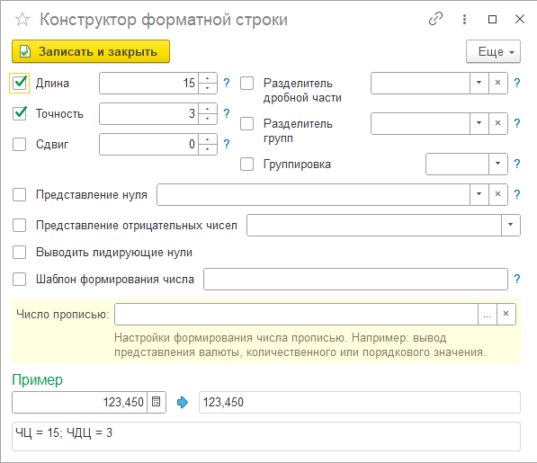
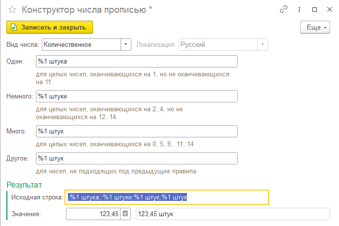
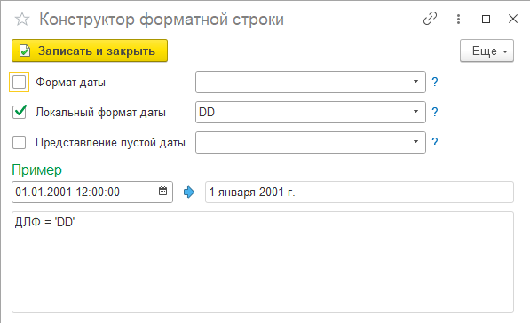
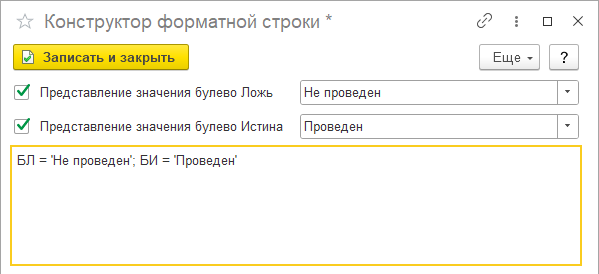
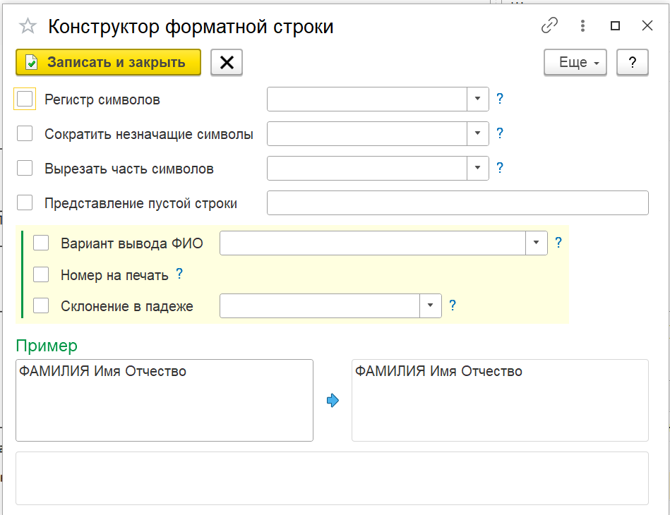

---
layout: default
title: Форматирование
parent: Настройка макета
grand_parent: Документация
nav_order: 12
--- 

# Форматирование значений

В процессе подготовки печатных форм часто необходимо привести значения к определенному виду, например:

* Вывести числа или даты с форматированием. Например: 100'000,00, 01 Января 2001 г.
* Вывести значения булево с форматированием. Например: для Ложь "Значение не указано"
* Вывести числа прописью. Например как сумма с учетом валюты (сто рублей 00 копеек) или количество с указанием наименования вида (10 строк);
* Вывести строку с форматированием. Например: изменить регистр букв, обрезать определенные символы, удалить пробелы;
* Подготовить номер документа на печать. Например: убрать префиксы, лидирующие нули.
* Вывести ФИО в определенном порядке и/или с сокращениями. Например: Петров И.А.

Для этих целей в программе существует механизм форматирования значений перед использованием в макете. Настройка форматирования может быть использована в:

* параметрах области макета;
* конструкторе данных QR-кода;
* конструкторе представления параметра области макета;
* конструкторе представления поля набора;
* конструкторе суммы прописью.

В табличных частях настройка формата находится в крайней правой колонке, с картинкой в заголовке . Если для значения задан формат, аналогичная картинка отображается в ячейке строки. Для создания новой настройки форматирования, необходимо дважды кликнуть на пустую ячейку напротив значения, которое требуется форматировать.

Следует учитывать, форматирование доступно для следующих типов значений:

* число
* дата
* булево
* строка

Если значение имеет отличный вид (ссылка на справочник, документ и т.д.) форматирование будет недоступно.

## Формат числа

    
     Форматирование числа

Настройка форматирования числа позволяет настроить вывод значения в строку с учетом длины, точности, сдвига и других настроек. Дополнительно в нижней части формы существует возможность задать вывод числа прописью. Вывод числа прописью имеет более высокий приоритет. 

Подробнее остановимся на форматировании числа прописью. Результат форматирования зависит от вида числа, которое лежит в основе форматирования.

| Вид числа | Описание |
|--|--|
| Валютное | Вывод суммы прописью, с учетом заданной валюты. Числовое значение выводится прописью. Например: сто пятьдесят тысяч рублей 00 копеек. |
| Количественное | Количественное числительное (например: один, восемьдесят, и т.д.). Числовое значение прописью не выводится. Например: осталось 25 штук |
| Порядковое | Порядковое числительное (например: первый, десятый, и т.д.). Числовое значение прописью не выводится. Например: 1-й в очереди |

    
     Форматирование числа прописью (количествоенное)

## Формат даты

    
     Форматирование даты

Форматирование даты имеет достаточно простую настройку. Более подробная информация о допустимых настройках полей расположена в подсказках напротив полей.

## Формат булево

    
     Форматирование булево

Форматирование значений булево (Истина, Ложь) позволяет привести значения к произвольным строковым значениям.

## Формат строки

    
     Форматирование строки

Настройки форматирования строки:

| Имя настройки | Описание |
|--|--|
| Регистр символов              | Позволяет перевести строку в верхний, нижний или титульный регистр. Титульный регистр преобразует строку следующим образом: у каждого слова строки первый символ преобразуется к верхнему регистру. Все остальные символы преобразуются к нижнему регистру. |
| Сократить незначащие символы  | Отсекает незначащие символы, стоящие слева от первого значащего символа в строке (Слева, Слева + Справа), и пробелы, стоящие справа от последнего значащего символа в строке (Справа, Слева + Справа) |
| Вырезать часть символов       | Вырезает часть символов согласно настройки. Слева, справа или диапазон |
| Вариант вывода ФИО            | Если данные поля содержат полное ФИО, можно выполнить форматирование до указанного шаблона. Кроме предоставленного списка шаблонов можно создать свой, используюся ключевые слова Фамилия, Имя, Отчество, Ф, И, О |
| Подготовить номер на печать   | Если данные поля содержат номер документа, код справочника и т.п., для удаления префикса информационной базы или организации номер можно обработать автоматически. При установке данной настройки, необходимо также указать какой из префиксов необходимо оставить (по умолчанию отключены оба) |
| Склонение в падеже            | В случае, если к значению строки необходимо выполнить склонение, необходимо указать Падеж, а также доп. настройки (это ФИО, пол). Конструктор выполнит склонение самостоятельно |

## Порядок обработки

В процессе подготовки результата существует порядок выполнения операций форматирования:

1. Изменение регистра
2. Подготовка номера на печать
3. Выполнение склонения
4. Форматирование ФИО
5. Сокращение незначащих символов
6. Вырез части символов