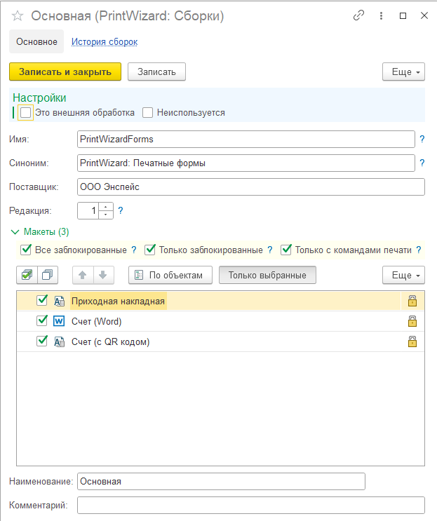
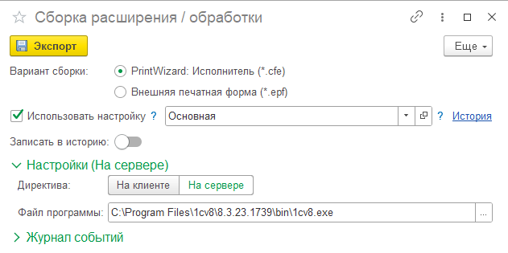

---
layout: default
title: Экспорт в файл
parent: Настройка макета
grand_parent: Документация
nav_order: 15
--- 

# Экспорт печатных форм

Все созданные печатные формы в конструкторе могут быть экспортированы в во внешний файл одним из следующих способов:

* файл формата *.pdwx - это формат конструктора PrintWizard. Выгрузка в данном формате может быть загружена в конструктор печатных форм. Также, файлы в данном формате можно сравнить между собой (специальным инструментом в конструкторе);
* файл формата *.epf - это формат внешней обработки. Внешняя печатная форма создается по требованиям БСП (библиотека стандартных подсистем) и может быть подключена в конфигурацию как внешняя печатная форма. ВАЖНО: Внешняя печатная форма не является полностью самостоятельной, для ее работы необходимо наличие полной версии конструктора, выгруженной версии расширения с печатными формами (см. ниже) или специальной "облегченной" версии PrintWizardExecutor (исполнитель);
* файл формата *.cfe - это формат расширения. Созданное расширение содержит "облегченную" версию конструктора (исполнитель), а также все печатные формы, согласно настройкам выгрузки.

## Экспорт в расширение

Один из основных сценариев разработки, который может быть организован с использованием экспорта в виде расширения:

* создание и доработка печатных форм выполняется на копии базы командой разработчиков;
* готовые макеты переносятся на живую базу по мере подготовки обновлений с определенной периодичностью.

Печатные формы, созданные для тестирования могут быть экспортированы в виде внешних печатных форм. После окончания разработки, они могут быть также включены в новую версию расширения с отключением внешней печатной формы.

Расширение с печатными формами не содержит объектов с хранением данных (справочников, документов и т.п.) и может быть в любой момент отключено без потери информации. Более того, данное расширение не требует наличие лицензии на сервере информационной базы, поскольку не содержит возможности редактирования печатных форм.

Рассмотрим процесс создания настройки сборки расширения и экспорт в файл. Сначала необходимо настроить сборку. Перейдем в справочник "Сборки (PrintWizard)", создадим новый элемент и заполним данные формы:

    
     Пример настройки сборки расширения

Рассмотрим реквизиты формы:

| Имя реквизита | Описание | Расширение | Обработка |
|--|--|--|--|
| Это внешняя обработка     | Признак настройки сборки для внешней обработки | Да | Да |
| Неиспользуется            | Признак, что настройка не используется более. Неиспользуемые настройки нельзя выбрать при сборке | Да | Да |
| Имя                       | Имя для установки в расширение / обработку | Да | Да |
| Синоним                   | Синоним для установки в расширение / обработку | Да | Да |
| Поставщик                 | Наименование поставщика для установки в расширение | Да | Нет |
| Редакция                  | Номер редакции сборки. Нумерация версий производится автоматически по шаблону [Редакция].[Версия]. Версии нумеруются автоматически согласно истории записанных версий | Да | Да |
| Все заблокированные       | Добавлять все заблокированные макеты, независимо от выбранных макетов в настройке | Да | нет |
| Только заблокированные    | Добавлять в сборку только заблокированные макеты, независимо от выбранных макетов в настройке | Да | Да |
| Только с командами печати | Добавлять в сборку только макеты с включенными командами для печати, независимо от выбранных макетов в настройке | Да | Да |
| Добавить общую команду    | Добавлять общую команды согласно настройке макетов | Нет | Да |
| Заголовок общей команды   | Заголовок общей команды (если добавлять) | Нет | Да |

Дополнительно в табличной части указываются макеты, которые должны войти в сборку. Для расширений наличие указанных макетов не обязательно при признаке "Все заблокированные". В таком случае, в расширение попадут все заблокированные макеты. Для внешней печатной формы указание макетов обязательно. Макеты указанные в сборке не обязательно должны быть заблокированы или иметь команды печати. Если не установлены ограничивающие признаки "Только заблокированные" и "Только с командами печати" они будут добавлены в сборку. К тому же они будут добвлены в команды печати. Поэтому следует внимательно относится к установленным настройкам.

Все обработки экспортируются в расширение по следующему принципу:

* обработки соответствуют объектам метаданных, все макеты объекта включены в одну обработку;
* если макет используется в нескольких объектах метаданных: макет будет добавлен только в одну обработку, в другой обработке он будет вызываться из первой обработки;
* команды печати добавляются автоматически;
* обработка имеет форму, где можно выбрать ссылку и макет для печати + выполнить печать;
* каждая обработка может быть сохранена во внешний файл и использована как внешняя печатная форма. Модуль объекта имеет все необходимые методы.

## Экспорт в обработку

Экспорт во внешнюю печатную форму может быть выполнен согласно заранее сохраненным настройкам или по произвольной настройке в форме экспорта. При этом историю версий можно хранить только для настроенных вариантов сборок.

Настройки сборки обработки соответствуют расширению, кроме настроек не предусмотренных для обработки (см. выше). При этом в результате, все макеты будут включены в одну обработку, независимо от объектов метаданных (для печати). Команды будут добавлены согласно настройкам макетов конструктора.

## Сборка расширение / обработку

Запустить процесс подготовки и сборки расширения или обработки можно несколькими путями:

* из формы справочника "Макеты" (внешняя печатная форма по указанному макету)
* из формы справочника "Сборки" (согласно текущей настройке сборки)
* из основного меню PrintWizard (согласно пункту меню)

При этом будет открыта форма запуска сборки:

    
     Форма запуска сборки расширения

Рассмотрим подробнее реквизиты на форме:

| Имя реквизита | Описание | Область | Комментарий |
|--|--|--|--|
| Вариант сборки            | Выбор варианта сборки: расширение или внешняя печатная форма | cfe, epf |  |
| Использовать настройку    | Признак использования настройки сборки | cfe, epf |  |
| Настройка сборки          | Значение настройки для применения в сборке | cfe, epf | Использовать настройку |
| Записать в историю        | Сохранить результат сборки в историю версий по указанной настройке | cfe, epf | Использовать настройку |
| Добавить общую команду    | Добавлять общую команды согласно настройке макетов | epf | НЕ Использовать настройку |
| Заголовок общей команды   | Заголовок общей команды | epf | НЕ Использовать настройку |
| Макеты                    | Таблица макетов для сборки в обработку (только для внешних печатных форм без настройки) | epf | НЕ Использовать настройку |
| Имя обработки             | Имя для установки в расширение / обработку | epf | НЕ Использовать настройку |
| Синоним обработки         | Синоним для установки в расширение / обработку | epf | НЕ Использовать настройку |
| Директива                 | Указание директивы для выполнения процесса подготовки и сборки | cfe, epf |  |
| Файл программы            | Путь к файлу программы 1С: Предприятие. Наличие установленного конфигуратора обязательно | cfe, epf |  |
| Каталог сборки            | Путь к каталогу сборки в режиме отладки | cfe, epf | Режим отладки |
| Каталог ИБ                | Путь к каталогу файловой ИБ в режиме отладки | cfe | Режим отладки |
| Авторизация               | Признак необходимости авторизации в ИБ | cfe | Режим отладки |
| Логин                     | Логин пользователя ИБ | cfe | Режим отладки |
| Пароль                    | Пароль пользователя ИБ | cfe | Режим отладки |
| Журнал событий            | Журнал событий выполненных в процессе подготовки и сборки | cfe, epf |  |

Всего в результате выполнения обработки можно получить следующие файлы:

* облегченное расширение (*.cfe) - расширение без конструктора и печатных форм, предназначено только для исполнения внешних печатных форм
* расширение с печатными формами (*.cfe) - расширение без конструктора, с печатными формами, с возможность исполнения внешних печатных форм
* внешняя печатная форма (*.epf) - внешняя печатная форма согласно настройке сборки или настройкам из формы

### Режим отладки

У обработки есть режим отладки (подменю "Еще" формы в правом верхнем углу). В данном режиме можно указать каталог сохранения временных файлов (Каталог сборки) и каталог информационной базы для сборки расширений (Каталог ИБ). В данном случае в каталоге сборки появятся следующие данные:

* данные исходного расширения или шаблона обработки в XML (каталоги cfe/old или epf/old соответственно)
* данные готового расширения или обработки в XML (каталоги cfe/new или epf/new соответственно)
* файлы исходного и готового расширения или обработки (*.cfe или *.epf соответственно)

# Экспорт в файл *.pdwx

Файл с расширением *.pdwx используется для хранения и обмена макетами между различными информационными базами. Также возможно сравнение файла *.pdwx с макетом конструктора или другим файлом. Для экспорта во внутренний формат не требуется сохранение настроек. Один макет всегда сохраняется в один файл. Технически файл *.pdwx является архивом, внутри которого хранится файл *.json с сериализованными данными (см. [pw#template#file]).

Для экспорта в файл *.pdwx перейдите в форму элемента макета, в меню "Еще" формы (правый верхний угол формы) перейдите в подменю "Обмен макетами" и выберите "Выгрузить в файл". После нажатия будет предложено указать путь для сохранения, после чего файл будет сохранен по указанному пути.

[1]: ../convert/pw_template_file.html