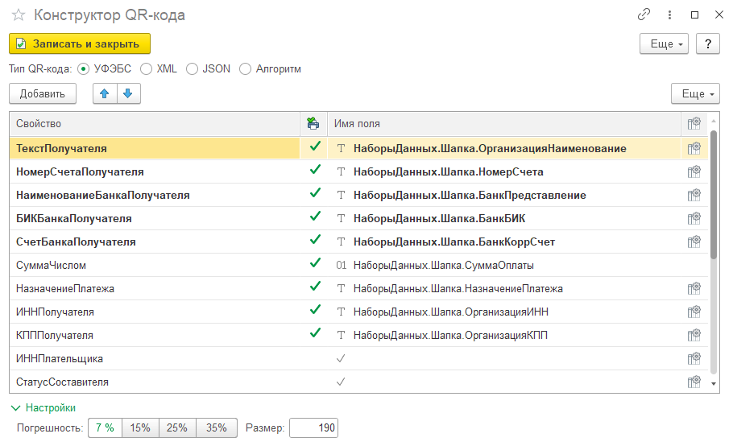

---
layout: default
title: QR-код
parent: Настройка макета
grand_parent: Документация
nav_order: 21
--- 

# QR-код

{: .important-title }
> Технические требования
> 
> Для формирования QR-кода необходимо наличие подсистемы "Печать", а в частности методов:
> * ГенерацияШтрихкода.ДанныеQRКода
> * УправлениеПечатьюРФ.ФорматнаяСтрокаУФЭБС (для типа УФЭБС)
>
> Дополнительно, если любой из модулей недоступны, система пытается выполнить указанные методы в общем модуле УправлениеПечатью.

Для добавления QR-кода в печатную форму необходимо выполнить следующую последовательность действий

* (для табличного документа) добавить картинку QR-кода
* (для офисного документа) добавить параметр на место для вставки картинки QR-кода
* указать тип параметра области макета `Данные QR-кода`
* выполнить настройку формирования значения QR-кода

    
     Настройка формирования QR-кода

Существует 4 типа способа формирования QR-кода

| Тип QR-кода | Описание |
|--|--|
| УФЭБС     | Унифицированные форматы электронных банковских сообщений для безналичных расчетов. Позволяет сформировать QR-код для оплаты через банковские приложения. |
| XML       | Значение структуры сериализованное в XML. Ключ - свойство, значение - подготовленное значение указанного поля |
| JSON      | Значение структуры сериализованное в JSON. Ключ - свойство, значение - подготовленное значение указанного поля |
| Алгоритм  | Возможность сформировать данные, путем выполнения произвольного кода. Результатом алгоритма должна быть строка со значением для QR-кода |

Настройки: 

* **Погрешность**. Уровень погрешности изображения, при котором данный QR-код все еще возможно 100% распознать;
* **Размер**. Определяет длину стороны выходного изображения в пикселях. Если минимально возможный размер изображения больше этого параметра - код сформирован не будет.