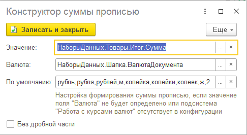
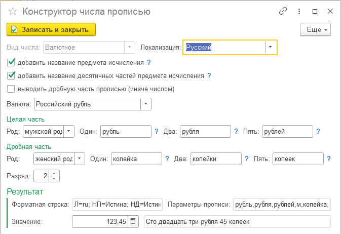

---
layout: default
title: Сумма прописью
parent: Настройка макета
grand_parent: Документация
nav_order: 22
--- 

# Сумма прописью

Для некоторых печатных форм необходимо добавить сумму прописью. Существует несколько вариантов, как это может быть реализовано в конструкторе:

* создать "Вычисляемое поле" в набор данных;
* использовать тип "Произвольный алгоритм" в параметре области макета;
* использовать тип "Сумма прописью" в параметре области макета.

Для первых двух случаях можно использовать методы, встроенные в конфигурации. Однако, самый простой способ - это последний. Разберем, как выполнить настройку параметра области макета.

Порядок действий настройки параметра области макета:
* переходим на закладку "Макет"
* активизируем строку области, где находится требуемый параметр
* активизируем строку параметра
* выбираем тип "Сумма прописью"
* двойным кликом по колонке "Значение" (в ТЧ Параметры области) переходим в форму конструктора значения

    
     Конструктор суммы прописью

Реквизиты формы:

| Имя реквизита | Описание |
|--|--|
| Значение          | Поле, содержащее числовое значение для вывода прописью |
| Валюта            | Поле, содержащее значение валюты. Не обязательно, в таком случае рекомендуется заполнить реквизит "По умолчанию" |
| По умолчанию      | Настройка вывода суммы прописью, если валюта не задана, не определена или подсистема "Валюты" (БСП) не используется |
| Без дробной части | Не выводить дробную часть в прописи |

Порядок определения настройки для вывода суммы прописью:
* если используется подсистема "Валюты" (БСП) и значение поля "Валюта" определено, используется метод "СформироватьСуммуПрописью" общего модуля "РаботаСКурсамиВалют"
* если подсистема отсутствует, или значение поля "Валюта" не определено, используется настройка "По умолчанию"
* если настройка по умолчанию не указана, сумма прописью формируется в российских рублях

По кнопке выбора в поле "По умолчанию", доступна форма конструктора числа прописью

    
     Конструктор прописи валюты "по умолчанию"

В данной форме вы можете настроить параметры формирования числа прописью, согласно требуемому функционалу. В подвале формы можно проверить какой результат получится при изменении.