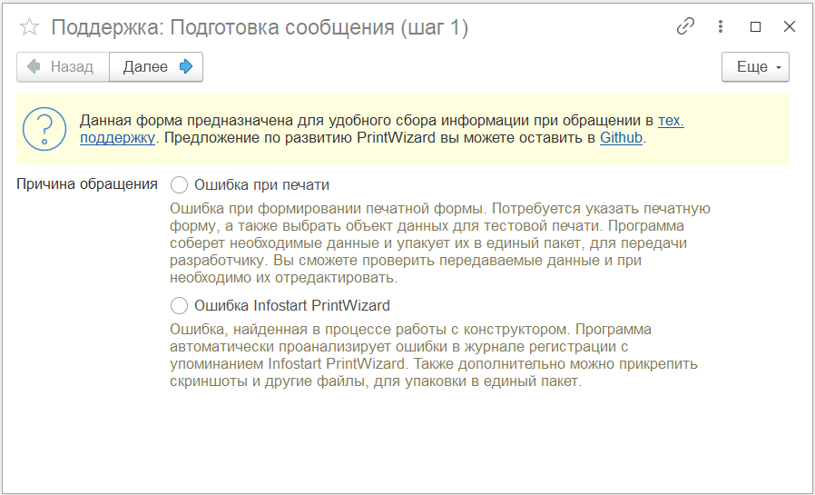
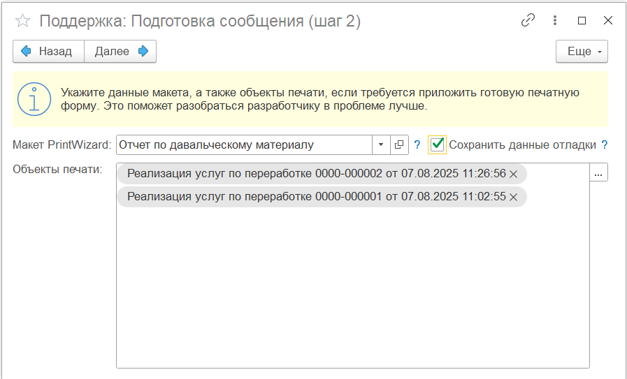
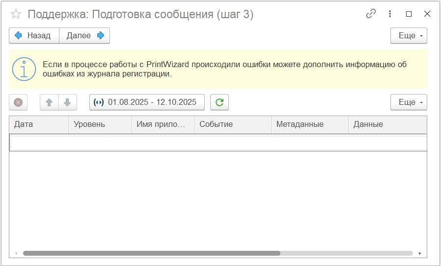
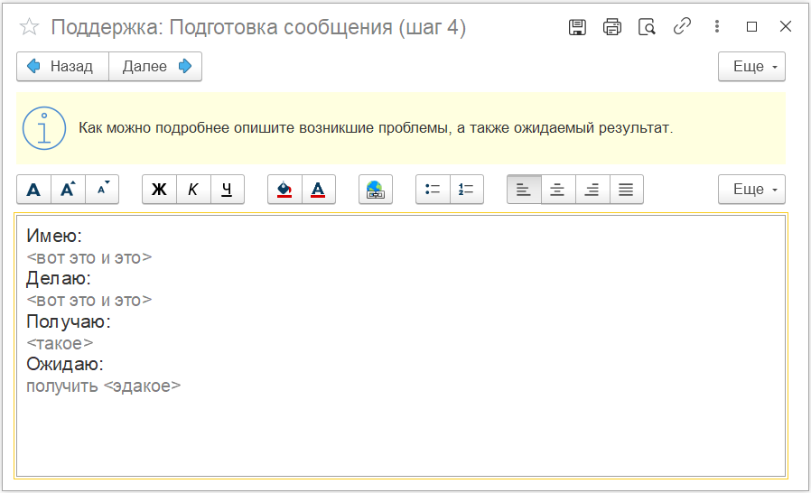
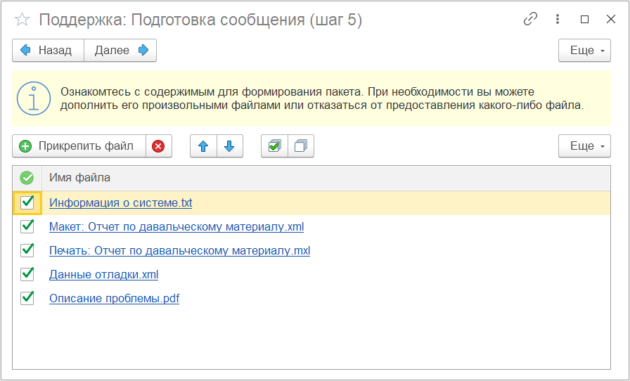
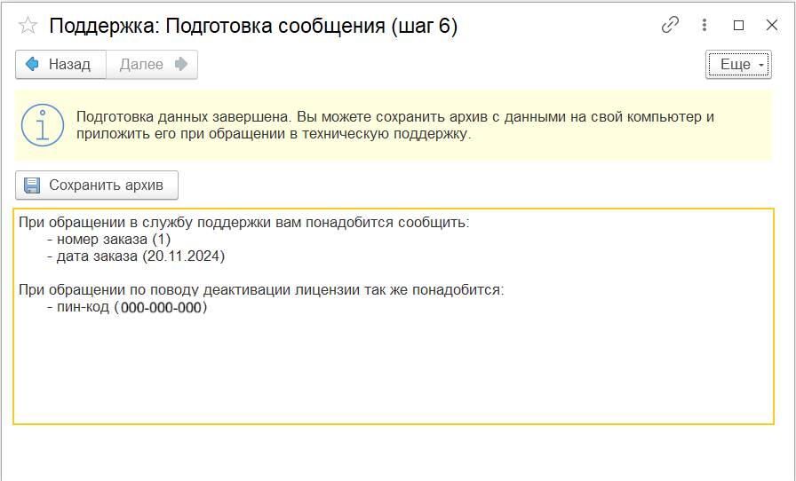

---
layout: default
title: Тех. поддержка
parent: Документация
nav_order: 4
--- 

# Техническая поддержка
{: .no_toc }

  

    Содержание
  

  {: .text-delta }
1. TOC
{:toc}

Конструктор запросов еще относительно молодой продукт и очень динамично развивается. Если в процессе работы с ним у вас возникли трудности вы всегда можете обратиться в техническую поддержку [Infostart][1].

В зависимости от проблемы, вам понадобиться сообщить дополнительную информацию. Для подготовки необходимого пакета данных в состав расширения входит специальный инструмент **Данные тех. поддержки**. Вы можете его найти в подразделе Сервис основного меню PrintWizard. Также, если проблема возникает с отдельным макетом, в форме списка и элемента макетов также расположена кнопка быстрого вызова обработки подготовки данных для тех. поддержки.

## Подготовка данных для технической поддержки

При запуске из главного меню, вы попадете на первый шаг обработки. Но при запуске из справочника **Макеты** этот шаг будет пропущен и выбрано значение **Ошибка при печати**.

    
     Шаг 1: Выбор причины обращения

При выборе причины Ошибка при печати, вы перейдете к шагу 2 (для другой причины данный шаг пропускается).

    
     Шаг 2: Выбор причины обращения

При переходе из справочника поле **Макет PrintWizard** будет заполнено автоматически. Если проблема в итоговой печатной форме, рекомендуется выбрать значение **Объекты печати** (один или несколько). В таком случае в сформированный пакет будет добавлена готовая печатная форма.

При выборе признака **Сохранить данные отладки** в состав пакета будет добавлена информация из журнала логирования процесса подготовки печатной формы.

{: .important-title }
> Важный момент
> 
> В некоторых компаниях достаточно строгая политика безопасности в отношении передачи данных третьим лицам. Поэтому рекомендуется формировать печатную форму на тестовых данных, которые не относятся к рабочим данным вашей организации.
>
> Какие данные будут подготовлены и могут быть переданы можно посмотреть, если включить **Режим отладки** на форме элемента макета и сформировать печатную форму с аналогичными объектами.

На следующем шаге программа поможет вам собрать данные об ошибках из журнала регистрации.

    
     Шаг 3: Данные журнала регистрации

В больших информационных базах сбор данных из журнала может занимать длительное время, поэтому не рекомендуется выбирать большой период. Обычно, если ошибка произошла недавно, достаточно округлить получение данных с начала дня.

При нажатии кнопки обновления, табличная часть будет заполнена ошибками и предупреждениями из журнала по следующим критериям:

* указанный объект метаданных относится к расширению PrintWizard
* в комментарии есть упоминание PrintWizard или pw_ (это служебный префикс объектов расширения)

Если какие-либо сообщения программа собрала ошибочно или вы не хотите их передавать, вы можете удалить строку из табличной части.

На следующем шаге программа предложит вам подробно описать проблему.

    
     Шаг 4: Описание проблемы

При переходе на шаг 4 поле будет пустым. На скриншоте предложен один из вариантов заполнения. В целом редактирование данного поля похоже на работу с офисным документом. Кроме того, в него можно добавить картинки (скриншоты например). Это может помочь разработчику при решении проблемы.

На финальном шаге, программа покажет собранные данные.

    
     Шаг 5: Подготовленные файлы

Также вы можете добавить другие произвольные файлы, которые помогут в решении проблемы. Давайте подробнее рассмотрим подготовленную информацию по умолчанию:

| Имя файла | Описание |
|--|--|
| Информация о системе.txt | Общая информация о системе. Системная информация, общие данные о конфигурации и данные о расширении Infostart PrintWizard |
| Макет: Отчет по давальческому материалу.xml | Выгруженный в формат XML макет печатной формы |
| Печать: Отчет по давальческому материалу.mxl | Выгруженный в формат табличного документа (или файлов docx) результат печати |
| Данные отладки.xml | Сериализованные в XML данные отладки при подготовке печатной формы |
| Описание проблемы.pdf | Пользовательское описание проблемы |
| Данные журнала регистрации.xml | Сериализованные в XML данные журнала регистрации |

Если какой-либо из файлов вы решили не передавать, достаточно отключить галочку в левой колонке. Удалить из списка можно только файлы добавленные вручную.

После этого переходим в финальному шагу.

    
     Шаг 6: Итоговые данные

При обращении в службу поддержки вам понадобится номер и дата заказа, а в некоторых случаях и зарегистрированный пин-код. Данная информация располагается на форме и может быть скопирована. Это поможет быстрее перейти от знакомства с поддержкой к решению проблемы.

При нажатии на кнопку **Сохранить архив** программа предложит выбрать место, куда он сохранит файл архива (zip) со всеми вложенными файлами.

Краткое описание и данная собранная информация наверняка позволит достаточно быстро диагностировать проблему и найти варианты ее решения.

[1]: https://infostart.ru/