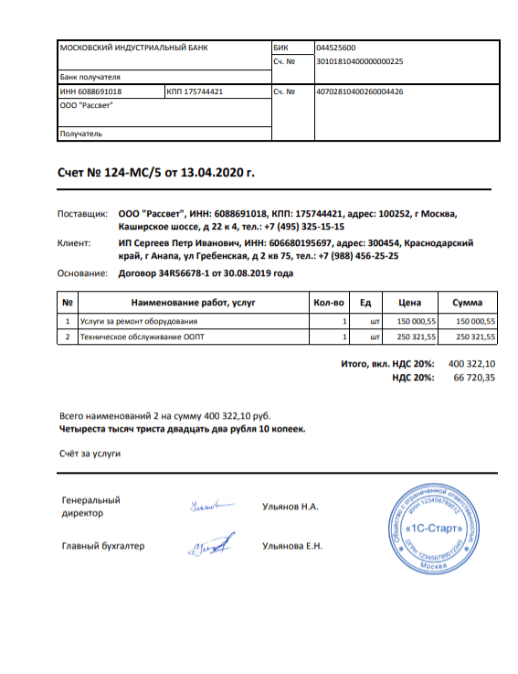
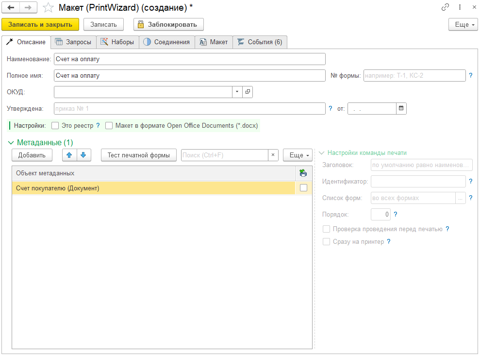
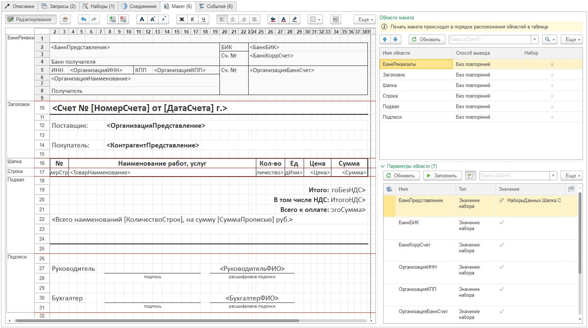
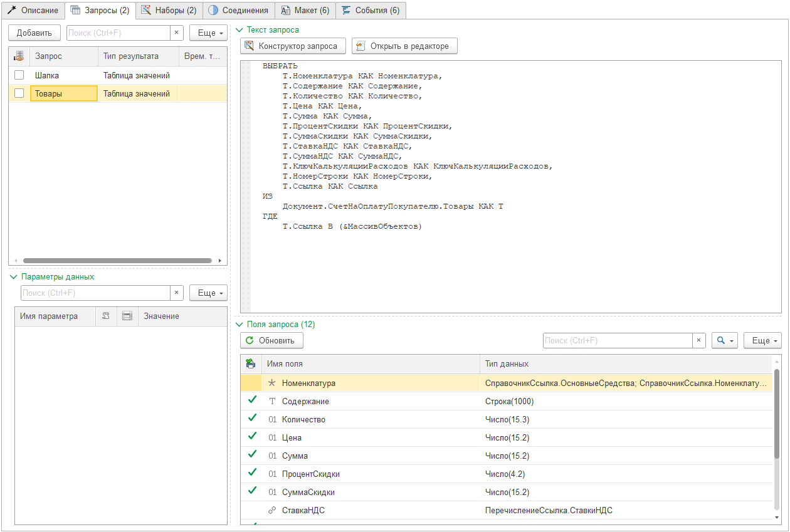
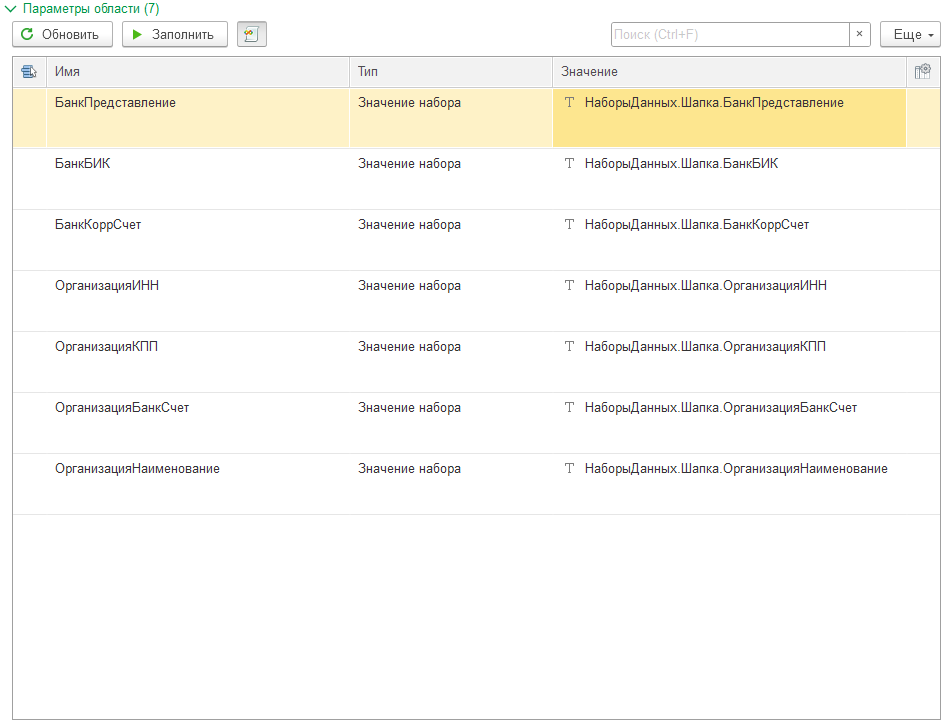
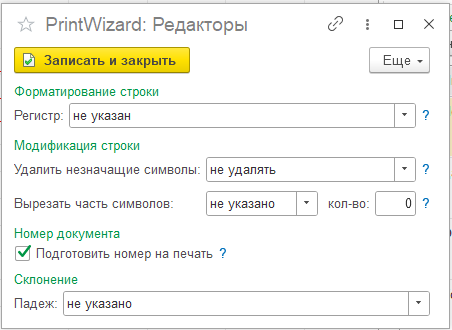
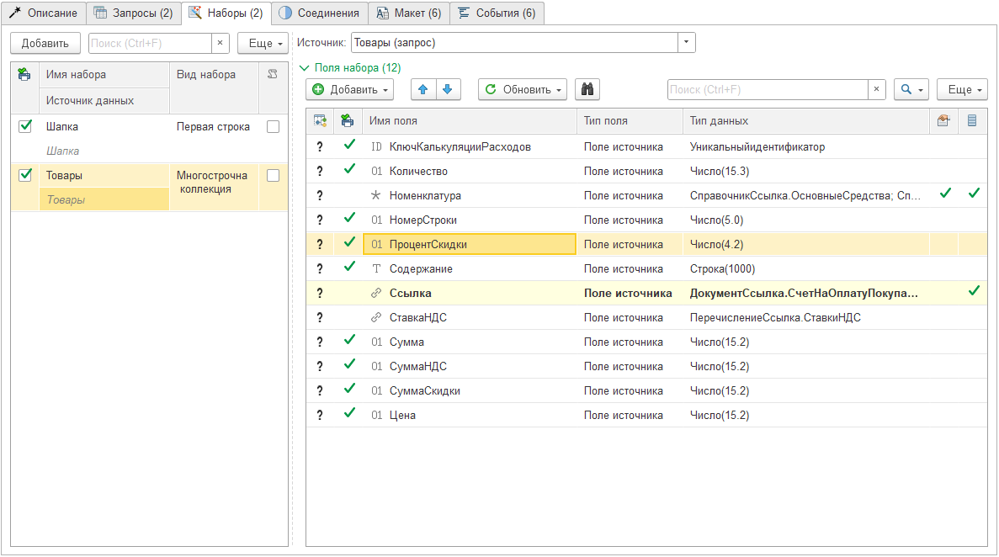
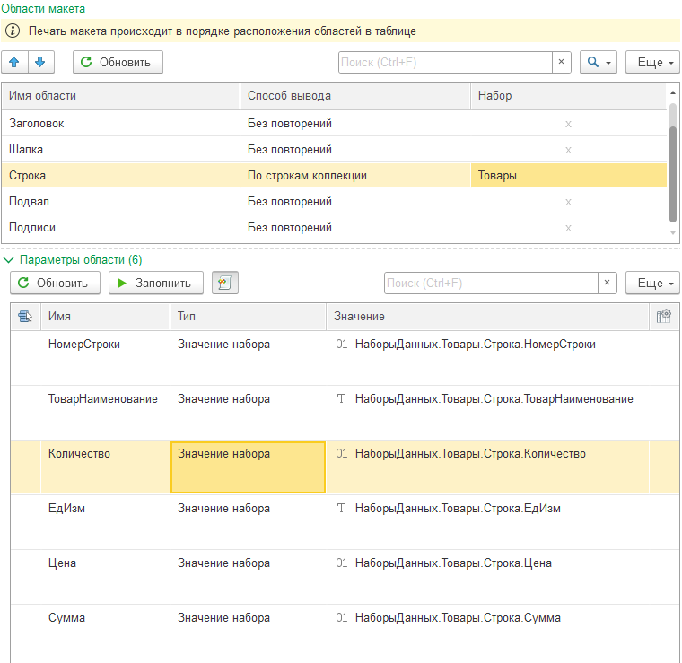
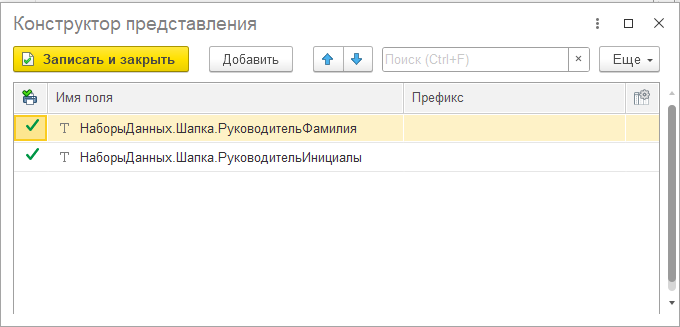
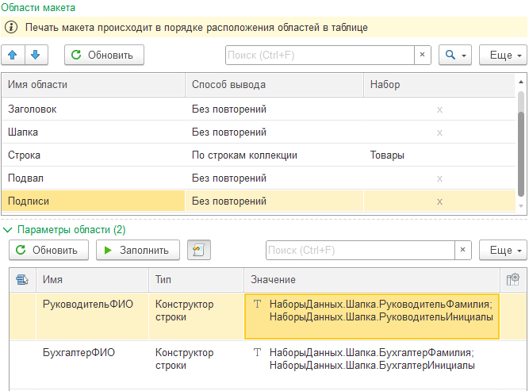

---
layout: default
title: Счет на оплату
parent: Примеры разработки
grand_parent: Документация
nav_order: 1
--- 

# Счет на оплату
{: .no_toc }

<details open markdown="block">
  <summary>
    Содержание
  </summary>
  {: .text-delta }
1. TOC
{:toc}
</details>

Практическое знакомство с конструктором начнем с простой печатной формы. В этом примере подробно, шаг за шагом описываются действия разработчика по визуальному конструированию печатной формы с помощью конструктора PrintWizard. В следующих примерах эти действия будут лишь кратко перечисляться. Поэтому данный пример будет полезен для новичков, не знакомых с конструктором, а остальным поможет вспомнить некоторые моменты разработки.

И так, разработаем печатную форму "Счет на оплату" для конфигурации "Бухгалтерия предприятия" (см. рис. 3.1)

<p align="center">
    
    <br>Рис. 3.1 Пример печатной формы "Счет на оплату"
</p>

Готовый макет для загрузки в конструктор, можно скачать [тут][2].

{: .important-title }
> ПРИМЕЧАНИЕ
>
> Все действия, описанные в этой главе будут выполняться на демонстрационной конфигурации 1С:Бухгалтерия.

## Визуальное конструирование

Для визуального конструирования печатной формы создадим новый элемент в справочнике "Макеты". В появившемся окне редактирования введем наименование макета *Счет на оплату*, заполним при необходимости другие реквизиты описывающие печатную форму (см. рис. 3.2).

Кроме того, в табличной части "Метаданные" укажем документ "Счет покупателю", поскольку именно для него создается печатная форма.

<p align="center">
    
    <br>Рис. 3.2 Настройка основной информации о печатной форме
</p>

{: .important-title }
> ПРИМЕЧАНИЕ
>
> Данная печатная форма планируется в формате табличного документа. Вариант создания печатной формы в формате офисного документа будет описан дополнительно.

На текущем этапе самым простым способом понять как сделать печатную форму, является создать ее макет. Для этого переходим на закладку "Макет" и в командной панели над табличным документом нажимаем кнопку "Редактирование". После чего, создадим треуемый макет.

<p align="center">
    
    <br>Рис. 3.3 Макет печатной формы
</p>

Почему рекомендуется на первом этапе создавать именно макет? Следует понимать, что именно содержимое параметров макета определяет данные, которые понадобится извлекать из базы данных. Более того, мы можем наполнять сбор данных по этапам. Основываясь на областях и тех параметрах, которые требуются для вывода области.

На представленном макете выделено 6 областей:

| Имя области | Описание данных |
|--|--|
| БанкРеквизиты | Банковские реквизиты организации для оплаты счета |
| Заголовок     | Реквизиты счета, представление сторон (организации, контрагента) |
| Шапка         | Шапка табличной части товаров и услуг |
| Строка        | Строки табличной части товаров и услуг |
| Подвал        | Подвал табличной части товаров и услуг |
| Подписи       | Подписи со стороны организации |

## Область БанкРеквизиты

Для начала сделаем вывод информации о банковских реквизитах. Для этого нам необходимо определить запрос, с помощью которого данные будут получены из базы данных. Далее мы их при необходимости сможем обработать и связать с параметрами области печатной формы.

Перейдем на закладку "Запросы". Добавить запросы можно вручную, но можно нажать кнопку "Обновить" (в командной панели или в подменю "Еще" над табличной частью Запросы). При обновлении, программа автоматически добавит запросы на основании реквизитов и табличных частей документа.

На нашем примере, после обновления, конструктор добавит 4 запроса:
* Шапка
* Товары
* ВозвратнаяТара
* РеквизитыКодаДляОплаты

Для упрощения, оставим только запросы "Шапка" и "Товары", а остальные удалим.

<p align="center">
    
    <br>Рис. 3.4 Запросы для формирования печатной формы
</p>

Теперь наша задача найти информацию о банковском счете. Если мы посмотрим на состав полей запроса "*Шапка*", то увидим там поле "*СтруктурнаяЕдиница*" с типом "*СправочникСсылка.БанковскиеСчета*". Кажется, то что нужно. Проверим, для этого быстро сделаем связь между полем запроса и параметром области макета. А потом протестируем печатную форму.

Пошагово создание связи в самом простом виде выглядит следующим образом:
* перейти на закладку "Наборы" и выполнить действия: 
  * создать набор для запроса "Шапка"
    * добавить строку, 
    * указать имя набора Шапка
    * вид набора "Первая строка"
    * источник "Шапка (запрос)"
  * обновить поля набора "Шапка"
    * подменю "Обновить" > "Из запроса" над табличной частью "Поля набора"
* перейти на закладку "Макет" и выполнить действия:
  * активизировать строку "БанкРеквизиты" в табличной части "Области макета"
  * активизировать строку "БанкПредставление" табличной части "Параметры области"
  * перейти в форму выбора доступных полей (двойным кликом на поле "Значение")
  * выбрать поле НаборыДанных > Шапка > СтруктурнаяЕдиница

После этого можно вернуться на закладку "Описание" и выполнить тест печатной формы. Над табличной частью "Метаданные" есть кнопка с аналогичным названием. При нажатии на нее, программа предложит выбрать документ, на котором необходимо выполнить тест, после выбора сформируется печатная форма.

{: .important-title }
> ПРИМЕЧАНИЕ
>
> В будущем планируется упростить процедуру тестирования и отладки печатной формы. Чтобы данные можно было смотреть без формирования печатной формы. А само формирование будет доступно из командной панели формы.

И так, после теста, мы удостоверимся, что данный реквизит нам подходит, однако он содержит ссылку на банковский счет, а нам надо вывести реквизиты банка и организации. Для этого необходимо отредактировать запрос. Редактировать запрос можно тремя способами:
* вручную в поле "Текст запроса"
* при помощи конструктора запроса, по кнопке "Конструктор запроса"
* вручную при помощи специального [расширенного редактора][1], по кнопке "Открыть в редакторе"

Самый простой и визуально наглядный способ: Конструктор запроса.

Дополним наш запрос недостающими полями:

```
	Т.СтруктурнаяЕдиница.Банк.Код КАК БанкБИК,
	Т.СтруктурнаяЕдиница.Банк.КоррСчет КАК БанкКоррСчет,
	Т.СтруктурнаяЕдиница.Банк.Наименование КАК БанкПредставление,
	Т.Организация.ИНН КАК ОрганизацияИНН,
	Т.Организация.КПП КАК ОрганизацияКПП,
	Т.Организация.НаименованиеПолное КАК ОрганизацияНаименование,
	Т.СтруктурнаяЕдиница.НомерСчета КАК ОрганизацияБанкСчет
```

Далее уже по описанное выше схеме, обновляем поля набора "Шапка" и связываем параметры области с доступными полями. В результате, связь должна выглядеть следующим образом:

<p align="center">
    
    <br>Рис. 3.5 Связь параметров области "Шапка" с данными
</p>

## Область Заголовок

Для данной табличной части у нас не хватает поля представления контрагента. Конечно, мы могли бы связать параметр "КонтрагентПредставление" с полем "Контрагент", но связь с полем ссылочного не рекомендуется. В таком случае, программа по умолчанию считает представление контрагента и подставит это значение. Стоит учитывать, что представление не всегда может быть равно наименованию. А в некоторых случаях, правило формирования представления может быть изменено разработчиком в процессе доработки программы.

Поэтому рекомендуется доработать запрос "Шапка" и добавить код:

```
Т.Контрагент.НаименованиеПолное КАК КонтрагентНаименование
```

После этого обновить набор, выполнить связь параметров области "Заголовок" с полями набора. Дополнительно, на текущем этапе можно отформатировать номер счета и дату. Например: если нам требуется, чтобы номер счета был без учета префикса информационной базы, для этого перейдем в настройку форматирования (колонка справа от колонки "Значение") и выполним настройку:

<p align="center">
    
    <br>Рис. 3.6 Настройка форматирования поля "НомерСчета"
</p>

Аналогично можно отформатировать поле "ДатаСчета".

## Области Строка

Поскольку область "Шапка" не содержит никаких параметров, ее настройку мы пропускам. Переходим в области "Строка".

Документ "Счет покупателям" может содержать одну и более строк в табличной части, соответственно, нам необходимо, чтобы область "Строка" была напечатана столько раз, сколько строк существует в табличной части. 

Для этого выполним следующие действия:
* добавим в запрос "Товары" недостающие поля

```
	Т.Номенклатура.Наименование КАК ТоварНаименование,
	Т.Номенклатура.ЕдиницаИзмерения.Наименование КАК ЕдИзм
```

* создадим набор данных "Товары"
  * имя: Товары
  * вид набора: Многострочная коллекция
  * источник: Товары (запрос)
* выполним обновление полей набора

<p align="center">
    
    <br>Рис. 3.7 настройка набора "Товары"
</p>

После этого нам необходимо изменить "Способ вывода" области "Строка" (табличная часть "Области макета" закладка "Макет") на значение "По строкам коллекции" и указать значение набора "Товары". После этого, можно нажать кнопку "Заполнить" над табличной частью "Параметры области" и программа автоматически сопоставит параметры и доступные поля. В результате вы должны увидеть следующее:

<p align="center">
    
    <br>Рис. 3.8 настройки области "Строка" и связь параметров области
</p>

## Область Подвал

В области "Подвал" есть несколько сложностей:
* необходимо отдельно рассчитать сумму без НДС, НДС и с НДС
* вывести сумму с НДС прописью

Для этого необходимо:
* доработать запрос "Товары"

```
	ВЫБОР
		КОГДА Т.Ссылка.СуммаВключаетНДС
			ТОГДА Т.Сумма - Т.СуммаНДС
		ИНАЧЕ Т.Сумма
	КОНЕЦ КАК СуммаБезНДС,
	ВЫБОР
		КОГДА Т.Ссылка.СуммаВключаетНДС
			ТОГДА Т.Сумма
		ИНАЧЕ Т.Сумма + Т.СуммаНДС
	КОНЕЦ КАК СуммаСНДС
```
* обновить поля набора "Товары"
* выполнить сопоставление всех параметров области "Подвал", кроме "СуммаПрописью"

Для формирования суммы прописью параметр области "СуммаПрописью" настроим следующим образом:
* установим значение "Произвольный алгоритм" в колонку "Тип"
* добавим произвольный алгоритм в колонку "Значение"

```
СуммаСНДС	= НаборыДанных.Товары.Итог.СуммаСНДС;
Валюта		= НаборыДанных.Шапка.ВалютаДокумента;

Результат = ОбщегоНазначенияБПВызовСервера.СформироватьСуммуПрописью(СуммаСНДС, Валюта);
```

В результате настройки, вы должны увидеть следующее:

<p align="center">
    
    <br>Рис. 3.9 настройки области "Подвал" и связь параметров области
</p>

## Область Подписи

Для формирования правильного представления ФИО подписантов (в формате Фамилия И.О.), необходимо отдельно получить поля "Фамилия" и "Инициалы". Для этого добавим код в текст запроса "Шапка" и обновим поля соответствующего набора

```
	Т.Руководитель.Фамилия КАК РуководительФамилия,
	Т.Руководитель.Инициалы КАК РуководительИнициалы,
	Т.ГлавныйБухгалтер.Фамилия КАК БухгалтерФамилия,
	Т.ГлавныйБухгалтер.Инициалы КАК БухгалтерИнициалы
```

Далее необходимо выполнить настройку параметров области. Настройка однотипная для обоих параметров. Рассмотрим на примере параметра "РуководительФИО"

* установим значение "Конструктор строки" в колонку "Тип"
* перейдем в настройку конструктора строки (двойной клик в колонке "Значение")
* при помощи кнопки "Подбор" (или Добавить) добавим поля "РуководительФамилия" и "РуководительИнициалы" (набор данных "Шапка")

<p align="center">
    
    <br>Рис. 3.10 настройка конструктора строки для параметра "РуководительФИО"
</p>

После выполнения настройки, записываем и закрываем форму. Делаем аналогично для параметра "БухгалтерФИО". В результате настройки, вы должны увидеть следующее:

<p align="center">
    
    <br>Рис. 3.11 настройки области "Подписи" и связь параметров области
</p>

## Финальный тест

После завершения настройки, выполним финальный тест. На закладке "Описание" нажимаем кнопку "Тест печатной формы" (табличная часть Метаданные) и смотрим на полученный результат. Если все выполнено верно, печатная форма должна быть сформирована полностью.

[1]: ../guide/ch_02_20.html
[2]: ../../pdwx/БухгалтерияПредприятия/СчетНаОплату.pdwx