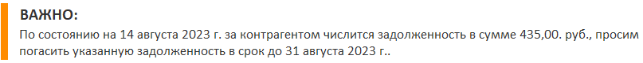
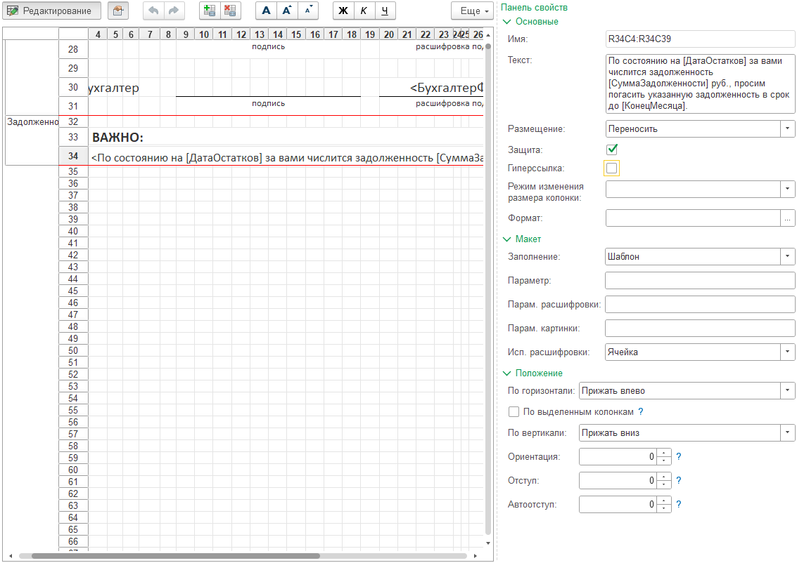
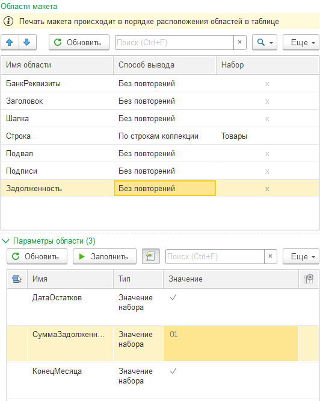
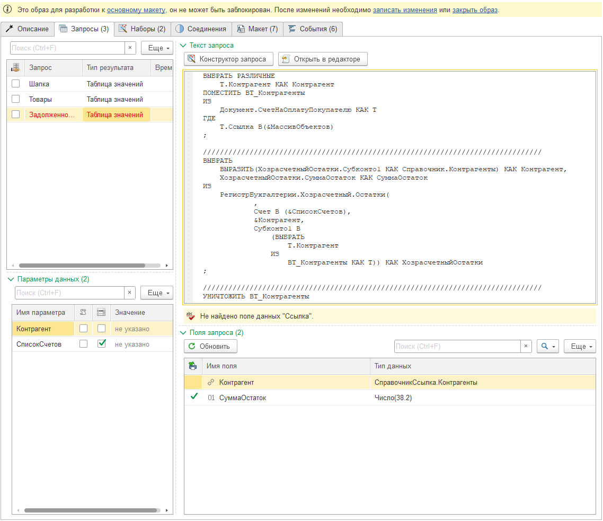
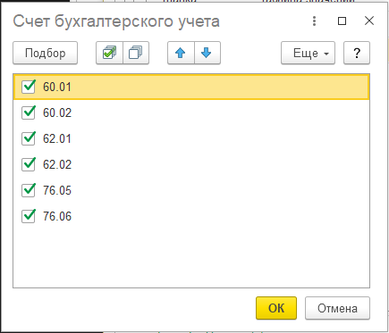
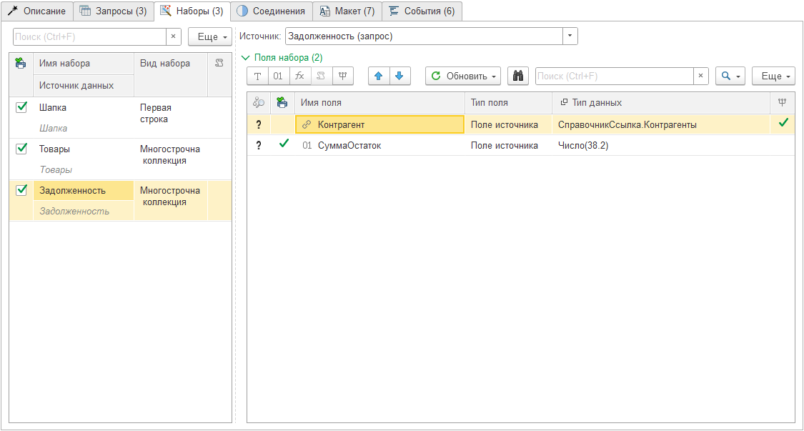
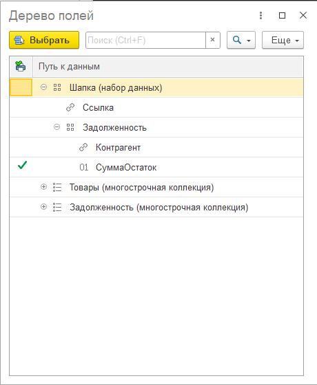
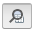

---
layout: default
title: Задолженность в счете
parent: Примеры разработки
grand_parent: Документация
nav_order: 1
--- 

# Счет на оплату
{: .no_toc }

<details open markdown="block">
  <summary>
    Содержание
  </summary>
  {: .text-delta }
1. TOC
{:toc}
</details>

На [предыдущем примере][1] была создана печатная форма для счета на оплату покупателю. По сути, мы воссоздали типовую печатную форму, которая уже существует в программе. В данной главе мы доработаем счет, задействуя дополнительные возможности конструктора, не затронутые в предыдущей главе.

И так, нам необходимо доработать счет следующим образом: в подвале, после подписей, необходимо вывести информацию о дебиторской задолженности контрагента. При этом, если задолженность кредиторская (или отсутствует) данный раздел не должен выводиться вовсе. Образец внешнего вида раздела с задолженностью представлен на картинке 3.13.

<p align="center">
    <a href="./../img/ch_03/3_13_section_debet.png"></a>
    <br>Рис. 3.13 Раздел "Задолженность" для счета на оплату
</p>

## Закладка Макет (область Задолженность)

В предыдущей главе мы завершили разработку печатной формы, добавили команду печати и заблокировали форму для изменений. Таким образом, сейчас для доработки формы нам надо принять решение: либо форму разблокировать (команда печати у пользователей пропадет), либо создать образ для разработки.

Поскольку данная форма активно используется, отключать возможность ее печати не рекомендуется. Поэтому мы создадим новый образ для разработки. Для этого открываем существующий макет, в заголовке видим предупреждение о том, что форма заблокирована, нажимаем "создать образ для разработки".

В новой форме макета, переходим на закладку "Макет" и выполняем доработку согласно рисунку 3.14

<p align="center">
    <a href="./../img/ch_03/3_14_template_debet.png"></a>
    <br>Рис. 3.14 Настройка закладки "Макет" для области "Задолженность"
</p>

Текст шаблона области:
```
По состоянию на [ДатаОстатков] за контрагентом имеется задолженность в сумме [СуммаЗадолженности] руб., просим погасить указанную задолженность в срок до [КонецМесяца].
```

После доработки обновим список областей, активизируем строку области "Задолженность" и если все выполнено правильно, вы должны увидеть следующее: 

<p align="center">
    <a href="./../img/ch_03/3_15_pararms_debet.png"></a>
    <br>Рис. 3.15 Область "Задолженность" и ее параметры
</p>

## Закладка Запросы

Для получения данных о задолженности, необходимо добавить новый запрос для сбора данных из регистров бухгалтерии. Для этого необходимо:

* создать новый запрос
  * Имя: Задолженность
  * Тип результата: Таблица значений
  * Текст запроса

```
ВЫБРАТЬ РАЗЛИЧНЫЕ
	Т.Контрагент КАК Контрагент
ПОМЕСТИТЬ ВТ_Контрагенты
ИЗ
	Документ.СчетНаОплатуПокупателю КАК Т
ГДЕ
	Т.Ссылка В(&МассивОбъектов)
;

////////////////////////////////////////////////////////////////////////////////
ВЫБРАТЬ
	ВЫРАЗИТЬ(ХозрасчетныйОстатки.Субконто1 КАК Справочник.Контрагенты) КАК Контрагент,
	ХозрасчетныйОстатки.СуммаОстаток КАК СуммаОстаток
ИЗ
	РегистрБухгалтерии.Хозрасчетный.Остатки(
			,
			Счет В (&СписокСчетов),
			&Контрагент,
			Субконто1 В
				(ВЫБРАТЬ
					Т.Контрагент
				ИЗ
					ВТ_Контрагенты КАК Т)) КАК ХозрасчетныйОстатки
;

////////////////////////////////////////////////////////////////////////////////
УНИЧТОЖИТЬ ВТ_Контрагенты
```

Обратите внимание, строка с запросом подсвечена красным цветом (есть ошибки), а под полем для ввода текста запроса указана ошибка `На найдено поле данных ""Ссылка""` (см. рис. 3.17)

<p align="center">
    <a href="./../img/ch_03/3_16_query_debet.png"></a>
    <br>Рис. 3.16 Результат добавления запроса "Задолженность"
</p>

{: .warning-title }
> ВАЖНО
>
> Поскольку данная печатная форма формируется для каждого документа отдельно (по каждой ссылке), программе необходимо наличие поле "Ссылка" в таблице с результатом запроса, для отбора данных по соответствующему документу. Однако, таблица задолженности не содержит ссылок на документ "Счет на оплату покупателю". Конечно, мы могли это сделать, но в данном случае это ни к чему. Для случаев, когда результат запроса содержит общие данные, без ссылок на объекты метаданных, достаточно поставить флажок в колонке "Это общие данные" (табличная часть Запросы, колонка слева от имени) и программа поймет, что данный результат с данными текущего запрос надо использовать целиком, независимо от ссылки в момент формирования печатной формы.

Установим флажок "Это общий запрос". Строка запроса должна стать обычным цветом, а текст ошибки пропасть.

Давайте немного подробнее посмотрим на текст запроса. Данный запрос состоит из 3-х частей:
* запрос списка уникальных контрагентов из счетов, для которых формируются печатные формы. Результат запроса помещается во временную таблицу `ВТ_Контрагенты` (инструкция `ПОМЕСТИТЬ ВТ_Контрагенты`);
* запрос остатков задолженности по контрагентам для субконто `&Контрагент`, счетов указанных в параметре `&СписокСчетов`, а также по списку контрагентов из `ВТ_Контрагенты`;
* уничтожение таблицы `ВТ_Контрагенты`. Данная операция выполняется для оптимизации хранения данных в процессе выполнения печатной формы.

{: .important-title }
> ПРИМЕЧАНИЕ
>
> Обратите внимание, что данные мы собираем сразу для всех контрагентов, которые могли быть в различных счетах на оплату.

Далее необходимо выполнить настройку параметров запроса (`&Контрагент`, `&СписокСчетов`):

* параметр `&Контрагент`
  * выберем тип "Виды субконто хозрасчетные"
  * в списке субконто выберем "Контрагенты"
* параметр `&СписокСчетов` (программа автоматически определила что требуется указать список счетов, в табличной части мы видим установленную галочку в соответствующей колонке):
  * выберем счета 60.01, 60.02, 62.01, 62.02, 76.05, 76.06

<p align="center">
    <a href="./../img/ch_03/3_17_query_accs.png"></a>
    <br>Рис. 3.17 Значения списка параметра &СписокСчетов
</p>

## Закладка Наборы

Далее нам необходимо добавить набор данных "Задолженность". Самый простой способ сделать это, нажать кнопку "Обновить" над табличной частью "Наборы". При этом программа автоматически добавит соответствующий набор и обновит поля в нем.

> Данную операцию можно выполнить и вручную:
> * нажать кнопку Добавить (в табличной части Наборы)
>   * Имя: Задолженность
>   * Вид набора: Многострочная коллекция
>   * Источник: Задолженность (запрос)
> * нажать кнопку "Обновить" > "Из запроса" над табличной частью "Поля набора"

В результате, данные закладки "Наборы" будут выглядеть следующим образом:

<p align="center">
    <a href="./../img/ch_03/3_18_data_debet.png"></a>
    <br>Рис. 3.18 Настройка закладки "наборы"
</p>

## Закладка Соединения

Если мы попытаемся настроить соответствие параметров областей макета и доступных полей наборов, то увидим, что нам доступны только поля с итогами по набору "Задолженность". То есть, вся задолженность, всех контрагентов. Что, по условиям задачи, нам явно не подходит.

Для того, чтобы в момент печати каждой формы, получить задолженность именно контрагента из шапки документа, необходимо выполнить соединение наборов *Шапка* и *Задолженность*. Для этого необходимо перейти на закладку "Соединения" и настроить их следующим образом:

* нажать "Добавить" > "Связь наборов", в новой строке указать значения:
  * Левая сторона: Шапка
  * Правая сторона: Задолженность
  * Имя соединения: Задолженность
  * Вид набора: Первая строка
* нажать "Добавить" > "Связь полей"
  * Левая сторона: Контрагент
  * Правая сторона: Контрагент

Таким образом, мы создали следующую инструкцию:
* для каждого набора "Шапка"
* найди в наборе "Задолженность" строки где Шапка.Контрагент = Задолженность.Контрагент
* найденную Первую строку добавь в виде группы "Задолженность" в доступные поля набора "Шапка"

При этом, в дереве доступных полей мы увидим, что появилась группа "Задолженность" внутри которой есть поля из набора "Задолженность"

<p align="center">
    <a href="./../img/ch_03/3_19_fields_debet.png"></a>
    <br>Рис. 3.19 Пример группы "Задолженность" в полях набора "Шапка"
</p>

{: .important-title }
> ПРИМЕЧАНИЕ
>
> Набор полей в вашем случае будет значительно больше. При этом, группа "Задолженность" должна также присутствовать в самом конце ветки "Шапка".

## Закладка Макет (параметры области)

После настройки соединения, можно перейти к настройке сопоставления параметров области "Задолженность" и доступных полей. Сходу понятно, что можно сопоставить параметр "СуммаЗадолженности" с полем "НаборыДанных.Шапка.Задолженность.СуммаОстаток". Для этого двойным кликом по колонке "Значение" в строке "СуммаЗадолженности" переходим в дерево выбора доступных полей и находим нужное поле "Шапка" > "Задолженность" > "СуммаОстаток". Не забываем настроить форматирование.

Однако, для остальных параметров, нам потребуется написать алгоритм. Они достаточно простые:

* параметр "ДатаОстатков": `Результат = Формат(ТекущаяДата(), "ДЛФ=DD");`
* параметр "КонецМесяца": `Результат = Формат(КонецМесяца(ТекущаяДата()), "ДЛФ=DD");`

{: .important-title }
> ПРИМЕЧАНИЕ
>
> Обратите внимание, рекомендуется, чтобы переменная "Результат" принимала максимально подготовленное к выводу в печатную форму значение. Выполнить интерактивную настройку для поля "Произвольный алгоритм" нельзя. Также настроить формат в ячейке табличного документа в некоторых случаях невозможно.

Теперь мы можем протестировать нашу печатную форму. 

## Закладка События

Остался один не охваченный вопрос. Как сделать так, чтобы если задолженность отсутствует, данная область вовсе не выходила на печать? Тут нам помогут события, генерируемые конструктором в процессе работы. Перейдем на закладку "События" и активизируем строку алгоритма "ПередВыводомОбласти".

Если прочитать описание, мы узнаем что: данное событие вызывается непосредственно перед тем, как область будет выведена в печатную форму. Также мы можем отказаться от вывода области. То что нужно!

Перейдем в расширенный редактор и выполним следующие действия:
* активизируем кнопку для отображения доступных полей ()
* в доступных полях найдем поле "Шапка" > "Задолженность" > "СуммаОстаток" и двойным кликом добавим его в текст алгоритма;
* допишем проверку, если `ИмяОбласти = "Задолженность" И СуммаОстаток <= 0`, то отказываемся от вывода области

Полный текст алгоритма, выглядит следующим образом:

```
СуммаОстаток = НаборыДанных.Шапка.Задолженность.СуммаОстаток;

Если ИмяОбласти = "Задолженность" И СуммаОстаток <= 0 Тогда
	Отказ = Истина;
КонецЕсли;
```

Записываем алгоритм и проверяем работу макета. Если все выполнено верно, то в случае наличия задолженности, область будет видна. А если задолженности нет, то область не появится в печатной форме. 

Теперь мы можем закрыть образ и перенести изменения в основной макет. Для этого в тексте предупреждения (в шапке макета) нажимаем "Закрыть образ" и соглашаемся в окне заданного вопроса с переносом всех наработок в основной макет. Нам больше не требуется делать блокироку основного макета и настраивать команды, поскольку основной макет будет заменен на доработанны. И при нажатии команды печать, пользователь увидит новую печатную форму с задолженности.

{: .important-title }
> ПРИМЕЧАНИЕ
>
> При необходимости сохранения оригинального макета, рекомендуется не использовать механизм образов для разработки, а скопировать исходный макет и доработать новый макет по соответствующим требованиям.

[1]: ./ch_03_02.html