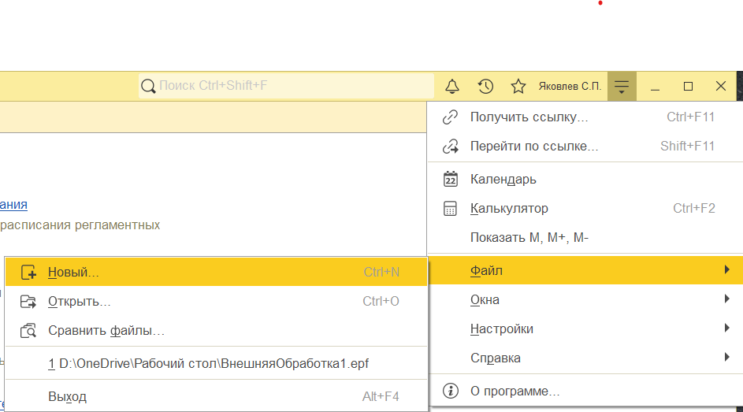
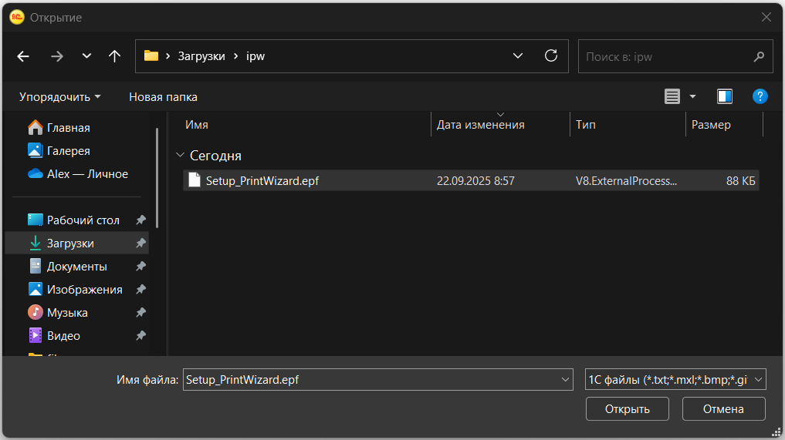
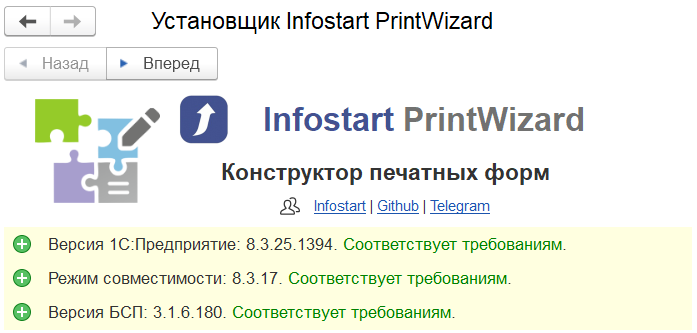
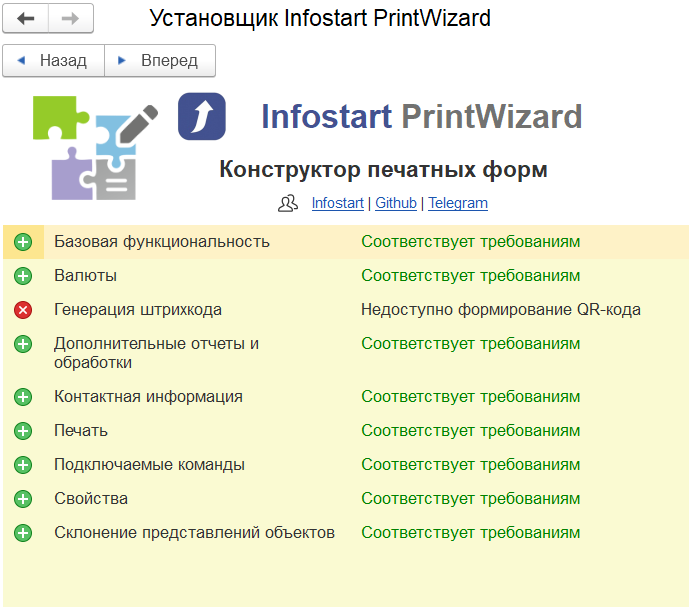
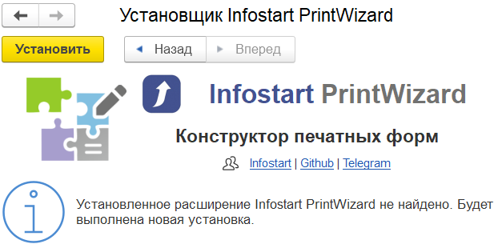
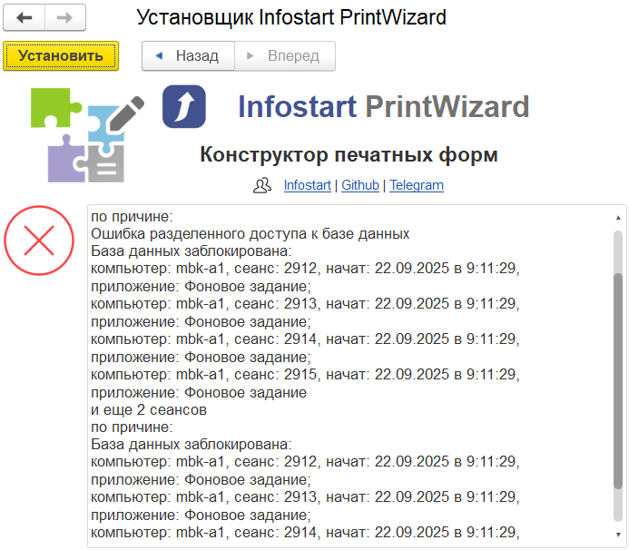
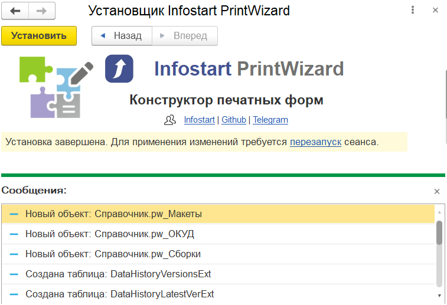

# Описание

{: .important-title }
> ВАЖНО
>
> С версии 2025.2.5 для установки расширения рекомендуется использовать обработку, поставляемую в составе комплекта.

Установка расширения может быть выполнена двумя способами:

1. При помощи обработки из комплекта поставки (**рекомендуемый способ**)
2. Стандартная установка расширения, через конфигуратор или предприятие

Рекомендуемым способом является установка при помощи обработки, поставляемой в составе комплекта. При установке через обработку программа автоматически выполняет проверки необходимых версий платформы, режима совместимости, библиотеки стандартных подсистем и входящих в состав конфигурации подсистем.

## Установка при помощи обработки

{: .important-title }
> ВАЖНО
>
> Поскольку конструктор создает новые объекты (справочники, регистры сведений, обработки) после установки потребуется выполнить реструктуризацию ИБ. В связи с этим, первую установку необходимо выполнять в монопольном режиме.
>
> Для расширения конфигурации пользователю необходимо иметь следующие право запуска внешних обработок.

Для установки расширения, необходимо выполнить запуск обработки установки. Для этого необходимо нажать **Основное меню** - **Файл** - **Открыть...** или комбинацию клавиш **Ctrl+O**.

    
     Открыть файл

Далее выбрать обработку из состава поставки:

    
     Выбор файла

После открытия обработки, первый шаг установки проверит требования к основным версия платформы, режима совместимости и библиотеки стандартных подсистем. Если все хорошо, вы увидите, что все требования соответствуют.

    
     Шаг 1. Проверка основных требований

Если все основные требования прошли проверку, можно переходить на следующий шаг. Для этого необходимо нажать **Вперед**.

На следующем шаге программа проверит все используемые подсистемы из состава БСП.

    
     Шаг 2. Проверка подсистем БСП

В процессе проверки подсистем программа анализирует их наличие в составе установленной библиотеки. Отсутствие обзательных подсистем не позволит продолжить установку. Для остальных подсистем, при их отсутствии, будет выдано пояснение, каким образом это влияет на работу конструктора. Например, на представленном слайде видно, что отсутствует подсистема "Генерация штрихкода" и последствия ее отсутствия.

> На самом деле отсутствие подсистемы "Генерации штрихкода" не влияет на возможность использования генерации QR-кода. В таком случае она выполняется средствами подсистемы "Печать". Однако, в новых версиях БСП данный функционал может быть исключен из подсистемы "Печать".

Если все обязательные подсистемы установлены, можем переходить на следующий шаг (Установка).

    
     Шаг 3. Установка расширения

На шаге 3 установщик проверит наличие текущей версии расширения Infostart PrintWizard. Если расширение уже установлено, сообщение будет содержать информацию о версии расширения и новой версии для установки. Для продолжения, необходимо нажать на кнопку **Установить**.

При нажатии на кнопку будет выполнена установка расширения. При этом, если произойдет ошибка - информация о причине будет отображена в соответствующем окне.

    
     Шаг 3. Ошибка установки

Если вышла ошибка, перед обращением к разработчику, рекомендуется проанализировать выданную ошибку. При необходимости, можно обратиться к администратору информационной базы.

    
     Шаг 3. Успешная установка (новая)

Если установка завершена успешно вы увидите предложение о перезапуске сеанса. При первой установке так же в поле сообщений будут указаны добавленные объекты информационной базы.

Для завершения установки необходимо нажать гиперссылку **Перезапуск**. Сеанс будет перезапущен автоматически. Если все получилось, после перезапуска вы увидите подменю PrintWizard в панели разделов.

Если это первая установка, далее необходимо выполнить [регистрацию расширения][1].

[1]: ./ch_09_02.html