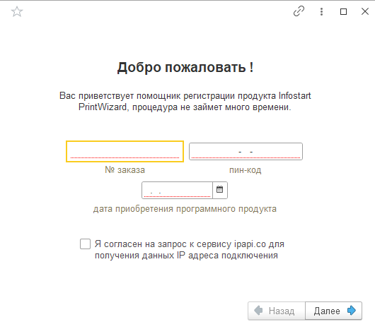

# Регистрация лицензии

{: .important-title }
> ВАЖНО
>
> Для регистрации программного продукта требуется доступ в интернет. Регистрация выполняется на стороне сервера.

При покупке вы получите основной pin-код для регистрации программного продукта, а также резервный pin-код для временной регистрации, в случае аннулирования лицензии.

После установки расширения необходимо будет выполнить регистрацию программного продукта. Для этого необходимо открыть данные о программе (меню PrintWizard -> "О программе"). Если программный продукт не обнаружит лицензию, вы увидете следующее:

    
     Окно "О программе"

В центре окна, на бледно-розовом фоне будет предупреждение о том, что лицензия не обнаружена. И предложение пройти в форму для регистрации. Нажмите на гиперссылку и появится окно регистрации продукта.

    
     Регистрация лицензии. Шаг № 1

В окне регистрации необходимо ввести следующие данные:

* логин пользователя на сайте Infostart.ru;
* pin-код полученный при покупке программного продукта;
* дата приобретения программного продукта;
* установить галочку в согласии для обращения на сайт ipapi.co. Указанный сайт используется для получения данных об ip-адресе, с которого выполняется запрос на регистрацию.

Рекомендуем запомнить указанную информацию, она понадобится для восстановления лицензии в случае ее утери или изменения параметров оборудования сервера.

После ввода, нажимаем кнопку "Далее" и переходим на следующий шаг.

    
     Регистрация лицензии. Шаг № 2

На следующей странице вы увидите данные, которые собрала программа для создания лицензии и привязки ее к оборудованию серверного компьютера. На текущем этапе отсутствуют поля для ввода, и после ознакомления с представленной информацией нажмите на кнопку "Далее".

    
     Регистрация лицензии. Шаг № 3

Если операция выполнена успешно, вы перейдете на следующую страницу, где будет представлена информация о программной лицензии.

## Ограничения при отсутствии лицензии

При отстутствии лицензии программа ограничивает только одну функцию: создание и редактирование макетов. Все созданные данные сохраняются, все заблокированные макеты с командами печати продолжат свою работу. Однако изменить или создать новый макет печатной формы не получится.

# Важная информация о лицензии

* каждый пин-код имеет ограничения на количество серверов и сеансов;
* повторная регистрация пин-кода возможна, но не более количества серверов, заданного для данного пин-кода;

Ключевые параметры компьютера:

* наименование операционной системы;
* серийный номер операционной системы;
* сетевое имя компьютера;
* объем оперативной памяти;
* данные о материнской плате;
* данные о BIOS;
* данные о процессоре;
* данные о жестких дисках.

Допускается увеличение оперативной памяти без потери лицензии, остальные изменения приводят к аннулированию лицензии (удалению). Изменения анализируются по текущему состоянию компьютера (сервера) относительно того состояния, когда выполнялась привязка лицензии.

# Восстановление пин-кода

Для восстановления пин-кода вам необходимо обратиться на почту vandalsvq@gmail.com.

В письме необходимо указать:

* пин-код полученный при покупке;
* логин на сайте инфостарт;
* дату покупки программного продукта (минимум месяц и год);
* адрес электронной почты для отправки пин-кода;
* телефон и контактное лицо для связи (при возникновении вопросов);
* причину замены пин-кода.

Восстановление пин-кода может занять до 1-го рабочего дня.