# Руководство по установке PrintWizard

## Содержание

1. [Введение](#введение)
2. [Системные требования](#системные-требования)
3. [Обзор процесса установки](#обзор-процесса-установки)
4. [Установка платформы 1С:Предприятие 8 и информационной базы](#установка-платформы-1спредприятие-8-и-информационной-базы)
   - [Установка платформы 1С:Предприятие 8](#установка-платформы-1спредприятие-8)
   - [Установка конфигурации (информационной базы)](#установка-конфигурации-информационной-базы)
   - [Создание информационной базы и запуск 1С](#создание-информационной-базы-и-запуск-1с)
5. [Установка PrintWizard](#установка-printwizard)
6. [Регистрация PrintWizard](#регистрация-printwizard)

---

## Введение

**PrintWizard** (далее — Система) поставляется в виде расширения конфигурации 1С:Предприятие 8. Расширение предназначено для гибкой настройки и управления печатными формами в конфигурациях, разработанных на базе «1С:Библиотеки стандартных подсистем».

---

## Системные требования

### Программное обеспечение

- Платформа 1С:Предприятие 8 версии **8.3.18 и выше** (используются асинхронные методы)
- Режим совместимости конфигурации: **8.3.14 и выше**
- Библиотека стандартных подсистем (БСП): версия **3.1.4 и выше**
- Обязательные подсистемы БСП:
  - БазоваяФункциональность
  - Печать
  - ПодключаемыеКоманды
  - Пользователи
- Любая конфигурация на управляемых формах, разработанная на базе «1С:Библиотеки стандартных подсистем», например «1С:Бухгалтерия предприятия 3.0», «1С:Управление нашей фирмой 1.6»

Дополнительно конструктор может задействовать подсистемы:

- **Свойства** — для быстрого добавления доп. реквизитов и свойств
- **Контактная информация** — для быстрого добавления контактной информации
- **Присоединенные файлы** — для вывода картинок из данных присоединённого файла
- **Склонения** — для выполнения склонений ФИО и других представлений
- **Префиксация объектов** — для исключения префикса из номеров документов
- **Генерация штрихкодов** — для создания QR-кода
- **Управление доступом** — используется для настройки команд печати (в консоли)

### Аппаратное обеспечение

PrintWizard является клиентским приложением, функционирующим в среде 1С:Предприятие 8. Для использования рекомендуются ресурсы со следующими характеристиками:

- Процессор: Intel Pentium/Celeron 2400 МГц и выше
- Оперативная память: 2 Гбайт и выше (рекомендуется 4 Гбайт)
- Жёсткий диск: 40 Гб и выше
- Прочее: устройство чтения компакт-дисков, USB-порт, SVGA-дисплей

### Интернет-ресурсы, необходимые для работы

Для корректной работы программы требуется обеспечить доступ к следующим ресурсам:

| Адрес | Назначение | Обязательно | Где |
|---|---|---|---|
| https://ipapi.co/ | Получение внешнего IP-адреса | Да | Сервер |
| https://pw.progtb.ru/ | Регистрация лицензии | Да | Сервер |
| https://api.github.com/ | Проверка наличия обновлений | Нет | Сервер |
| https://storage.yandexcloud.net/ | Временное хранилище файлов PrintWizard | Нет | Сервер |
| https://view.officeapps.live.com/ | Отображение шаблонов в формате офисных документов | Нет | Клиент |
| https://code.1c.ai | Доступ к 1С:Напарник | Нет | Сервер |

Порты по умолчанию: HTTPS — 443, HTTP — 80.

---

## Обзор процесса установки

Предварительно на компьютере пользователя должна быть установлена платформа 1С:Предприятие 8 и создана или подключена информационная база 1С.

Установка PrintWizard осуществляется в виде расширения конфигурации 1С. Рекомендуемым способом является установка при помощи обработки `Setup_PrintWizard.epf`, поставляемой в составе дистрибутива.

> **Важно:** Первую установку необходимо выполнять в **монопольном режиме**, поскольку при первичной установке создаются новые объекты информационной базы (справочники, регистры сведений, обработки), после чего потребуется реструктуризация ИБ.

Экземпляр ПО доступен для загрузки с сайта Infostart.

Платформа 1С:Предприятие 8 может быть скачана:

- действующими пользователями — со страницы поддержки пользователей: https://releases.1c.ru/
- новыми пользователями — доступна бесплатная учебная версия: http://online.1c.ru/catalog/free/28765768/

---

## Установка платформы 1С:Предприятие 8 и информационной базы

Обязательным предусловием использования PrintWizard является наличие на компьютере пользователя установленной платформы 1С:Предприятие 8 и подключённой базы 1С.

Детали установки платформы описаны в официальной инструкции: https://its.1c.ru/db/v8318doc#bookmark:adm:TI000000024

### Установка платформы 1С:Предприятие 8

1. Скачать дистрибутив по ссылке http://online.1c.ru/catalog/free/28814183/ и распаковать скачанный архив. В распакованной папке найти и запустить файл `setup.exe`.

   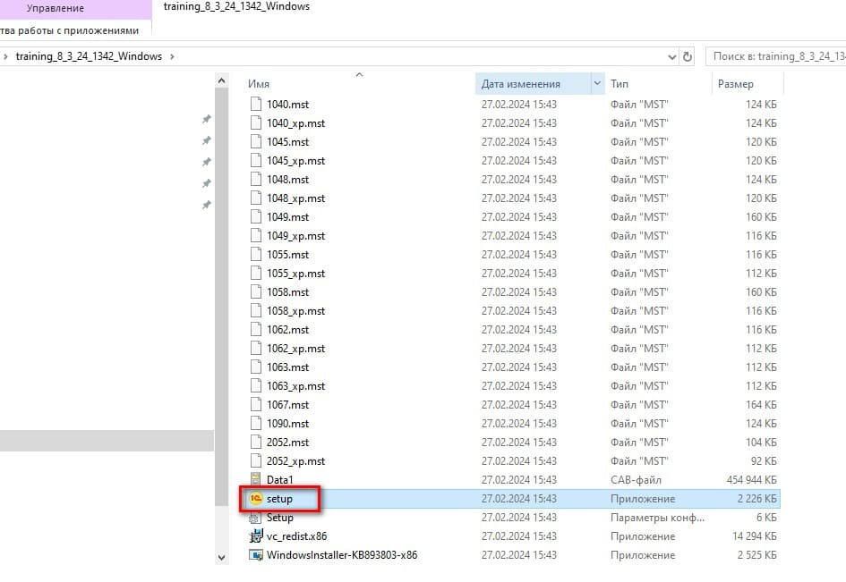

2. В окне приветствия мастера установки нажать **«Далее»**.

   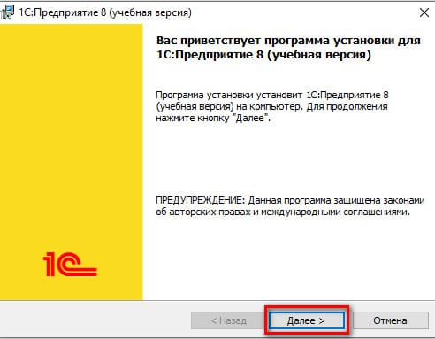

3. В окне выбора компонентов оставить всё по умолчанию, нажать **«Далее»**.

   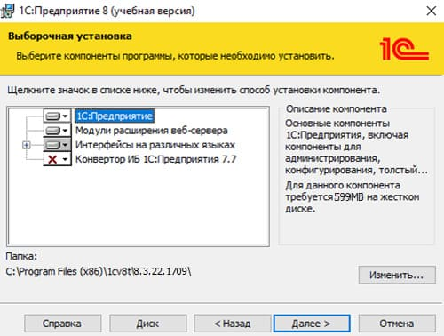

4. В окне выбора языка интерфейса выбрать **«Русский»** (или оставить «Системные установки»), нажать **«Далее»**.

   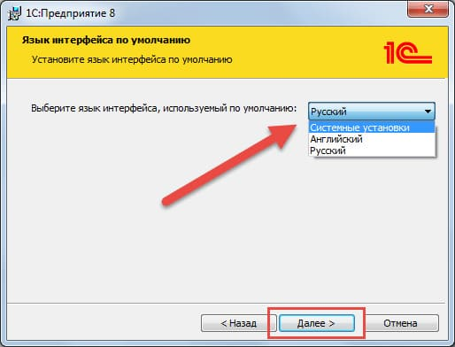

5. Нажать **«Установить»** и дождаться завершения процесса установки. По окончании нажать **«Готово»**.

   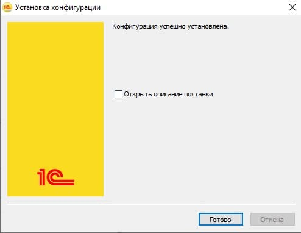

6. После завершения установки на рабочем столе появится ярлык 1С:Предприятие. При запуске откроется главное окно выбора информационных баз.

   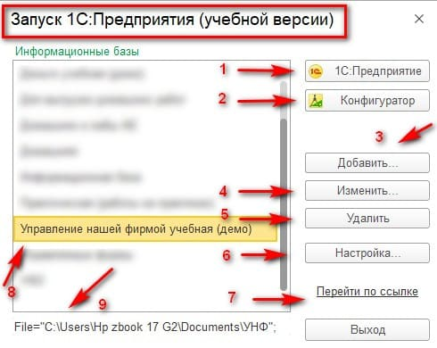

### Установка конфигурации (информационной базы)

1. Из каталога с конфигурацией (например, `smallBuiseness`) запустить файл `setup.exe`. В окне мастера установки нажать **«Далее»**.

   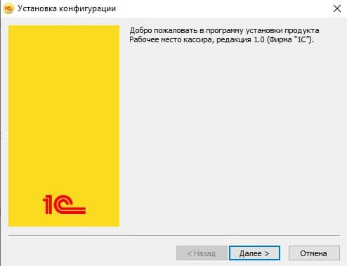

2. Путь к каталогу шаблонов оставить по умолчанию, нажать **«Далее»**.

   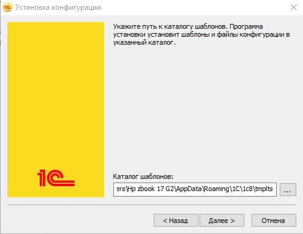

3. Дождаться завершения установки. Нажать **«Готово»**.

   *(Окно завершения установки конфигурации — аналогично шагу 5 установки платформы)*

### Создание информационной базы и запуск 1С

1. Запустить 1С:Предприятие из меню «Пуск» или с ярлыка. При первом запуске появится вопрос о добавлении новой информационной базы. Выбрать **«Создание новой информационной базы»** и нажать **«Далее»**.

   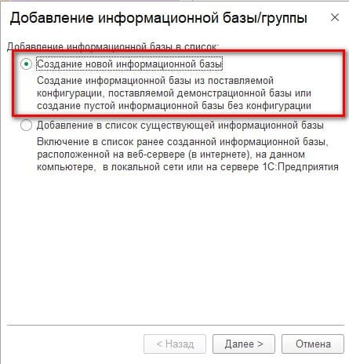

2. В следующем окне выбрать создание ИБ из шаблона, в списке шаблонов выбрать нужную конфигурацию (например, **«Управление нашей фирмой учебная (демо)»**), нажать **«Далее»**.

   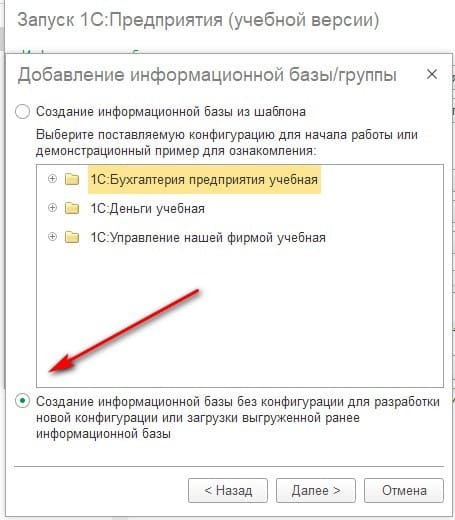

3. Указать наименование информационной базы и путь для её размещения, нажать **«Далее»**.

   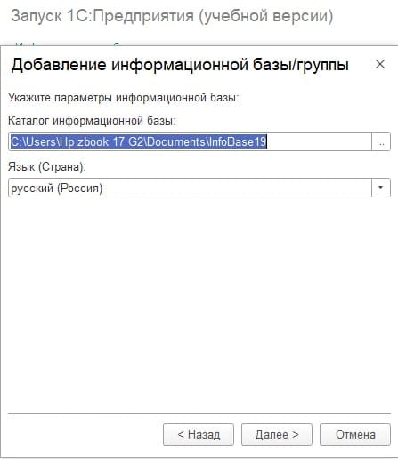

4. На последнем шаге оставить параметры запуска по умолчанию и нажать **«Готово»**.

   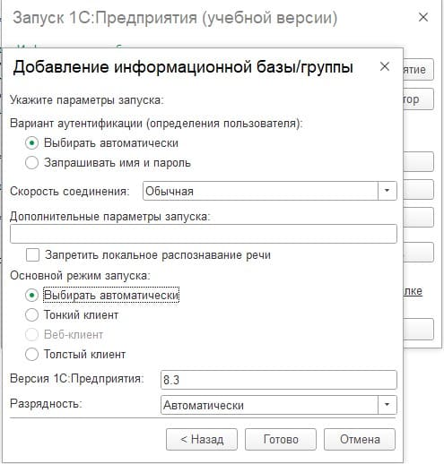

5. В списке информационных баз выбрать созданную базу и нажать **«1С:Предприятие»** для запуска. В окне авторизации выбрать пользователя и нажать **«ОК»**.

---

## Установка PrintWizard

> **Важно:** Для установки при помощи внешней обработки пользователь должен иметь право запуска внешних обработок. Первую установку необходимо выполнять в **монопольном режиме**.

1. Распаковать скачанный архив с дистрибутивом PrintWizard.

2. Открыть информационную базу 1С в монопольном режиме.

3. В главном меню выбрать **Основное меню → Файл → Открыть…** (или нажать **Ctrl+O**).

   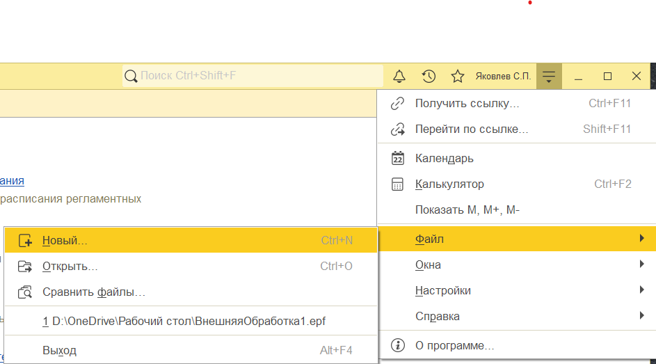

4. В диалоге выбора файла найти и открыть файл `Setup_PrintWizard.epf` из каталога с дистрибутивом.

   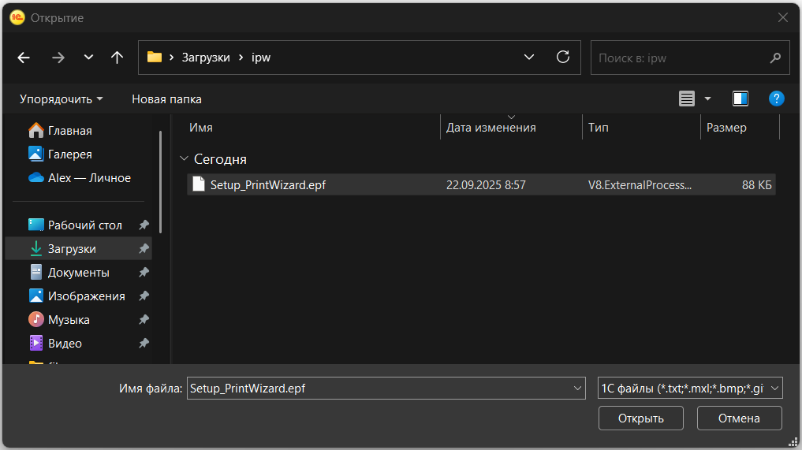

5. **Шаг 1. Проверка основных требований.** Программа автоматически проверит версию платформы, режим совместимости и версию библиотеки стандартных подсистем. Если все требования выполнены — нажать **«Вперёд»**.

   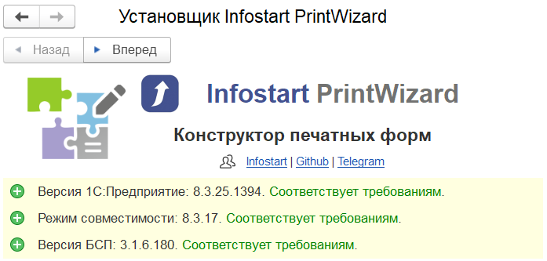

6. **Шаг 2. Проверка подсистем БСП.** Программа проверит наличие всех необходимых подсистем. Отсутствие обязательных подсистем не позволит продолжить установку. Если все обязательные подсистемы установлены — нажать **«Вперёд»**.

   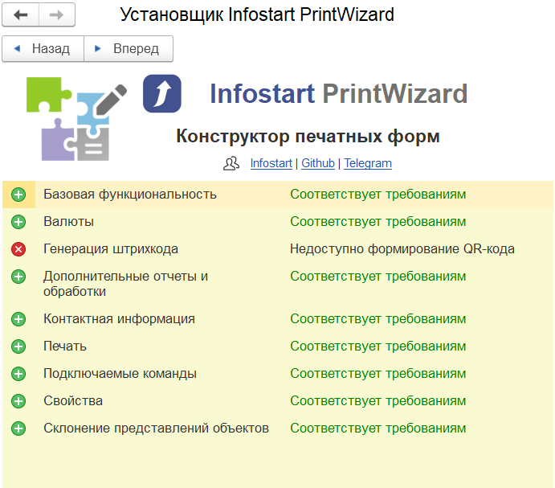

7. **Шаг 3. Установка расширения.** Установщик проверит наличие текущей версии расширения PrintWizard. Нажать кнопку **«Установить»**.

   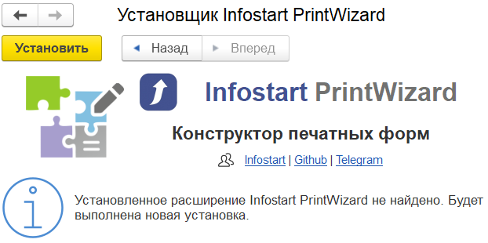

   Если в процессе установки возникла ошибка — её описание будет выведено в соответствующем окне. Рекомендуется проанализировать сообщение об ошибке или обратиться к администратору информационной базы.

   

8. После успешной установки появится сообщение с предложением перезапустить сеанс. Нажать гиперссылку **«Перезапуск»** — сеанс будет перезапущен автоматически.

   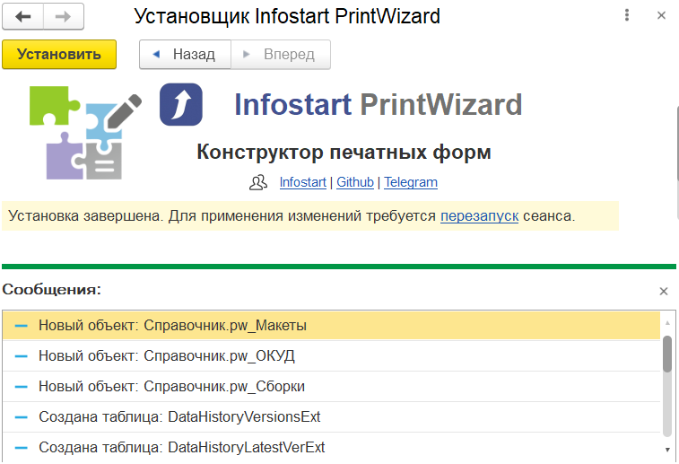

9. После перезапуска в панели разделов появится подменю **PrintWizard**.

> **Примечание:** Если это первая установка, далее необходимо выполнить регистрацию расширения.

---

## Регистрация PrintWizard

После первой установки расширения необходимо выполнить регистрацию лицензии. Без регистрации функция редактирования печатных форм будет недоступна.

При запуске PrintWizard без лицензии появится окно с сообщением об отсутствии лицензии и предложением перейти к регистрации.

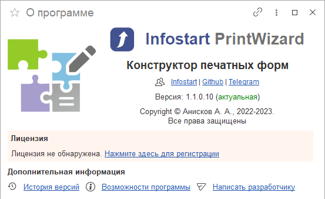

### Шаг 1. Ввод данных заказа

В открывшемся окне помощника регистрации ввести:
- **№ заказа** — номер заказа, полученный при покупке продукта
- **Пин-код** — пин-код из комплекта поставки
- **Дата приобретения** — дата приобретения программного продукта
- Установить флажок согласия на запрос к сервису ipapi.co для получения данных IP-адреса подключения
- Нажать **«Далее»**

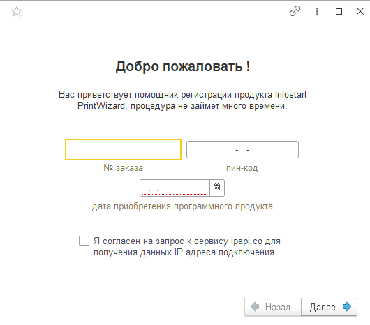

### Шаг 2. Подтверждение данных привязки

На следующем шаге будут показаны параметры компьютера, к которым будет привязана лицензия (IP-адрес, характеристики процессора, объём RAM, ОС). Ознакомиться с условиями привязки и нажать **«Далее»** для продолжения.

> **Важно:** Редактирование печатных форм PrintWizard будет возможно только на указанном компьютере (или подключённых к нему клиентах). Изменение оборудования или ОС приведёт к необходимости повторного получения лицензии с использованием дополнительного пин-кода.

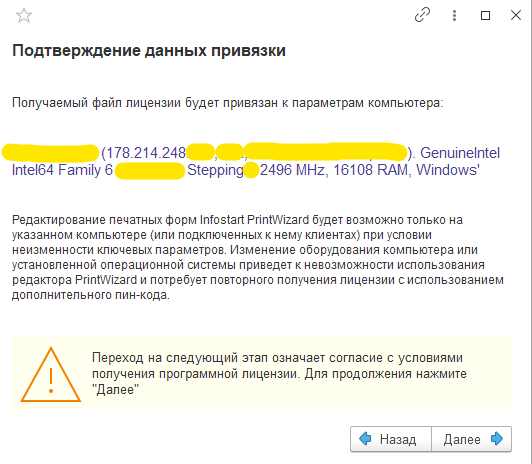

### Шаг 3. Завершение регистрации

После успешной активации будет показано окно с параметрами полученной лицензии:
- Логин
- Пин-код
- Имя компьютера
- Минимальный объём памяти
- Операционная система

Нажать **«Далее»** для завершения регистрации.

> **Важно:** При обнаружении одинаковых лицензий на разных компьютерах (даже в одной сети) они будут аннулированы. Существующие печатные формы продолжат работать, однако возможность редактировать и создавать новые будет отключена.

На этом установка и регистрация **PrintWizard** завершена.
