# PrintWizard

## Конструктор печатных форм для платформы «1С:Предприятие 8»

### Руководство пользователя

---

**Документ:** Руководство пользователя
**Программный продукт:** PrintWizard (Конструктор печатных форм)
**Версия документа:** 1.0
**Дата выпуска:** 2026 г.

**Правообладатель:** Общество с ограниченной ответственностью «Энспейс» (ООО «Энспейс»), Российская Федерация.

**Автор:** Анисков Александр Александрович.

**Свидетельство о государственной регистрации программы для ЭВМ:** № 2022685985 от 30 декабря 2022 г. (заявка № 2022684121 от 07 декабря 2022 г.). Зарегистрированное наименование программы: «Print wizard (Конструктор печатных форм)»; коммерческое наименование — «PrintWizard».

---

## Аннотация

Настоящий документ является руководством пользователя программного продукта «PrintWizard» (далее — *PrintWizard*, *Конструктор*, *Система*) — конструктора печатных форм для платформы «1С:Предприятие 8».

Документ содержит сведения о назначении программы, условиях её выполнения, порядке установки и регистрации, а также описание последовательности действий пользователя при работе с программой: создание печатных форм, настройка источников данных, редактирование макета, выполнение печати и экспорта.

Документ предназначен для конечных пользователей программы — специалистов, выполняющих разработку и сопровождение печатных форм в информационных базах «1С:Предприятие 8» (бизнес-аналитиков, методологов, программистов 1С, технических специалистов).

Структура документа соответствует требованиям ГОСТ 19.505-79 «Единая система программной документации. Руководство оператора. Требования к содержанию и оформлению» с учётом требований к технической документации, предъявляемых при включении программного обеспечения в Единый реестр российских программ для электронных вычислительных машин и баз данных (Минцифры России).

---

## Содержание

1. [Назначение программы](#1-назначение-программы)
   - 1.1. [Область применения](#11-область-применения)
   - 1.2. [Краткое описание возможностей](#12-краткое-описание-возможностей)
   - 1.3. [Уровень подготовки пользователя](#13-уровень-подготовки-пользователя)
2. [Условия выполнения программы](#2-условия-выполнения-программы)
   - 2.1. [Требования к программному обеспечению](#21-требования-к-программному-обеспечению)
   - 2.2. [Требования к аппаратному обеспечению](#22-требования-к-аппаратному-обеспечению)
   - 2.3. [Требования к интернет-ресурсам](#23-требования-к-интернет-ресурсам)
   - 2.4. [Требования к квалификации пользователя](#24-требования-к-квалификации-пользователя)
3. [Выполнение программы](#3-выполнение-программы)
   - 3.1. [Установка PrintWizard в информационную базу](#31-установка-printwizard-в-информационную-базу)
   - 3.2. [Регистрация лицензии](#32-регистрация-лицензии)
   - 3.3. [Запуск конструктора](#33-запуск-конструктора)
   - 3.4. [Реестр печатных форм](#34-реестр-печатных-форм)
   - 3.5. [Создание печатной формы](#35-создание-печатной-формы)
   - 3.6. [Тестовая печать и режим отладки](#36-тестовая-печать-и-режим-отладки)
   - 3.7. [Публикация печатной формы](#37-публикация-печатной-формы)
   - 3.8. [Печать из формы объекта](#38-печать-из-формы-объекта)
   - 3.9. [Пакетная печать](#39-пакетная-печать)
   - 3.10. [Экспорт и обмен макетами](#310-экспорт-и-обмен-макетами)
   - 3.11. [Завершение работы](#311-завершение-работы)
4. [Сообщения пользователю](#4-сообщения-пользователю)
   - 4.1. [Сообщения при установке](#41-сообщения-при-установке)
   - 4.2. [Сообщения при регистрации лицензии](#42-сообщения-при-регистрации-лицензии)
   - 4.3. [Сообщения при работе с макетом](#43-сообщения-при-работе-с-макетом)
   - 4.4. [Сообщения при формировании печатной формы](#44-сообщения-при-формировании-печатной-формы)
5. [Поддержание жизненного цикла программы](#5-поддержание-жизненного-цикла-программы)
   - 5.1. [Обновление программы](#51-обновление-программы)
   - 5.2. [Удаление программы](#52-удаление-программы)
   - 5.3. [Техническая поддержка](#53-техническая-поддержка)
   - 5.4. [Совершенствование и развитие программы](#54-совершенствование-и-развитие-программы)
6. [Приложения](#6-приложения)
   - 6.1. [Глоссарий](#61-глоссарий)
   - 6.2. [Перечень дополнительных источников](#62-перечень-дополнительных-источников)

---

## 1. Назначение программы

### 1.1. Область применения

Программа «PrintWizard» (далее — Конструктор) предназначена для создания, редактирования, тиражирования и сопровождения печатных форм в информационных базах «1С:Предприятие 8». Конструктор реализован в виде расширения конфигурации и не вносит изменений в основную конфигурацию информационной базы.

Программа применяется в следующих типовых сценариях:

- разработка новых печатных форм (счетов, актов, накладных, отчётов, договоров и иных документов) для произвольных объектов информационной базы;
- доработка существующих печатных форм в режиме «1С:Предприятие» без использования Конфигуратора;
- параллельное ведение нескольких вариантов одной печатной формы;
- организация структурированного хранения и общего доступа к печатным формам в рамках организации;
- пакетная печать комплектов документов;
- экспорт печатных форм во внешние обработки или в расширения конфигурации для последующего использования в других информационных базах.

Конструктор позволяет специалистам различной квалификации (бизнес-аналитикам, методологам, программистам, руководителям проектов) совместно работать над печатными формами и сокращает трудозатраты на их разработку и сопровождение.

### 1.2. Краткое описание возможностей

В состав функциональных возможностей программы входят:

**Создание и редактирование печатных форм.** Конструктор предоставляет визуальный механизм создания печатной формы на основе декларативного описания. Поддерживается формирование печатных форм в двух форматах:

- табличный документ «1С:Предприятие 8»;
- офисный документ формата `*.docx` (Open Office XML).

**Управление источниками данных.** В рамках одного макета пользователь может задать произвольное количество запросов к информационной базе, объединить их в наборы данных, настроить соединения между наборами, использовать произвольные алгоритмы получения и обработки данных.

**Редактирование макета с быстрым доступом к командам.** Встроенный редактор табличного документа и просмотр содержимого офисного документа в окне макета (требуется доступ в интернет к сервису предварительного просмотра).

**Управление областями макета.** Настройка областей для повторения (в шапке, в подвале), управление переносом областей на следующую страницу, условный вывод областей.

**Программное влияние на формирование.** Алгоритмы обработчиков событий конструктора (перед инициализацией, при получении данных, перед формированием, перед выводом страницы и др.), а также произвольные пользовательские функции, доступные в любом алгоритме макета.

**Специальные поля и вспомогательные формы.** Настройка представлений данных, генерация QR-кода (в том числе в формате УФЭБС для быстрых платежей и в произвольных форматах XML/JSON), вывод картинок из присоединённых файлов и базы данных.

**Автоматическое добавление команды печати.** Разработанная печатная форма автоматически появляется в подменю «Печать» формы объекта или формы списка соответствующего справочника/документа.

**Пакетная печать.** Встроенный механизм пакетной печати позволяет вывести комплект документов (в том числе включающий типовые печатные формы конфигурации) для нескольких объектов одновременно.

**Экспорт и обмен.** Экспорт макета во внешнюю обработку, экспорт группы макетов в расширение конфигурации, обмен макетами в специализированном формате `*.pdwx`.

**Версионный контроль и групповая работа.** Встроенный механизм образов для разработки позволяет вести разработку параллельно с эксплуатируемой версией печатной формы.

**Отладка макета.** Журнал событий подготовки макета, режим отладки, сравнение макетов между собой.

### 1.3. Уровень подготовки пользователя

Для работы с программой пользователю необходимы:

- базовые навыки работы с операционной системой и пользовательским интерфейсом платформы «1С:Предприятие 8»;
- понимание структуры используемой конфигурации в объёме, необходимом для разработки печатных форм (объекты метаданных, реквизиты, табличные части, регистры);
- базовые знания языка запросов «1С:Предприятие 8» (для настройки источников данных);
- базовые знания встроенного языка «1С:Предприятие 8» (для использования событий и пользовательских функций, при необходимости).

Глубокие знания платформы или работа в Конфигураторе не требуются. Все основные операции выполняются в режиме «1С:Предприятие».

---

## 2. Условия выполнения программы

### 2.1. Требования к программному обеспечению

Программа предназначена для эксплуатации в среде платформы «1С:Предприятие 8». Минимальные требования к программному обеспечению:

| Параметр | Значение |
|---|---|
| Платформа «1С:Предприятие 8» | версия **8.3.18** и выше (используются асинхронные методы) |
| Режим совместимости конфигурации | **8.3.14** и выше |
| Библиотека стандартных подсистем (БСП) | версия **3.1.4** и выше |
| Операционная система | любая, поддерживаемая платформой «1С:Предприятие 8» (Windows, Linux, macOS) |

**Обязательные подсистемы Библиотеки стандартных подсистем:**

- БазоваяФункциональность
- Печать
- ПодключаемыеКоманды
- Пользователи

**Поддерживаемые конфигурации.** Любая конфигурация на управляемых формах, разработанная на базе «1С:Библиотеки стандартных подсистем», в том числе:

- «1С:Бухгалтерия предприятия 3.0»;
- «1С:Управление нашей фирмой 1.6»;
- «1С:Зарплата и управление персоналом 3»;
- «1С:Управление торговлей 11» и иные конфигурации, удовлетворяющие требованиям выше.

**Дополнительные подсистемы БСП** (используются при их наличии в конфигурации):

| Подсистема | Назначение |
|---|---|
| Свойства | Быстрое добавление дополнительных реквизитов и свойств |
| Контактная информация | Быстрое добавление контактной информации |
| Присоединённые файлы | Вывод картинок из присоединённых файлов |
| Склонения | Склонение Ф. И. О. и иных представлений |
| Префиксация объектов | Исключение префикса из номеров документов |
| Генерация штрихкодов | Создание QR-кода и иных штрихкодов |
| Управление доступом | Настройка прав на команды печати |

### 2.2. Требования к аппаратному обеспечению

Программа функционирует как клиентское расширение в среде «1С:Предприятие 8». Минимально рекомендуемые характеристики рабочей станции:

| Компонент | Значение |
|---|---|
| Процессор | Intel Pentium / Celeron 2400 МГц и выше |
| Оперативная память | 2 ГБ (рекомендуется 4 ГБ и выше) |
| Свободное место на диске | 40 ГБ |
| Видеоадаптер и монитор | SVGA-дисплей |
| Дополнительно | устройство чтения компакт-дисков, USB-порт |

Серверная часть размещается в инфраструктуре, обеспечивающей работу платформы «1С:Предприятие 8» (файловый или клиент-серверный режим), и не предъявляет дополнительных требований сверх типовых для платформы.

### 2.3. Требования к интернет-ресурсам

Для корректной работы Конструктора требуется обеспечить доступ к следующим интернет-ресурсам:

**Обязательные (на сервере «1С:Предприятие»):**

| Адрес | Назначение |
|---|---|
| `https://ipapi.co/` | Получение внешнего IP-адреса для привязки лицензии |
| `https://pw.progtb.ru/` | Регистрация и проверка лицензии |

**Необязательные (расширенная функциональность):**

| Адрес | Назначение | Где требуется |
|---|---|---|
| `https://storage.yandexcloud.net/` | Временное хранилище файлов PrintWizard | На сервере |
| `https://code.1c.ai` | Доступ к ассистенту «1С:Напарник» | На клиенте |

**Используемые порты:** HTTPS — 443, HTTP — 80.

### 2.4. Требования к квалификации пользователя

Для выполнения базовых операций пользователю достаточно навыков работы в режиме «1С:Предприятие» в объёме типовых пользовательских функций (создание, изменение и сохранение элементов справочников, использование команд печати, ввод данных, навигация по интерфейсу).

Для самостоятельной разработки печатных форм рекомендуется уровень подготовки бизнес-аналитика или младшего программиста 1С (см. подраздел [1.3](#13-уровень-подготовки-пользователя)).

---

## 3. Выполнение программы

Настоящий раздел описывает последовательность действий пользователя при работе с программой: от установки в информационную базу до завершения работы.

### 3.1. Установка PrintWizard в информационную базу

Полное описание процесса установки приведено в документе «Инструкция по установке» (файл `PrintWizard_Install_Guide.pdf`, поставляемый в составе дистрибутива). Ниже приведена краткая последовательность действий.

#### 3.1.1. Подготовка к установке

До начала установки необходимо убедиться, что выполнены следующие условия:

1. На рабочей станции установлена платформа «1С:Предприятие 8» версии 8.3.18 или выше.
2. Создана или подключена информационная база с конфигурацией, удовлетворяющей требованиям (см. раздел [2.1](#21-требования-к-программному-обеспечению)).
3. Получен дистрибутив PrintWizard (архив, содержащий обработку `Setup_PrintWizard.epf` и сопутствующие файлы).
4. Получены реквизиты лицензии: номер заказа и пин-код.
5. Пользователь, выполняющий установку, имеет права на запуск внешних обработок и административные права в информационной базе.

> **Важно.** Первичную установку расширения необходимо выполнять в монопольном режиме, так как при первой установке создаются новые объекты информационной базы (справочники, регистры сведений, обработки) и выполняется реструктуризация ИБ.

#### 3.1.2. Запуск установщика

1. Распаковать архив с дистрибутивом в произвольный каталог.
2. Открыть информационную базу в монопольном режиме.
3. В главном меню выбрать **Основное меню → Файл → Открыть…** (или нажать `Ctrl+O`).
4. Указать путь к файлу `Setup_PrintWizard.epf` и нажать **Открыть**.

   
  <em>Рисунок 1. Открытие файла внешней обработки</em>

   
  <em>Рисунок 2. Выбор файла Setup_PrintWizard.epf</em>

#### 3.1.3. Прохождение шагов мастера

Мастер установки выполняет последовательную проверку условий и установку расширения:

**Шаг 1. Проверка основных требований.** Программа автоматически проверяет версию платформы, режим совместимости и версию Библиотеки стандартных подсистем. При успешной проверке нажать **Вперёд**.

   
  <em>Рисунок 3. Шаг 1. Проверка основных требований</em>

**Шаг 2. Проверка подсистем БСП.** Программа проверяет наличие обязательных подсистем (см. раздел [2.1](#21-требования-к-программному-обеспечению)). При отсутствии хотя бы одной из обязательных подсистем установка невозможна.

   
  <em>Рисунок 4. Шаг 2. Проверка подсистем БСП</em>

**Шаг 3. Установка расширения.** Установщик проверяет наличие текущей версии расширения и устанавливает или обновляет расширение PrintWizard. Нажать кнопку **Установить**.

   
  <em>Рисунок 5. Шаг 3. Установка расширения</em>

В случае ошибки её описание выводится в окне мастера. Рекомендуется проанализировать сообщение или обратиться к администратору информационной базы.

  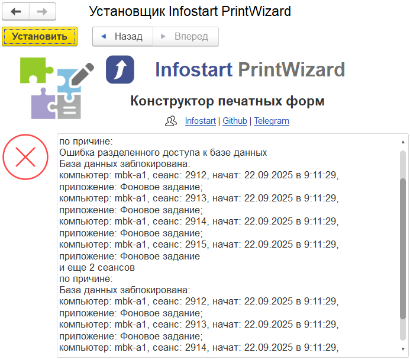 
  <em>Рисунок 6. Пример ошибки установки</em>

После успешной установки на экран будет выведено предложение перезапустить сеанс. Нажать гиперссылку **Перезапуск** — сеанс будет перезапущен автоматически.

   
  <em>Рисунок 7. Успешная установка — перезапуск сеанса</em>

#### 3.1.4. Проверка установки

После перезапуска сеанса в панели разделов конфигурации появится новое подменю **PrintWizard**, содержащее команды:

- **Макеты (PrintWizard)** — реестр печатных форм;
- **Пакетная печать (PrintWizard)** — форма пакетной печати;
- иные сервисные команды.

При первой установке необходимо выполнить регистрацию лицензии (см. раздел [3.2](#32-регистрация-лицензии)).

### 3.2. Регистрация лицензии

Без регистрации лицензии функции редактирования печатных форм недоступны. Формирование уже существующих печатных форм остаётся доступным.

#### 3.2.1. Вход в помощник регистрации

При попытке открыть редактор макета без активной лицензии Конструктор выводит сообщение об отсутствии лицензии с предложением перейти к регистрации. Нажать гиперссылку **Зарегистрировать** в данном сообщении.

   
  <em>Рисунок 8. Окно — лицензия не обнаружена</em>

Помощник регистрации также можно открыть из подменю **PrintWizard → Регистрация PrintWizard**.

#### 3.2.2. Шаг 1. Ввод данных заказа

В помощнике ввести:

- **№ заказа** — номер заказа, полученный при приобретении продукта;
- **Пин-код** — пин-код из комплекта поставки;
- **Дата приобретения** — дата приобретения программного продукта.

Установить флажок согласия на запрос к сервису `ipapi.co` для получения внешнего IP-адреса подключения и нажать **Далее**.

   
  <em>Рисунок 9. Шаг 1. Ввод данных заказа</em>

#### 3.2.3. Шаг 2. Подтверждение данных привязки

На экран выводятся параметры рабочей станции, к которым будет привязана лицензия: внешний IP-адрес, идентификатор процессора, объём оперативной памяти, операционная система.

   
  <em>Рисунок 10. Шаг 2. Подтверждение данных привязки лицензии</em>

> **Важно.** Редактирование печатных форм PrintWizard возможно только на указанной рабочей станции (или подключённых к ней клиентах). Изменение оборудования или операционной системы приведёт к необходимости повторного получения лицензии с использованием дополнительного пин-кода.

Ознакомиться с условиями и нажать **Далее**.

#### 3.2.4. Шаг 3. Завершение регистрации

После успешной активации на экран выводятся параметры полученной лицензии: логин, пин-код, имя компьютера, минимальный объём памяти, операционная система. Нажать **Далее** для завершения регистрации.

  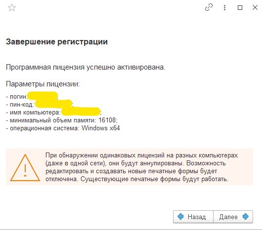 
  <em>Рисунок 11. Шаг 3. Завершение регистрации — параметры лицензии</em>

> **Важно.** При обнаружении одинаковых лицензий на разных компьютерах (даже в одной сети) лицензии будут аннулированы. Существующие печатные формы продолжат работать, но возможность редактировать и создавать новые формы будет отключена.

После завершения регистрации Конструктор готов к работе.

### 3.3. Запуск конструктора

Для запуска Конструктора:

1. Запустить платформу «1С:Предприятие 8» и открыть информационную базу, в которой установлено расширение PrintWizard.
2. Авторизоваться в информационной базе под учётной записью, имеющей одну из ролей:
   - **PrintWizard: Редактирование** — полный доступ к редактированию печатных форм;
   - **PrintWizard: Печать** — доступ к пакетной печати без возможности редактирования;
   - либо полные права в информационной базе.
3. В панели разделов перейти в подменю **PrintWizard**.

  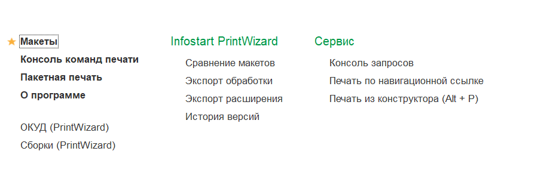 
  <em>Рисунок 12. Подменю «PrintWizard» в панели разделов конфигурации</em>

Подменю **PrintWizard** содержит точки входа во все основные функции:

- **Макеты (PrintWizard)** — реестр печатных форм (см. раздел [3.4](#34-реестр-печатных-форм));
- **Пакетная печать (PrintWizard)** — форма пакетной печати (см. раздел [3.9](#39-пакетная-печать));
- **Регистрация PrintWizard** — помощник регистрации лицензии (см. раздел [3.2](#32-регистрация-лицензии)).

### 3.4. Реестр печатных форм

Все созданные пользователем печатные формы хранятся в справочнике **Макеты (PrintWizard)**. Доступ к справочнику возможен из подменю **PrintWizard → Макеты (PrintWizard)**.

  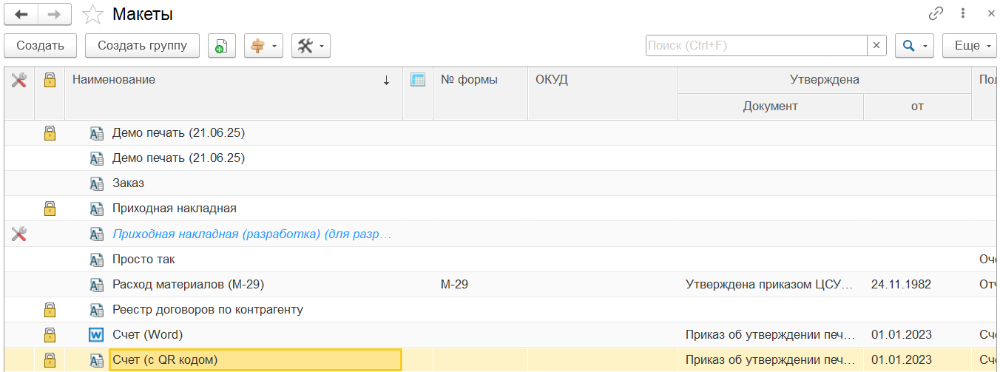 
  <em>Рисунок 13. Форма списка справочника «Макеты (PrintWizard)»</em>

Форма списка справочника содержит следующие колонки:

| Колонка | Описание |
|---|---|
|  | Признак макета-образа для разработки |
|  | Признак заблокированного для изменений макета |
| Наименование | Краткое представление печатной формы. Пиктограмма слева указывает на формат: табличный или офисный документ |
|  | Признак печатной формы в виде реестра |
| № формы | Номер унифицированной формы или внутренний номер |
| ОКУД | Номер по Общероссийскому классификатору управленческой документации |
| Утверждена — Документ | Документ, которым утверждена печатная форма |
| Утверждена — от | Дата документа утверждения |
| Полное наименование | Полное наименование печатной формы |
| Комментарий | Произвольный комментарий |

Командная панель формы списка содержит стандартные команды справочника (создание, копирование, изменение, пометка на удаление, поиск, отбор) и дополнительное подменю **Экспорт / импорт макетов**:

- **Загрузить из файла** — загрузка макета из файла формата `.xml`, `.epf` или `.pdwx`;
- **Сохранить в файл** — сохранение макета в файл `.xml` или `.pdwx`;
- **Экспорт в обработку** — экспорт текущего макета во внешнюю обработку;
- **Экспорт в расширение** — экспорт выбранных макетов в расширение конфигурации.

### 3.5. Создание печатной формы

Создание новой печатной формы выполняется в форме элемента справочника **Макеты (PrintWizard)**. В форме списка нажать кнопку **Создать**.

  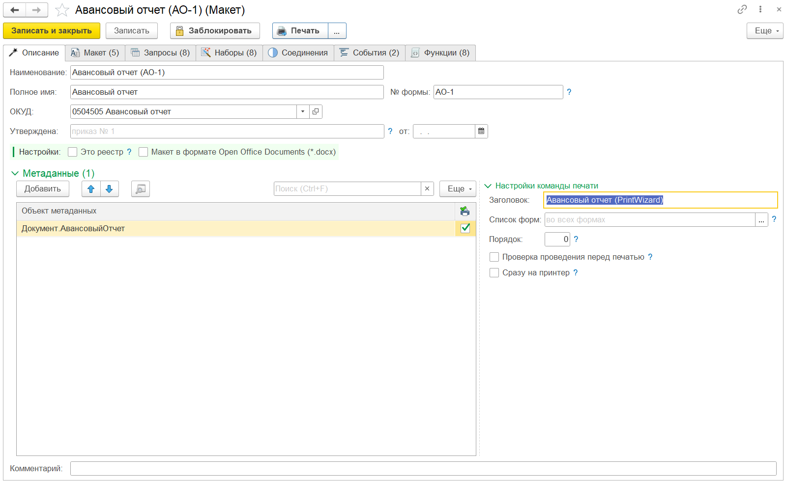 
  <em>Рисунок 14. Основная форма макета конструктора</em>

Форма элемента организована в виде 6–7 закладок:

| Закладка | Назначение |
|---|---|
| Описание | Основная информация о макете, базовая настройка, объекты и команды печати |
| Запросы | Запросы данных и параметры запросов |
| Наборы | Наборы данных и дополнительные поля |
| Соединения | Соединения наборов данных |
| Макет | Настройка макета печатной формы, областей и параметров |
| События | Алгоритмы обработчиков событий конструктора |
| Функции | Произвольные функции, доступные из любого алгоритма макета |
| Журнал | Журнал событий подготовки макета (доступен в режиме отладки) |

Ниже приведено описание основных действий пользователя на каждой закладке.

#### 3.5.1. Закладка «Описание»

На закладке «Описание» задаются основные реквизиты и настройки печатной формы.

  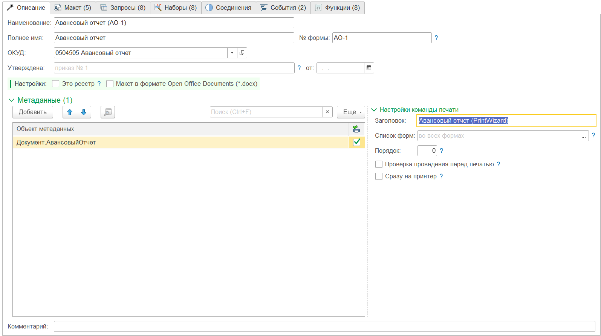 
  <em>Рисунок 15. Закладка «Описание»</em>

**Основные реквизиты:**

| Реквизит | Описание |
|---|---|
| Наименование | Краткое представление печатной формы |
| Полное имя | Полное наименование |
| № формы | Номер унифицированной формы или внутренний номер |
| ОКУД | Номер по Общероссийскому классификатору управленческой документации |
| Утверждена | Документ утверждения печатной формы |
| от | Дата документа утверждения |
| Комментарий | Произвольный комментарий |

**Основные настройки:**

- **Это реестр.** Признак формирования одной печатной формы для нескольких объектов (журнал, реестр). При снятом флаге для каждого объекта формируется отдельная печатная форма.
- **Макет в формате Open Office Documents (`*.docx`).** При установленном флаге печатная форма формируется в формате офисного документа, при снятом — в формате табличного документа «1С».

**Раздел «Метаданные».** В разделе указываются объекты информационной базы (справочники, документы и др.), для которых будет доступна печатная форма. Для каждого объекта устанавливается признак необходимости добавления команды печати.

**Настройки команды печати:**

| Реквизит | Описание |
|---|---|
| Заголовок | Представление команды печати |
| Идентификатор | Уникальный идентификатор команды |
| Список форм | Список форм объекта, для которых доступна печать; если не указан — для всех форм |
| Порядок | Порядок размещения команды в меню «Печать» |
| Проверка проведения перед печатью | Проверка проведения документа перед формированием |
| Сразу на принтер | Вывод печатной формы сразу на принтер, без предварительного просмотра |

#### 3.5.2. Закладка «Запросы»

На закладке «Запросы» задаются источники данных в виде запросов на встроенном языке запросов «1С:Предприятие 8».

  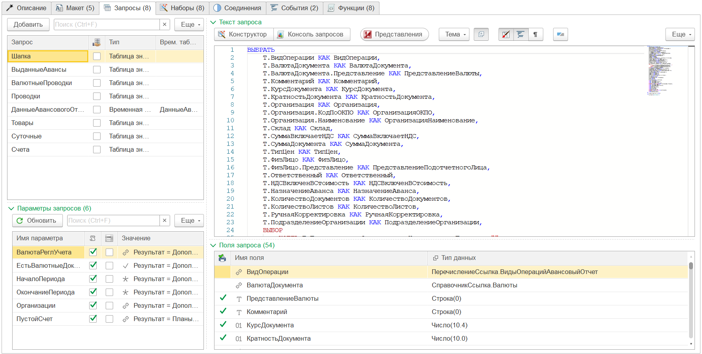 
  <em>Рисунок 16. Закладка «Запросы»</em>

Форма закладки разделена на две части:

- в левой части — список запросов и параметры, передаваемые в запросы;
- в правой части — текст запроса и список полей, возвращаемых запросом.

Каждый запрос имеет собственное имя. Допускается использовать пакетные запросы и временные таблицы, передавать результат одного запроса в качестве параметра другого. Параметром запроса по умолчанию выступает `&МассивОбъектов` — массив ссылок на объекты, для которых формируется печатная форма.

Для создания и редактирования запросов используется встроенный текстовый редактор с подсветкой синтаксиса. Конструктор запроса вызывается из командной панели формы.

#### 3.5.3. Закладка «Наборы»

Наборы данных формируются автоматически на основе запросов или произвольных алгоритмов и используются для подстановки данных в параметры макета.

  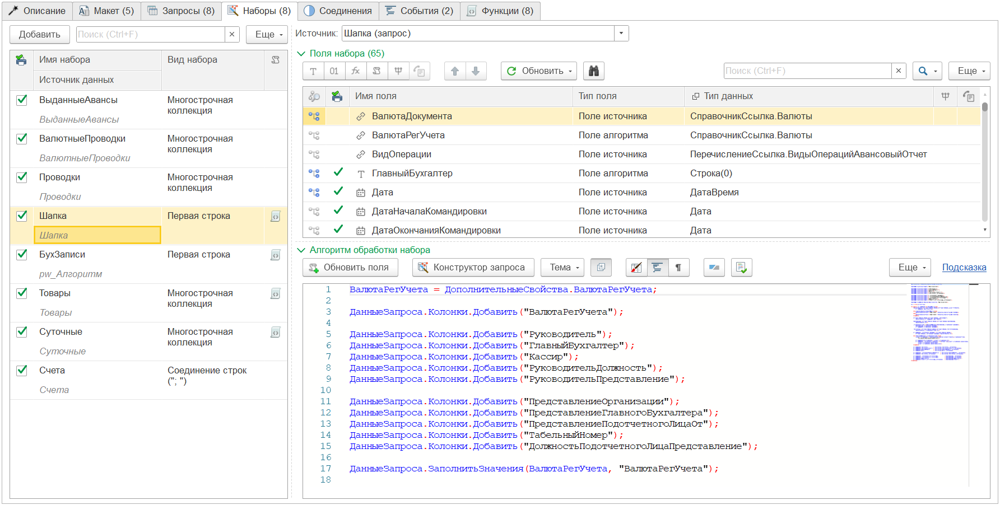 
  <em>Рисунок 17. Закладка «Наборы»</em>

**Параметры набора:**

| Параметр | Описание |
|---|---|
| Имя набора | Пользовательское имя |
| Источник данных | Имя запроса или алгоритм формирования |
| Вид набора | Способ формирования коллекции: «Первая строка», «Последняя строка», «Многострочная коллекция», «Соединение строк» |
| Признак алгоритма обработки | Указывает на наличие дополнительной обработки данных набора алгоритмом |

Многострочная коллекция используется для вывода таблиц (например, табличной части документа). Виды «Первая строка» и «Последняя строка» используются для вывода единичных значений в шапку или подвал документа. Вид «Соединение строк» формирует строку из значений колонки, разделённых заданным символом.

Для произвольного алгоритма формирования набора входящий параметр `ДанныеЗапроса` должен быть подготовлен полностью в коде алгоритма.

#### 3.5.4. Закладка «Соединения»

Закладка предназначена для настройки соединений между несколькими наборами данных. Используется в случаях, когда данные одного набора зависят от данных другого (например, остатки на складе для номенклатуры из табличной части документа).

#### 3.5.5. Закладка «Макет»

Закладка «Макет» — основная при разработке внешнего вида печатной формы. Внешний вид закладки зависит от выбранного формата документа (см. подраздел [3.5.1](#351-закладка-описание)):

- для табличного документа отображается встроенный редактор табличного документа;
- для офисного документа — окно просмотра загруженного шаблона `*.docx`.

  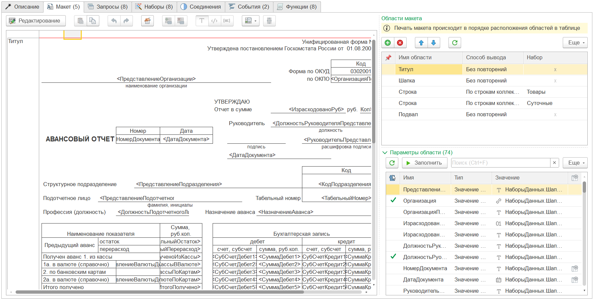 
  <em>Рисунок 18. Закладка «Макет» — режим табличного документа</em>

  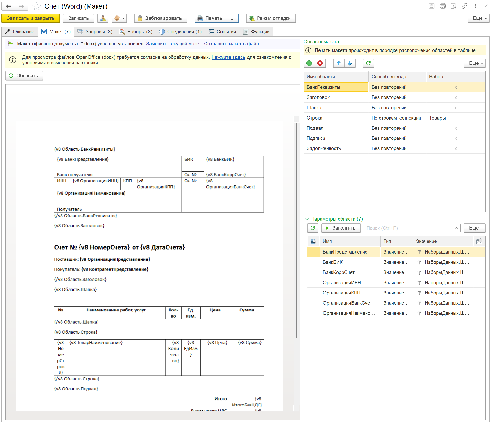 
  <em>Рисунок 19. Закладка «Макет» — режим офисного документа (`*.docx`)</em>

Форма закладки разделена на две части:

- левая часть — макет печатной формы;
- правая часть — список областей макета и параметров текущей области.

**Области макета.** Список областей формируется автоматически (для офисного документа — после загрузки шаблона). Для табличного документа предусмотрено ручное обновление списка областей.

Колонки таблицы областей:

| Колонка | Описание |
|---|---|
|  | Настройка вывода области (только для табличного документа) |
| Имя области | Имя области в макете |
| Способ вывода | Способ заполнения области («По строкам коллекции», «Однократно» и др.) |
| Набор | Имя набора данных, связанного с областью (для способа «По строкам коллекции») |
| Условия | Индикатор наличия условий вывода области |

  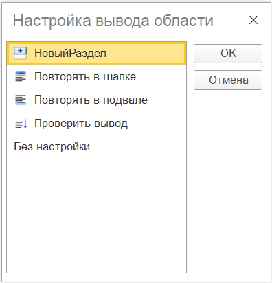 
  <em>Рисунок 20. Варианты настройки вывода области (для табличного документа)</em>

**Настройка вывода области (для табличного документа):**

| Вариант | Описание |
|---|---|
| Без настройки | Область выводится без дополнительной настройки |
| Новый раздел | Сброс настроек предыдущих областей; начало нового раздела печати |
| Повторять в шапке | Повтор области в начале каждой страницы |
| Повторять в подвале | Повтор области в конце каждой страницы |
| Проверить с переносом на след. страницу | Проверка вместимости области; перенос на следующую страницу при недостатке места |

**Параметры области.** Для каждой области в нижней правой таблице задаётся соответствие между параметрами макета (имена ячеек/полей в шаблоне) и значениями из наборов данных, реквизитов объектов или произвольных алгоритмов.

#### 3.5.6. Закладка «События»

На закладке «События» задаются алгоритмы-обработчики ключевых событий формирования печатной формы. Для каждого события предусмотрен набор входящих параметров.

Перечень доступных событий:

| Событие | Назначение |
|---|---|
| ПередИнициализацией | Подготовка данных или отказ от печати до запуска формирования |
| ПриПолученииДанных | Обработка таблиц данных после выполнения запросов |
| ПередФормированием | Подготовка перед формированием печатного документа |
| ПередВыводомСтраницы | Подготовка перед выводом очередной страницы |
| ПриВыводеОбласти | Обработка вывода конкретной области |
| ПриЗавершенииФормирования | Завершающая обработка готового документа |

Использование событий необязательно. Для типовых печатных форм формирование выполняется без участия пользовательского кода.

#### 3.5.7. Закладка «Функции»

На закладке «Функции» (доступна с версии 2025.1) пользователь может определить произвольные функции, доступные из любого алгоритма макета (событий, обработки наборов, параметров области). Функции используются для вынесения общих алгоритмов и упрощения сопровождения макета.

  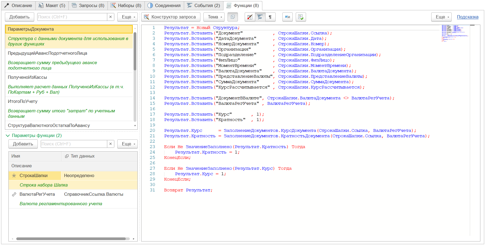 
  <em>Рисунок 21. Закладка «Функции»</em>

Для добавления функции необходимо нажать **Добавить** над таблицей функций, ввести имя функции и при необходимости добавить параметры. Тело функции задаётся в правой части окна.

### 3.6. Тестовая печать и режим отладки

Для проверки корректности печатной формы в командной панели формы макета предусмотрена команда **Тестовая печать**. Команда позволяет сформировать печатную форму для выбранного объекта без её публикации.

**Режим отладки.** Для диагностики проблем при формировании предусмотрен режим отладки. Включение режима выполняется из подменю **Ещё → Режим отладки** в форме макета. При включённом режиме отладки:

- появляется дополнительная закладка **Журнал**;
- после выполнения тестовой печати журнал заполняется детальной информацией о ходе подготовки печатной формы (выполненные запросы, сформированные наборы, отработавшие события, ошибки).

Журнал предназначен для самостоятельного анализа ситуаций, когда печатная форма формируется не так, как ожидалось.

### 3.7. Публикация печатной формы

После завершения разработки печатной формы её необходимо опубликовать (заблокировать от изменений). Без блокировки печатная форма недоступна конечным пользователям.

**Блокировка макета.** В командной панели формы макета нажать кнопку **Заблокировать**. После блокировки:

- макет становится недоступным для редактирования;
- команда печати автоматически добавляется в подменю **Печать** соответствующих форм объектов (при их следующем открытии);
- пользователи с правом печати получают возможность формировать данную печатную форму.

Дальнейшую доработку заблокированного макета рекомендуется выполнять через механизм **Образов для разработки**: для опубликованной печатной формы создаётся отдельный макет-образ, в котором ведётся параллельная разработка. После завершения доработки макет-образ заменяет основной.

### 3.8. Печать из формы объекта

Для конечного пользователя сформированная и опубликованная печатная форма доступна стандартным образом — в подменю **Печать** формы объекта или формы списка соответствующего справочника/документа.

Последовательность действий пользователя:

1. Открыть форму объекта или форму списка.
2. Выбрать в списке необходимые объекты (для печати по нескольким).
3. Нажать кнопку **Печать** на командной панели формы.
4. В подменю выбрать необходимую печатную форму.
5. В открывшемся окне просмотра выполнить печать или сохранение документа стандартными средствами платформы.

Если в настройках команды печати установлен флаг **Сразу на принтер**, окно предварительного просмотра не открывается; печатная форма передаётся непосредственно на устройство печати, заданное по умолчанию.

### 3.9. Пакетная печать

Механизм пакетной печати позволяет вывести комплект документов для одного или нескольких объектов одновременно. Механизм размещён в подменю **PrintWizard → Пакетная печать (PrintWizard)**. Для работы требуется одна из ролей: **PrintWizard: Печать** или **PrintWizard: Редактирование**.

  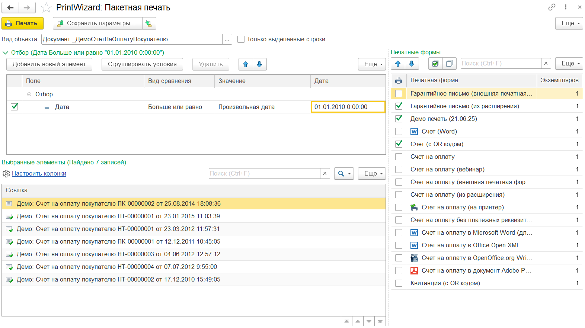 
  <em>Рисунок 22. Форма пакетной печати</em>

В форме пакетной печати настраиваются:

- **Вид объекта** — выбор объекта информационной базы, для которого выполняется печать;
- **Отбор** — настройка отбора списка объектов, для которых требуется выполнить печать;
- **Печатные формы** — список доступных печатных форм с указанием количества экземпляров для каждой.

Запуск выполняется кнопкой **Печать**. По завершении выводится результат пакетной печати — единый табличный документ, содержащий все сформированные формы.

Форма пакетной печати также доступна из подменю **Печать** в виде команды **Пакетная печать (PrintWizard)**. При открытии из подменю формы объекта выбор вида объекта блокируется и параметры формы не сохраняются.

> **Важно.** При выборе печатных форм не следует выбирать одновременно формы в табличном формате и в формате офисных документов. В таком случае формы в формате офисных документов будут исключены из результата. Пакетная печать нескольких форм в формате офисных документов допускается.

### 3.10. Экспорт и обмен макетами

Конструктор поддерживает несколько вариантов экспорта печатных форм.

**Экспорт во внешнюю обработку.** Команда **Экспорт в обработку** в форме макета или в форме списка формирует файл внешней обработки `.epf`, содержащий печатную форму. Для выполнения такой обработки в другой информационной базе требуется наличие полной или упрощённой версии Конструктора. Упрощённая версия может быть получена из этой же формы экспорта.

**Экспорт в расширение конфигурации.** Команда **Экспорт в расширение** формирует расширение конфигурации `.cfe`, содержащее выбранные печатные формы. Расширение может быть подключено в произвольную совместимую информационную базу.

**Обмен макетами в формате `*.pdwx`.** Команды **Сохранить в файл** и **Загрузить из файла** позволяют сохранять и загружать отдельные макеты в специализированном формате. Формат используется для обмена между информационными базами и для резервного хранения макетов.

> **Примечание.** При загрузке макета необходимо учитывать совместимость форматов: загрузка возможна между версиями с одинаковой первой цифрой версии файла.

### 3.11. Завершение работы

Завершение работы с Конструктором не требует выполнения специальных действий. Для корректного завершения сеанса:

1. Сохранить все открытые макеты (кнопка **Записать и закрыть** в форме макета).
2. Закрыть открытые формы Конструктора.
3. Завершить сеанс «1С:Предприятие» штатным образом (Основное меню → Файл → Выход).

Незавершённые изменения, не сохранённые перед закрытием формы макета, будут потеряны. Платформа «1С:Предприятие» выводит соответствующее предупреждение при попытке закрыть форму с несохранёнными изменениями.

---

## 4. Сообщения пользователю

В настоящем разделе перечислены наиболее распространённые сообщения, выводимые программой пользователю, их назначение и рекомендуемые действия.

### 4.1. Сообщения при установке

| Сообщение | Описание | Действия пользователя |
|---|---|---|
| «Версия платформы не соответствует требованиям» | Установлена версия платформы ниже 8.3.18 | Обновить платформу «1С:Предприятие 8» |
| «Режим совместимости конфигурации не соответствует требованиям» | Режим совместимости конфигурации ниже 8.3.14 | Согласовать с администратором повышение режима совместимости |
| «Не найдена обязательная подсистема БСП: <имя>» | В конфигурации отсутствует обязательная подсистема Библиотеки стандартных подсистем | Установка невозможна. Использовать конфигурацию, удовлетворяющую требованиям |
| «Версия БСП ниже требуемой» | Версия Библиотеки стандартных подсистем ниже 3.1.4 | Обновить конфигурацию до версии с БСП 3.1.4 и выше |
| «Ошибка установки расширения» | Возникла ошибка при установке расширения | Проанализировать описание ошибки. Обратиться к администратору информационной базы или в службу технической поддержки |
| «Требуется перезапуск сеанса» | Расширение успешно установлено | Нажать гиперссылку «Перезапуск» |

### 4.2. Сообщения при регистрации лицензии

| Сообщение | Описание | Действия пользователя |
|---|---|---|
| «Лицензия не обнаружена» | Расширение установлено, лицензия не зарегистрирована | Перейти к регистрации лицензии (см. раздел [3.2](#32-регистрация-лицензии)) |
| «Неверный номер заказа или пин-код» | Введены некорректные реквизиты лицензии | Проверить введённые данные. При сохранении ошибки обратиться в службу технической поддержки |
| «Ошибка соединения с сервером лицензирования» | Недоступен ресурс `pw.progtb.ru` | Проверить доступ к интернет-ресурсам (см. раздел [2.3](#23-требования-к-интернет-ресурсам)) |
| «Ошибка получения внешнего IP-адреса» | Недоступен ресурс `ipapi.co` | Проверить доступ к интернет-ресурсам |
| «Лицензия аннулирована» | Обнаружено использование одинаковой лицензии на нескольких компьютерах | Обратиться в службу технической поддержки |
| «Лицензия успешно зарегистрирована» | Регистрация завершена успешно | Нажать «Далее» для завершения работы помощника |

### 4.3. Сообщения при работе с макетом

| Сообщение | Описание | Действия пользователя |
|---|---|---|
| «Макет заблокирован для изменений» | Попытка редактирования заблокированного макета | Использовать механизм образов для разработки (создать макет-образ) |
| «Поле <имя> не найдено в наборе данных» | Параметр макета ссылается на отсутствующее поле набора | Проверить состав полей набора. При необходимости добавить поле в запрос или удалить параметр |
| «Не задан источник данных для набора» | Набор данных не связан с запросом или алгоритмом | Указать источник данных на закладке «Наборы» |
| «Ошибка выполнения запроса» | Запрос содержит синтаксическую или логическую ошибку | Проанализировать описание ошибки. Использовать конструктор запроса для проверки |
| «Не указан целевой объект метаданных» | На закладке «Описание» не указан ни один объект | Добавить хотя бы один объект на закладку «Описание» |

### 4.4. Сообщения при формировании печатной формы

| Сообщение | Описание | Действия пользователя |
|---|---|---|
| «Документ не проведён» | Установлен флаг проверки проведения; документ не проведён | Провести документ или снять флаг проверки проведения в настройках команды |
| «Отказ от формирования печатной формы» | Алгоритм события вернул отказ от формирования | Проверить логику обработчика события |
| «Ошибка вывода области <имя>» | Возникла ошибка при выводе области макета | Включить режим отладки и проанализировать журнал |
| «Не удалось получить данные» | Ошибка получения данных из запроса или алгоритма | Включить режим отладки и проанализировать журнал |
| «Формирование завершено успешно» | Печатная форма сформирована и готова к выводу | Просмотреть результат и выполнить печать/сохранение |

При получении нестандартных сообщений, не приведённых выше, рекомендуется включить **Режим отладки** (см. подраздел [3.6](#36-тестовая-печать-и-режим-отладки)) и проанализировать содержимое журнала. При невозможности самостоятельно устранить ошибку — обратиться в службу технической поддержки (см. подраздел [5.3](#53-техническая-поддержка)).

---

## 5. Поддержание жизненного цикла программы

### 5.1. Обновление программы

Программа обновляется в виде новых версий расширения, поставляемых правообладателем. Информация о выпуске новых версий публикуется:

- в репозитории проекта: [https://infostart.ru/marketplace/printwizard/](https://infostart.ru/marketplace/printwizard/).

Для обновления необходимо:

1. Получить новый дистрибутив у правообладателя или скачать с сайта продукта.
2. Открыть информационную базу в монопольном режиме.
3. Запустить обработку `Setup_PrintWizard.epf` из новой поставки.
4. Пройти шаги мастера (см. раздел [3.1](#31-установка-printwizard-в-информационную-базу)). При наличии установленной более ранней версии расширения мастер выполнит обновление.
5. После завершения обновления выполнить перезапуск сеанса.

Существующие печатные формы сохраняются и продолжают работать после обновления. При необходимости адаптации макетов под новые возможности версии правообладатель публикует сопроводительные материалы.

### 5.2. Удаление программы

Удаление расширения PrintWizard из информационной базы выполняется штатным образом средствами платформы «1С:Предприятие 8»:

1. Открыть информационную базу в монопольном режиме под пользователем с административными правами.
2. Перейти в раздел **НСИ и администрирование → Печатные формы, отчёты и обработки → Расширения** (точное наименование раздела зависит от конфигурации).
3. В списке расширений выбрать расширение PrintWizard.
4. Нажать кнопку **Удалить**.
5. Подтвердить удаление и выполнить реструктуризацию информационной базы.

> **Внимание.** При удалении расширения все созданные пользователем макеты будут безвозвратно удалены. Перед удалением рекомендуется выполнить выгрузку важных макетов в файлы формата `*.pdwx` (см. раздел [3.10](#310-экспорт-и-обмен-макетами)).

### 5.3. Техническая поддержка

Техническая поддержка осуществляется правообладателем — Обществом с ограниченной ответственностью «Энспейс» (ООО «Энспейс») — по следующим каналам:

| Канал | Адрес |
|---|---|
| Сайт с документацией | [https://infostart.ru/marketplace/printwizard/](https://infostart.ru/marketplace/printwizard/) |
| Регистрация ошибок и предложений | [https://infostart.ru/marketplace/printwizard/](https://infostart.ru/marketplace/printwizard/) |

При обращении в техническую поддержку рекомендуется предоставлять:

- версию платформы «1С:Предприятие 8»;
- наименование и версию используемой конфигурации;
- версию расширения PrintWizard;
- описание выполняемых действий и наблюдаемой ошибки;
- скриншоты, журнал событий конструктора (см. подраздел [3.6](#36-тестовая-печать-и-режим-отладки)), при возможности — выгруженный макет в формате `*.pdwx`.

Время реагирования и иные параметры технической поддержки регулируются условиями приобретения программного продукта.

### 5.4. Совершенствование и развитие программы

Развитие программы выполняется правообладателем (ООО «Энспейс») в соответствии с планом работ, формируемым с учётом:

- предложений и замечаний пользователей, поступающих через каналы технической поддержки;
- изменений требований платформы «1С:Предприятие 8» и Библиотеки стандартных подсистем;
- развития смежных технологий (форматы документов, средства интеграции, требования регуляторов).

Информация о текущих планах развития публикуется в разделе [Issues](https://infostart.ru/marketplace/printwizard/) репозитория проекта.

Среди ключевых направлений развития:

- расширение возможностей групповой разработки печатных форм;
- поддержка возможностей новых версий платформы;
- создание вариантов печатной формы на основе общего макета;
- расширение возможностей встроенной консоли кода;
- механизм универсальных алгоритмов для использования в макетах.

---

## 6. Приложения

### 6.1. Глоссарий

| Термин | Определение |
|---|---|
| Конструктор, PrintWizard | Программный продукт «PrintWizard» — расширение конфигурации «1С:Предприятие 8» для создания печатных форм |
| Макет конструктора | Декларативное описание печатной формы, хранящееся в виде элемента справочника «Макеты (PrintWizard)» |
| Макет печатной формы | Шаблон оформления печатной формы (табличный документ или офисный документ `*.docx`), являющийся частью макета конструктора |
| Область макета | Именованный фрагмент макета печатной формы, используемый для вывода данных (шапка, строка таблицы, подвал и т. д.) |
| Запрос | Запрос на встроенном языке запросов «1С:Предприятие 8», возвращающий данные для печатной формы |
| Набор данных | Коллекция данных, сформированная на основе запроса или произвольного алгоритма, используемая при выводе областей макета |
| Событие | Точка вмешательства пользовательского кода в процесс формирования печатной формы |
| Образ для разработки | Копия опубликованной печатной формы, используемая для параллельной разработки изменений |
| Реестр | Печатная форма, формируемая одним документом для нескольких объектов (журнал, список) |
| БСП | Библиотека стандартных подсистем «1С:Предприятие 8» |
| УФЭБС | Унифицированный формат электронных банковских сообщений (используется для генерации QR-кодов быстрого платежа) |
| ОКУД | Общероссийский классификатор управленческой документации |

### 6.2. Перечень дополнительных источников

Подробная техническая документация по работе с программой, включающая иллюстрированные пошаговые сценарии разработки печатных форм различной сложности, опубликована на официальном сайте документации:

- [https://infostart.ru/marketplace/printwizard/](https://infostart.ru/marketplace/printwizard/)

Сопроводительные материалы:

- «Инструкция по установке PrintWizard» (`PrintWizard_Install_Guide.pdf`) — поставляется в составе дистрибутива;
- История версий: [https://infostart.ru/marketplace/printwizard/](https://infostart.ru/marketplace/printwizard/);
- Примеры разработки печатных форм: [https://infostart.ru/marketplace/printwizard/](https://infostart.ru/marketplace/printwizard/).

Нормативная документация:

- ГОСТ 19.505-79 «Единая система программной документации. Руководство оператора. Требования к содержанию и оформлению»;
- ГОСТ 19.105-78 «Единая система программной документации. Общие требования к программным документам».

---

*© ООО «Энспейс», 2022–2026. Все права на программный продукт «PrintWizard» («Print wizard (Конструктор печатных форм)», свидетельство Роспатента № 2022685985 от 30.12.2022) принадлежат правообладателю. Воспроизведение, распространение и иное использование настоящего документа без согласия правообладателя не допускается.*
