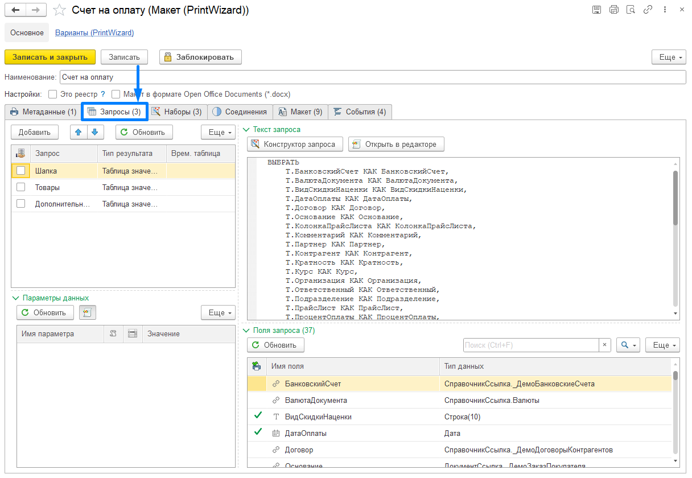

# Инструменты вкладки Запросы

**Механизм запросов** — это один из способов доступа к данным, которые поддерживает платформа. Запросы представляют собой табличную модель доступа к данным. Используя этот механизм, пользователь может читать и обрабатывать данные, хранящиеся в информационной базе.

Более подробная информация о механизме запросов:

[Работа с запросами](docs\query\Работа-с-запросами.md)

## Описание элементов на форме

### Табличная часть документа

 - с помощью данной кнопки в табличную часть добавляется новый Запрос

 - переместить текущий элемент вверх/вниз

  - кнопка автоматического формирования/обновления запроса из метаданных

 - признак “это общий запрос без отбора по Ссылке” - для таких запросов не контролируется наличие поля "***Ссылка***"

**Запрос** - наименование созданного запроса

**Тип результата** - тип данных полученных в результате запроса (заполняется автоматически)

**Временная таблица** - в ячейку автоматически заполняется наименование временной таблицы, в случае если результатом запроса является временная таблица

### Текст запроса

 - кнопка вызова Конструктора запроса

 - открыть текст запроса в специальном редакторе

### Поля запроса

 - кнопка для обновления списка полей, полученных из запроса

### Параметры данных

  - обновление параметров данных

 - использование специализированного редактора для изменения алгоритма (по умолчанию включен)

## Конструктор запросов

**Конструктор запроса**  — это один из инструментов разработки. Он позволяет составить текст запроса на языке запросов исключительно визуальными средствами.

В конструкторе запросов есть возможность: указывать, какие данные должны присутствовать в результате запроса, как они связаны, сгруппированы, какие итоги следует рассчитать, возможность работать с временными таблицами, редактировать пакет запросов.

Результатом работы конструктора будет являться синтаксически правильный текст запроса. Таким образом, пользователь может составить работоспособный запрос, даже не владея синтаксисом языка запросов — необходимые синтаксические конструкции конструктор сгенерирует автоматически. Готовый текст запроса может быть сразу же вставлен в текст модуля или скопирован в буфер обмена.

