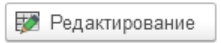
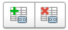
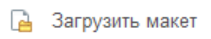
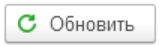
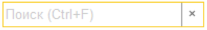
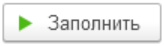
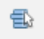
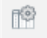

# Инструменты вкладки Макет

На вкладке Макеты производится отрисовка макета, задаются области и присваиваются значения параметров.

 - кнопка (де)активации режима редактирования макета

 - кнопка (де)активации панели Свойств ячеек табличного документа

 - кнопки используются для отмены/повторения последнего действия

 - кнопки для назначения/удаления областей макета

  - группа кнопок для работы с шрифтом в макете (изменить шрифт/ увеличить/уменьшить размер шрифта)

По кнопке **Еще** доступна команда:

 - кнопка используется для закрузки готового макета

Доступно три варианта загрузки готового макета:

* Из макета объекта

* Из общего макета

* Из файла на диске

### Группа Области Макета

 - кнопки для перемещения элементов вверх/вниз в табличной части

 - кнопка для обновления данных в табличной части Области макета

 - панель для поиска по табличной части Области макета

#### Табличная часть Области макета

**Имя области** - заданное наименование области

**Способ вывода** - способ вывода области

Доступные Способы вывода:

* *Без повторений* - Данным способом область выводится в печатной форме один раз, в основном используется для вывода шапки документа

* *По строкам коллекции* - 

* *Перенос строки* -

* *Контрольная строка* - 

* *Строка переноса* - 

* *Пустая область* - 

* *Не выводить на печать* - 

**Набор** - здесь указывается коллекция, которая будет отражаться в данной области

### Группа Параметры области

 - кнопка для обновления табличной части Параметры области макета

 - кнопка используется для автоматического заполнения параметров областей макета по набору выбранному в ТЧ области макета в поле Набор (при условии совпадения наименования Параметра и полей набора)

 - флаг использования специализированной консоли кода????????????????????????

### Табличная часть Параметры области

 - параметр расшифровки, для него разрешено хранение более сложных типов данных

**Имя** - наименование парамаетров принадлежащих области на которой позиционируется курсор в ТЧ Области макета/в макете

**Тип** - тип Параметра

Доступные типы:

* *Значения набора* - поле из набора

* *Конструктор строки* - состравное поле из нескольких полей набора с возможостью добавления префиксов

* *Произвольный алгоритм* - поле заданное вручную с помощью специального редактора

**Значение** - значение параметра (путь к данным или произвольный алгоритм)

 - настройки форматирования значения поля (доступны по двойному щелчку ЛКМ)