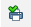

# Инструменты вкладки Метаданные

На вкладке **Метаданные** задается источник данных для будущей печатной формы (объект метаданных) - чаще всего это документ/справочник, по данным которого необходимо печатать форму. Также на данной вкладке задаются параметры кнопки печати.

## Описание элементов на форме

### Табличная часть

 - с помощью данной кнопки Объекты метаданных добавляются в табличную часть

 - переместить текущий элемент вверх/вниз

 - кнопка для запуска тестирования печатной формы

 - кнопка для запуска тестирования печатной формы

### Настройки команды печати

**Заголовок** - наименование на кнопке печати

**Идентификатор** - идентификатор для внутреннего использования

**Список форм** - выбор форм для отображения кнопки печати (форма списка/ элемента/ выбора), если параметр не указан, то кнопка отображается на всех формах объекта

**Порядок** - порядок расположения команды печати в списке на печать

**Проверка проведения перед печатью** - признак необходимости проверки проведения документа перед печатью, если не задан - проверка не выполняется

**Сразу на принтер** - если признак задан печать формы производится без предварительного просмотра