# Инструменты вкладки Наборы

Наборы необходимы для выбора определенных параметров в макет. Они заполняются автоматически на основании Запросов из документа.

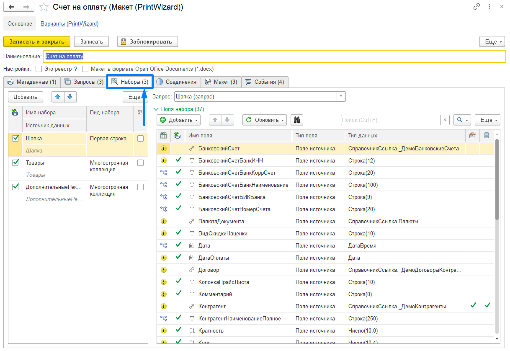

## Описание элементов на форме

### Инструменты вкладки

 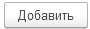 - с помощью данной кнопки в табличную часть добавляется новый Набор

 - переместить текущий элемент вверх/вниз

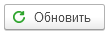 - кнопка автоматического формирования/обновления запроса из метаданных

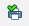 - флаг использования набора данных  макете для печати

### Табличная часть

**Имя набора** - наименование набора

**Источник данных** - наименование таблицы Запроса на основании которого создается набор

**Вид набора:**

***Первая строка*** - используется, когда из набора нужна первая строка в таблице или получаемые данные и есть Строка

***Последняя строка*** - используется когда нужна последняя строка из таблицы

***Соединение строк*** - используется, когда нужно получить перечисление данных через разделитель “;“

***Многострочная коллекция*** - используется для данных таблиц.

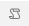 - флаг использования для соответствующего набора специализированного редактора для изменения алгоритма (по умолчанию выключен)

### Инструменты группы Поля набора

Запрос - выпадающий список, автоматически переключается при переключении по наборам в ТЧ

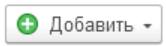 - кнопка для добавления в набор дополнительных полей, не из запроса, есть возможность добавить:

**Поле алгоритма** - используется для добавление поля с помощью произвольного алгоритма

**Поле доп. реквизита** - используется для добавление в наборы поля из списка доп. реквизитов 

**Поле конструктора** - используется для конструирования из одного/нескольких полей наборов одного поля с возможностью добавления префиксов

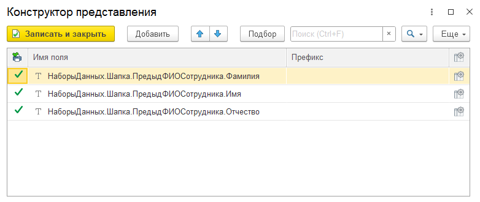

**Поле нумератора** - используется для добавления поля набора в виде нумератора (например для вложенных списков)

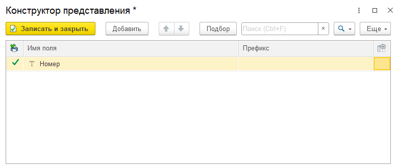

 - переместить текущий элемент вверх/вниз

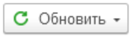 - кнопка для обновления данных полей наборов

**Из запроса** - используется если были изменен запрос

**Из алгоритма** - используется для обновления данных при наличии Алгоритма (если активен флаг   и задан алгоритм)

:bulb: Алгоритм используется в случае если есть необходимость в дополнительной обработке данных запроса/ нужно добавить дополнительное поле в набор

**Из набора** -  используется если нужно добавить данные из другого набора в текущий набор

**Использование** - используется, когда нужно обновить информацию об использовании полей в Макете (данная информация автоматически обновляется при Записи)

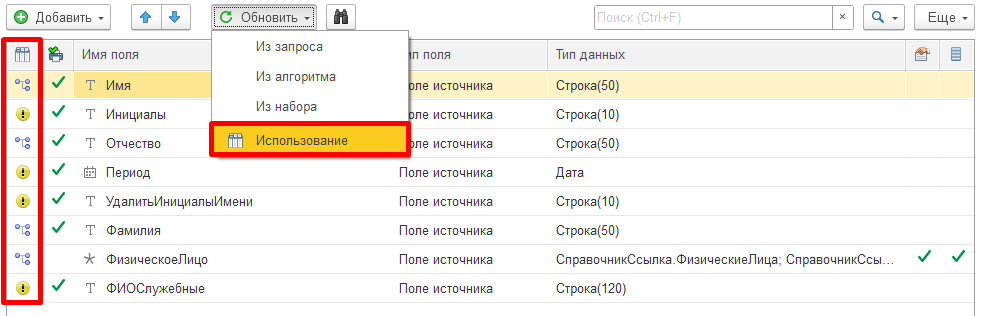

  - используется для получения информации о том, где в макете используется конкретное поле набора данных

### Табличная часть Поля набора

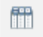 - показывает наличие связи поля набора с данными макета печатной формы

 - флаг поле набора простого типа и рекомендуется для использования в печатной форме

**Имя поля** - наименование поля набора

**Тип поля** - тип поля набора

Доступные типы полей:

* *Поле источника* - поле полученное из запроса

* *Поле нумератора* - поле ????????????????

* *Поле конструктора* - составное поле с использованием префиксов

* *Поле доп реквизита* - поле выбирается из дополнительных реквизитов метаданных ??????

* *Поле алгоритма* - поле созданное вручную для вывода данных, полученных с помощью Алгоритма обработки данных

**Тип данных** - тип данных поля набора (Число/Строка/Ссылка)

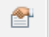 - флаг есть ли дополнительные реквизиты у поля

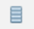 - флаг есть ли дополнительные сведения у поля

