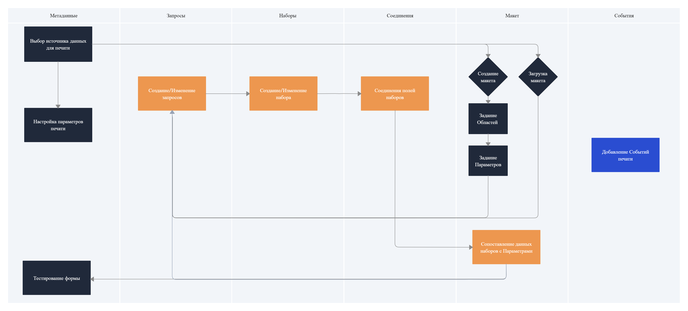

# Работа с Print Wizard

В данной главе описывается общее устройство Мастера печатных форм, рассматривается последовательность этапов создания печатной формы и описывается назначение каждого элемента, используемого для ее создания.

Формирование печатной формы с использованием Мастера разбивается на несколько этапов. При этом разбиение на этапы – не логическое, а физическое. То есть в каждый из этих этапов разработчик может вмешаться в любое время.

## Визуализация процесса работы с Print Wizard

На схеме проедставлены Этапы разработки формы с обозначением соответствующих вкладок для удобства навигации в Мастере.

1. Для начала на вкладке [**Метаданные**](Метаданные.md) необходимо выбрать *Источник данных для печати* (Из какого объекта предполагается выводить на печать форму). Также на данной вкладке настраиваются параметры команды печати.
2. На вкладке [**Макет**](Макет.md) загружается либо создается вручную макет будущей печатной формы, в нем производится задание **Областей** печати и задаются **Параметры**, которые в дальнейшем будут использоваться для вывода данных на печать.
3. На вкладке [**Запросы**](Запросы.md) генерируются/создаются Запросы к базе данных на получение исходных данных, которые в дальнейшем будут обработаны на вкладке [**Наборы**](Наборы.md).
4. На вкладке [**Соединения**](Соединения.md) разработчик задает связь Наборов по необходимым полям для получения данных из разных таблиц.
5. После этого разработчик возвращается на вкладку [**Макет**](Макет.md) для сопоставления данных полученных наборов с параметрами, заданными на шаге 2.
6. Далее полученный результат необходимо протестировать. Для этого необходимо вернуться на вкладку [**Метаданные**](Метаданные.md).

:bulb: **По шагам описанным выше необходимо проходить до тех пор пока результат не удовлетворит разработчика.**

7. На вкладке [**События**](События.md) данные генерируются автоматически, также есть возможность задать их самостоятельно.
