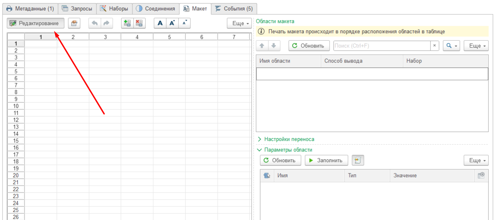

# Создание простой печатной формы

В данной ветке мы подробно рассмотрим пример создания простой печатной формы с помощью Мастера печатных форм. Пример целиком основан на использовании визуальных средств разработки (без программирования).
Обратите внимание, что действия описанные в данной инструкции будут применяться для создания и более сложных печатных форм, поэтому данное руководство будет полезно как аналитикам, так и разработчикам.  
Практическое знакомство с инструментарием Мастера печатных форм начнем с простой формы Счет на оплату.

## Создание проекта

На главной странице Мастера печатных форм нажмите кнопку **Создать**:

Заполните *Наименование*:

Мы создали проект. далее необходимо определить, что будет являться источником отбора данных для печатной формы - вкладка **Метаданные**. В нашем примере это документ Счет на оплату покупателю. Из него мы планируем выводить на печать форму.

На вкладке Метаданные нажмите **Добавить** и выберите Объект метаданных из предложенного списка:

Поставьте **флаг "Добавить команду печати на форму объекта"**, чтобы добавить кнопку печати на форму объекта метаданных (на форму документа Счет на оплату покупателю):

При желании есть возможность изменить *Настройки команды печати*, заданные по умолчанию.

Следующий шаг - отрисовка макета будущей печатной формы, для этого в ***PrintWizard*** предусмотрены различные механизмы облегчающие данную задачу.

## Загрузка макета

Доступно три варианта загрузки готового макета:

* Из макета объекта

* Из общего макета

* Из файла на диске

:bulb: **Загрузка макета доступна только в режиме Редактирования макета**

## Создание макета вручную

Для начала выберите формат макета, по умолчанию выбран табличный формат, при необходимости измените данную настройку с помощью флага **Макет в формате Open Office Documents (* .docx)**

В нашем примере мы рассмотрим наиболее простой вариант - табличный.

Табличный формат редактируется на вкладке Макет, с помощью активирования кнопки **Редактирование**.

Для помощи при создании макета на верхней панели вкладки **Макет** и в меню **Еще** вы найдете множество настроек, предназначенных для редактирования текста, объединения/разъединения ячеек, задания границ и т.д.

### Задание Областей макета

Области макета предназначены для однократного или многократного вывода информации содержащейся в данной области.

Область может состоять из нескольких расположенных подряд строк или колонок, либо быть прямоугольной областью таблицы.

Чтобы добавить Области макета выделите нужные строки на форме редактирования и нажмите кнопку **Назначить имя** (см. картинку). Соответственно, чтобы удалить Область воспользуйтесь кнопкой справа от неё.

Области в макете отделены красными линиями.

:bulb: **Имя Области может начинаться только с буквы и содержать только буквы, цифры и символ “_“**

В нашем примере зададим следующие Области:

* ПлатежныеРеквизиты

* ЗаголовокСчета

* Поставщик

* Покупатель

* ШапкаТаблицы

* Строка

* Итого

* ИтогоНДСВСумме

* Подвал

Добавленные Области появятся на форме **Области макета**:

На данной форме редактируется **Способ вывода** каждой области:

### Способы вывода областей макета

* Без повторений - Данным способом область выводится в печатной форме один раз, в основном используется для вывода шапки документа

* По строкам коллекции - 

* Перенос строки -

* Контрольная строка - 

* Строка переноса - 

* Пустая область - 

* Не выводить на печать - 

В нашем примере все данные в макете будут выводиться один раз (Способ вывода - *Без повторений*), кроме Области *Строка*, так как в данной области будут отражены данные из табличной части по количеству строк в документе. Соответственно Способ вывода необходимо выбрать - *По строкам коллекции*.

### Задание Параметров

После задания Областей необходимо задать Параметры в макете, которые в дальнейшем будут использоваться для вывода данных на печать. Для этого воспользуемся **панелью Свойств**.

**Панель Свойств** можно добавить/убрать на рабочий экран с помощью кнопки на верхней панели вкладки Макет:

:bulb: **Параметры в Макете необходимо задавать в угловых скобках “<>”, в Шаблонах Параметры необходимо задавать в квадратных скобках “[]“.**

В нашем примере:

Задаем Параметр в Области "Поставщик" - <Поставщик> - предполагаем, что в него будет выводиться ФИО поставщика. Для этого, стоя на ячейке <Поставщик>, на **панели Свойств** в **Значение** выбираем *Параметр*.

Задаем Шаблон в Области ЗаголовокСчета - "Счет на оплату № [НомерДокумента] от [ДатаДокумента]" - предполагаем, что в него будет выводиться Счет на оплату с номером и датой. Для этого, стоя на ячейке на **панели Свойств** выбираем **Значение** - *Шаблон*.

Наш макет готов к использованию. Следующим Шагом необходимо задать откуда берутся данные для Вывода в Параметрах.

Получение данных для печатной формы состоит из двух этапов:

1. **Запрос** к базе данных на получение исходных данных - "сырые данные". То есть в чистом виде они не всегда пригодны для использования в макете и чаще всего требуют обработки

2. Манипуляция с данными из Запроса с целью подготовить удобные **Наборы** для вывода в печатную форму

## Создание запросов

Создадим Запросы для печатной формы Счет на оплату покупателю. Для того чтобы автоматически сформировать Запросы на основании выбранных метаданных на вкладке Запросы нажмем кнопку Обновить (см. скрин):

По данной кнопке табличная часть слева автоматически заполняется Запросами на основании Метаданных, в табличной части (ТЧ) Текст запроса попадает текст запроса, а в ТЧ Поля запроса отображается список полей из соответствующего запроса с указанием Типов данных.

Созданные автоматически Запросы можно редактировать с помощью **Конструктора запроса** и **Специального редактора**.

Для нашего примера нет необходимости создавать дополнительные Запросы. Обо всех возможностях вкладки Запросы см. здесь [Работа с запросами](docs/docs\query\Работа-с-запросами.md).

Но у нас есть поля, которые не были получены с помощью автоматического запроса, такие как: ИНН и Полное наименование Организации, ФИО Руководителя и ФИО Главного бухгалтера. Эти данные мы сможем получить пополнив один из запросов данными из Справочника Организации.

Эти данные мы добавим к готовому запросу с помощью **Конструктора запроса**. Для этого, находясь на строке того Запроса, куда хотим добавить недостающие данные, нажмем кнопку **Конструктор запроса**.

На вкладке **Таблицы и поля** в раскрывающемся списке Таблицы раскроем **Т**, выберем необходимые поля и двойным щелчком мыши добавим их по очереди в **Поля** в правой части конструктора и нажмем ***ОК***. 

Поля автоматически попадут в Запрос:

Чтобы вновь добавленные поля попали в ТЧ Поля запроса нажмём кнопку **Обновить**:

ФИО Главного бухгалтера и Директора добавим таким же образом.

:bulb: **Выбирайте поля с Типом строка чтобы в дальнейшем их можно было использовать в печатной форме.**

Также, любой запрос можно редактировать вручную с помощью удобного помощника - Редактора запросов:

Запросы для нашей печатной формы готовы. Следующий шаг - создание Наборов данных на основе созданных Запросов.

## Создание Наборов

Для того чтобы автоматически сформировать Наборы на основании Запросов на вкладке Наборы нажмем кнопку **Обновить**:

По данной кнопке табличная часть слева автоматически заполняется Наборами на основании Запросов.

На этой же форме редактируется *Вид набора*:

* Первая строка - используется, когда нужна первая строка в таблице или данные и есть Строка.

* Последняя строка - используется когда нужна последняя строка в таблице

* Соединение строк - используется, когда нужно перечисление через разделитель “;“

* Многострочная коллекция - используется для данных таблиц.

Обновим Поля набора с помощью кнопки **Обновить**. На выбор предлагается Обновить данные из:

* Запроса

* Алгоритма

* Набора

